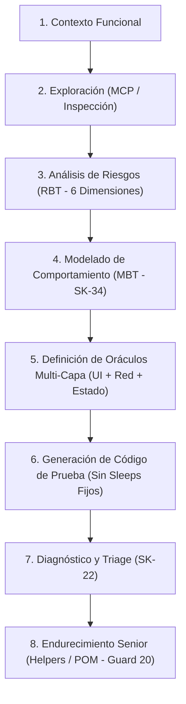

# Estándar de Escalera de Prompts de 8 Peldaños (.agents/rules/01_prompt_staircase_standard.md)

Este documento define la secuencia procedimental innegociable de 8 peldaños que todo subagente de IA y desarrollador DEBE seguir al abordar tareas de automatización de pruebas y QA.

---

## Regla Fundamental
> ⚠️ **"Un error común es pedirle a la IA el Peldaño 6 (generar código) sin haber completado y validado los Peldaños 1 al 5. No automatices pantallas; automatiza comportamientos."**

---

## Los 8 Peldaños de la Escalera de Prompts

---

### Desglose de Peldaños

| Peldaño | Nombre del Peldaño | Acción Exigida al Agente de IA | Artefacto Generado |
| :---: | :--- | :--- | :--- |
| **1** | **Contexto Funcional** | Leer documentación del ticket, PRD y contrato OpenAPI. | Comprensión del dominio |
| **2** | **Exploración (MCP)** | Observar la pantalla visual y mapear selectores estables. | Mapa de Selectores / UI |
| **3** | **Análisis de Riesgos (RBT)** | Auditar riesgos en UI, Estado, Persistencia, Backend, UX y Regresión. | Matriz RBT (Gate 1) |
| **4** | **Modelado (MBT - `SK-34`)** | Definir Estados, Transiciones, Guards e Invariantes. | Modelo MBT (Gate 2) |
| **5** | **Definición de Oráculos** | Establecer validaciones exactas para UI, Red y Estado. | Tupla de 3 Oráculos |
| **6** | **Generación de Código** | Escribir la suite TDD/E2E sin `sleeps` fijos ni delays flotantes. | Código de Prueba Base |
| **7** | **Diagnóstico y Triage** | Analizar fallos, flakiness y timing sin relajar oráculos. | Fix Mínimo (`SK-22`) |
| **8** | **Endurecimiento Senior** | Encapsular en Page Objects y helpers, anotando el código. | Code Refactor (Guard 20) |
