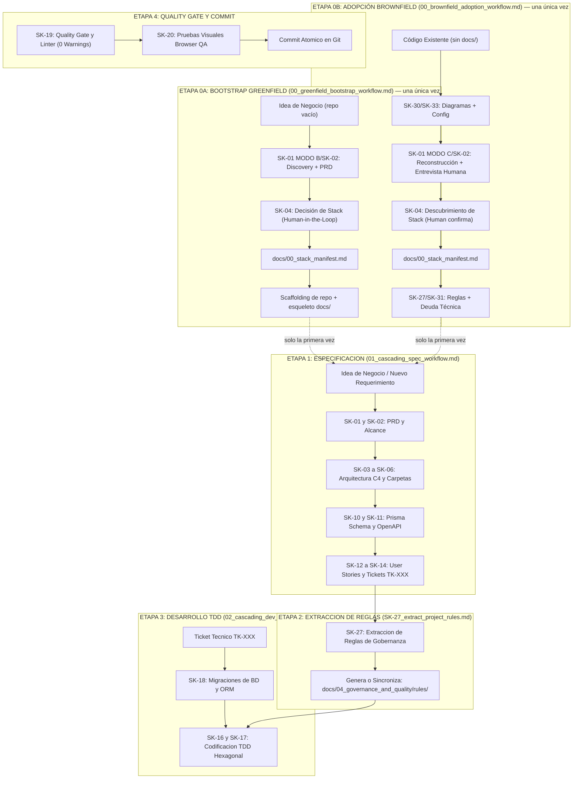

# Trazo Maestro del Ciclo de Vida VSDD (Idea → Specs → Rules → Code → Commit)

Este documento describe el flujo de trabajo end-to-end ejecutado por el asistente de IA en el repositorio, siguiendo la metodología **Verified Spec-Driven Development (VSDD)**.

---

## Diagrama Arquitectónico del Ciclo Completo

---

## Descripción Detallada de las Etapas

### ETAPA 0A: Bootstrap Greenfield (`00_greenfield_bootstrap_workflow.md`) — solo la primera vez, repo vacío
1. **Entrada:** Idea de negocio sobre un directorio sin código previo relevante ni `docs/00_stack_manifest.md`.
2. **Acción de la IA:** Delega en `SK-01` (Modo B)/`SK-02` para el Discovery y el PRD inicial, propone opciones de stack tecnológico y espera confirmación humana explícita antes de escribir `docs/00_stack_manifest.md`, luego scaffoldea el repositorio y el esqueleto mínimo de `docs/` que la Etapa 1 necesita para poder leer sus índices.
3. **Resultado:** Repositorio con stack aprobado, estructura base y `docs/` listo para que la Etapa 1 opere con normalidad.

### ETAPA 0B: Adopción Brownfield (`00_brownfield_adoption_workflow.md`) — solo la primera vez, código existente
1. **Entrada:** Código existente y funcional, sin `docs/00_stack_manifest.md` (proyecto que adopta `.agents/` retroactivamente).
2. **Acción de la IA:** Extrae diagramas y config con `SK-30`/`SK-33`, reconstruye el producto con `SK-01` (Modo C)/`SK-02` mediante entrevista humana obligatoria (el código dice el "qué", el humano dice el "por qué"), y usa `SK-04` en modo descubrimiento (nunca propone alternativas a tecnología ya en producción, solo detecta e inspecciona) para escribir `docs/00_stack_manifest.md` real. Cierra con `SK-27`/`SK-31` (reglas + deuda técnica) ahora que `docs/` tiene contenido real.
3. **Resultado:** Igual que la Etapa 0A — repositorio con `docs/` completo y `docs/00_stack_manifest.md` reflejando lo que ya existe, listo para que la Etapa 1 opere. Ninguna de las dos Etapa 0 se repite — proyectos ya bootstrapeados/adoptados entran directo por la Etapa 1.

---

### ETAPA 1: De la Idea a la Especificación Técnica (`01_cascading_spec_workflow.md`)
1. **Entrada:** Requerimiento de negocio suministrado por el usuario en lenguaje natural.
2. **Acción de la IA:** Asume los roles de **Software Architect** y **Product Owner** e invoca la secuencia de skills de `specs/` (de `SK-01` a `SK-15`):
   - **`SK-02`:** Registra las reglas de negocio en `docs/01_product_definition/` (PRD del producto).
   - **`SK-03` / `SK-05`:** Adapta las capas de arquitectura y estructura en `docs/02_architecture_design/`.
   - **`SK-06` / `SK-07`:** Modifica el modelo físico en la declaración del esquema ORM y los contratos HTTP en `docs/03_persistence_and_api/` (Especificación de API y `openapi.yaml`).
   - **`SK-11` / `SK-12`:** Crea la User Story (`US-NNN.md`) y los Tickets Técnicos (`TK-NNN.md`) atómicos en `docs/05_agile_planning/`.
3. **Resultado:** El backlog y la documentación en `docs/` quedan 100% actualizados y trazables en el mapa Mermaid de `14_backlog_map.md`.

---

### ETAPA 2: Extracción Dinámica de Reglas (`SK-27_extract_project_rules.md`)
1. **Entrada:** Inicio de la fase de desarrollo.
2. **Acción de la IA:** La skill `SK-27` lee la documentación recién actualizada en `docs/` y traduce las directivas técnicas a **archivos de reglas de gobernanza** en `docs/04_governance_and_quality/rules/` (ej. `domain_rules.md`, `backend_rules.md`, `frontend_rules.md`, `database_rules.md`, `testing_rules.md`, `security_rules.md`, `git_rules.md`) infiriendo dinámicamente los estándares del proyecto actual.

---

### ETAPA 3: De Ticket a Código Probado (`02_cascading_dev_workflow.md`)
1. **Entrada:** Orden de implementar un ticket técnico específico (ej. *"Desarrolla el ticket TK-001"*).
2. **Acción de la IA:**
   - **Migración (`SK-18`):** Si el ticket cambia la BD, modifica el esquema de persistencia u ORM del proyecto, corre la migración local y regenera el cliente ORM.
   - **Codificación TDD (`SK-16` / `SK-17`):**
     - **RED:** Escribe primero la prueba automatizada que falla (usando `InMemoryRepository` en lugar de mocks frágiles).
     - **GREEN:** Escribe la implementación en las capas Hexagonales (`Domain` → `Application` → `Infrastructure`) hasta pasar el test.
     - **REFACTOR:** Limpia la solución independizando la lógica de frameworks.

---

### ETAPA 4: Quality Gate, QA Visual y Commit
1. **Inspección de Código (`SK-19`):** Ejecuta los compiladores de tipos y linters oficiales declarados en `AGENTS.md`. Se exige estricto **0 errores y 0 advertencias**.
2. **QA Visual en Navegador (`SK-20`):** Si es un ticket de UI, abre el subagente de navegación interactivo, prueba los clics táctiles en botones de 48px y registra evidencias.
3. **Commit Atómico:** Realiza exactamente **1 commit en Git** vinculado al ticket `TK-XXX`.

---

## Diagnóstico de Estado del Proyecto (lo ejecuta `/momoy`)

Procedimiento de **solo lectura**: no crees, edites ni borres ningún archivo. Responde en qué etapa está el proyecto y qué comando toca.

1. **¿Bootstrapeado?** Si `AGENTS.md` no existe o es el stub de `install.sh` (contiene "proyecto sin bootstrapear"), el proyecto no arrancó: recomienda `/momoy-greenfield` si el directorio no tiene código relevante, o `/momoy-brownfield` si ya tiene código funcionando.
2. **¿Stack aprobado?** Si falta `docs/00_stack_manifest.md`, el bootstrap quedó incompleto: recomienda retomar el workflow de bootstrap que corresponda.
3. **Salud de las especificaciones:** ejecuta `python3 .agents/scripts/check_spec_artifacts.py` (informe, no bloquea) y resume sus hallazgos por gate.
4. **¿Tickets pendientes?** Revisa el `status` del frontmatter de `docs/05_agile_planning/12_tickets/**/TK-*.md` (y el índice de tickets si existe). Si hay tickets en `approved` o `in_progress`, toma el siguiente según el orden del índice y comprueba su Definition of Ready con `--ticket TK-XXX`: si pasa, recomienda `/momoy-dev TK-XXX`; si no, di que no está listo y por qué.
5. **Sin trabajo pendiente:** recomienda `/momoy-spec [idea]` para la siguiente funcionalidad, o `/momoy-audit-spec` si las especificaciones no se auditaron desde su último cambio.

**Respuesta:** (a) el estado detectado con la evidencia (archivo que lo prueba), (b) el resumen de salud de las especificaciones, (c) el siguiente comando recomendado con su argumento, y (d) la tabla de comandos de la sección 2 de `.agents/README.md`.

---

## Principios Fundamentales del Sistema

1. **Agnóstico y Portátil:** Toda la carpeta `.agents/` es 100% independiente del proyecto. Puede trasladarse a cualquier otro repositorio.
2. **Fuente Única de Verdad (`docs/`):** El proyecto se gobierna desde su propia documentación viva.
3. **Cero Vibe-Coding:** Ningún desarrollo se realiza improvisando. Todo responde a un ticket `TK-XXX` previamente diseñado.
