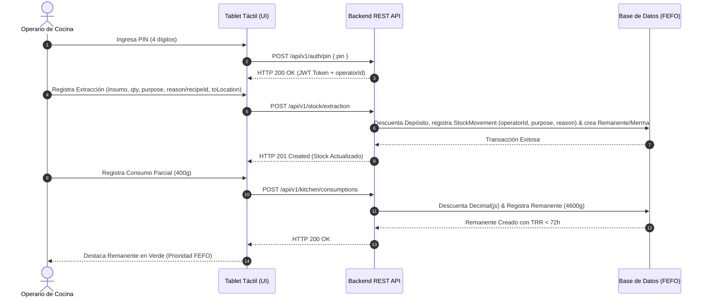

> **Navegación:** [01_product_discovery.md](./01_product_discovery.md) ➔ [01_glosario_y_reglas_negocio.md](./01_glosario_y_reglas_negocio.md) ➔ [ 02_prd.md ]

---

# 📝 Documento de Requisitos de Producto (PRD): RestoStock

## 📌 ÍNDICE DE CONTENIDOS
1. [Descripción General del Producto](#1-descripción-general-del-producto)
   - 1.1. [Problemática de Negocio](#11-problemática-de-negocio)
   - 1.2. [Propuesta de Solución (MVP)](#12-propuesta-de-solución-mvp)
   - 1.3. [Objetivos de Negocio y KPIs](#13-objetivos-de-negocio-y-kpis-métricas-de-éxito)
2. [Definición de Usuarios (User Personas)](#2-definición-de-usuarios-user-personas)
3. [Flujo End-to-End Prioritario](#3-flujo-end-to-end-prioritario)
   - 3.1. [Happy Path: Secuencia de Pasos](#31-happy-path-secuencia-de-pasos)
   - 3.2. [Diagrama Visual de Secuencia del Caso de Uso E2E (Mermaid)](#32-diagrama-visual-de-secuencia-del-caso-de-uso-e2e-mermaid)
   - 3.3. [Flujos Alternativos y Manejo de Errores (Edge Cases)](#33-flujos-alternativos-y-manejo-de-errores-edge-cases)
4. [Límites del Sistema y Non-Goals (Fuera de Alcance)](#4-límites-del-sistema-y-non-goals-fuera-de-alcance)
5. [Backlog de Historias de Usuario (INVEST)](#5-backlog-de-historias-de-usuario-invest)
   - [US-001: Autenticación por PIN del Personal de Cocina](#us-001-autenticación-por-pin-del-personal-de-cocina)
   - [US-002: Registro de Extracciones de Bodega](#us-002-registro-de-extracciones-de-bodega)
   - [US-003: Consulta Táctil de Remanentes Activos en Orden FEFO](#us-003-consulta-táctil-de-remanentes-activos-en-orden-fefo)
   - [US-004: Registro de Consumo Parcial de Remanentes](#us-004-registro-de-consumo-parcial-de-remanentes)
   - [US-005: Registro de Descartes y Mermas](#us-005-registro-de-descartes-y-mermas)
   - [US-006: Consulta de Alertas y Notificaciones Críticas en Cocina](#us-006-consulta-de-alertas-y-notificaciones-críticas-en-cocina)
   - [US-007: Consumo Rápido de Stock por Recetas](#us-007-consumo-rápido-de-stock-por-recetas)
   - [US-008: Cierre de Turno y Conciliación de Cocina](#us-008-cierre-de-turno-y-conciliación-de-cocina)
   - [US-009: Dashboard y Reporte de Mermas Visibles](#us-009-dashboard-y-reporte-de-mermas-visibles)
   - [US-010: Gestión Mínima de Personal (Alta y Bloqueo de Operarios)](#us-010-gestión-mínima-de-personal-alta-y-bloqueo-de-operarios)
   - [US-011: Trazabilidad y Auditoría de Movimientos de Stock](#us-011-trazabilidad-y-auditoría-de-movimientos-de-stock)
   - [US-012: Gestión de Catálogo Maestro (Alta de Insumos y Recetas)](#us-012-gestión-de-catálogo-maestro-alta-de-insumos-y-recetas)
   - [US-013: Reabastecimiento de Bodega](#us-013-reabastecimiento-de-bodega)
   - [US-019: Costeo de Insumos y Valorización Monetaria de Mermas](#us-019-costeo-de-insumos-y-valorización-monetaria-de-mermas)
   - [US-020: Indicador TRR Real en el Dashboard de Reportes](#us-020-indicador-trr-real-en-el-dashboard-de-reportes)
   - [US-021: Advertencia de Apertura Duplicada al Extraer Insumo](#us-021-advertencia-de-apertura-duplicada-al-extraer-insumo)
   - [US-025: Depósito de Insumos en Sub-Sector de Bodega y Stock Multi-Sector](#us-025-depósito-de-insumos-en-sub-sector-de-bodega-y-stock-multi-sector)
   - [US-032: Escaneo de Código de Barras en Extracción de Bodega](#us-032-escaneo-de-código-de-barras-en-extracción-de-bodega)
   - [US-033: Registro de Temperatura de Refrigeración al Iniciar Turno](#us-033-registro-de-temperatura-de-refrigeración-al-iniciar-turno)
   - [US-034: Panel de Configuración de Agentes IA](#us-034-panel-de-configuración-de-agentes-ia)
   - [US-035: Generador de Recetas de Aprovechamiento Anti-Desperdicio](#us-035-generador-de-recetas-de-aprovechamiento-anti-desperdicio)
6. [Estrategia de Calidad y Verificación (QA/Testing)](#6-estrategia-de-calidad-y-verificación-qatesting)
7. [Roadmap Post-MVP (Fase 2)](#7-roadmap-post-mvp-fase-2)

---

## 1. Descripción General del Producto

### 1.1. Problemática de Negocio
En la gestión operativa diaria de los restaurantes se produce un flujo descontrolado de insumos en el depósito principal. La falta de registro de quién extrae la mercancía y para qué área de la cocina se destina genera mermas misteriosas y pérdidas de inventario que afectan directamente el margen de ganancia. 

Adicionalmente, el desperdicio se multiplica una vez que los insumos ingresan a la cocina. Cuando una unidad de compra (ej. una horma de queso de 5 kg o una caja de salsa) se abre, el remanente sobrante suele almacenarse en heladeras o alacenas sin ningún tipo de registro físico ni de caducidad dinámica. Esto produce tres graves ineficiencias:
1. Cocineros que abren un lote nuevo sellado porque desconocen que ya hay un empaque abierto (duplicidad de aperturas).
2. Tiempo desperdiciado por el personal buscando ingredientes abiertos en diferentes áreas de frío/secos.
3. Insumos que caducan prematuramente al no ser rotados de forma prioritaria tras ser abiertos.

### 1.2. Propuesta de Solución (MVP)
**RestoStock** es una aplicación web de control de inventario y trazabilidad diseñada específicamente para cocinas. El MVP permite a los encargados y personal autorizado registrar de manera ultra rápida cada extracción del depósito principal, reportar el uso parcial de un insumo y rastrear la ubicación física exacta de su remanente dentro de los almacenes secundarios de la cocina (ej. heladeras, congeladores, estanterías). 

El sistema optimiza la rotación de inventarios forzando una lógica FEFO (First Expired, First Out) y alertando al personal sobre los insumos abiertos para asegurar su consumo prioritario. Esto se complementa con:
*   **Feed táctil de notificaciones críticas:** Tarjetas de alertas sobre vencimientos FEFO inminentes, rotura de stock de seguridad de línea y estado de red offline.
*   **Consumo rápido por recetas (manual):** Registro manual de uso de insumos mediante plantillas de recetas guardadas en la terminal, descontando de forma secuencial en orden FEFO sin integrarse con sistemas de comandas externos o facturación (BOM).
*   **Cierre de turno y conciliación física:** Flujo de fin de jornada para que el operario declare el inventario real en cocina y el sistema genere de manera guiada los registros de merma y discrepancias.
*   **Dashboard y reporte de mermas visibles:** Panel web administrativo para que el administrador visualice en tiempo real los descartes acumulados agrupados por insumo y causa, haciendo la merma visible de inmediato.

La identidad visual de la aplicación sigue el **Sistema FEFO** (turno Día/Noche, `US-022`) — ver [`DESIGN.md`](../../DESIGN.md) y [`docs/02_architecture_design/05_ui_ux_design_system.md`](../02_architecture_design/05_ui_ux_design_system.md) para el detalle completo de tokens, tipografía y ergonomía táctil. La navegación se organiza en un **shell de rutas de nivel superior** (Inventario, Estaciones, Recetas, Reportes, Ajustes) con acceso por rol (`US-023`), en lugar de un tablero único con menús superpuestos; el contenido de cada ruta se muestra inline y Ajustes tiene sub-rutas enlazables (`US-024`).

### 1.3. Objetivos de Negocio y KPIs (Métricas de Éxito)
*   **Reducción de Merma Desconocida:** Disminuir en un **30%** la diferencia financiera entre el inventario teórico del sistema y las auditorías físicas semanales en un periodo de 90 días.
*   **Tasa de Rotación de Remanentes (TRR):** Lograr que el tiempo promedio desde que se abre un insumo y se registra su remanente hasta que se marca como "totalmente consumido" sea **menor a 72 horas (3 días)**.
*   **Reducción de Duplicidad de Aperturas:** Bajar a cero la incidencia de apertura de nuevos insumos sellados cuando ya existe un remanente activo del mismo ingrediente en la cocina.

---

## 2. Definición de Usuarios (User Personas)

### 2.1. Chef de Cocina / Encargado de Almacén (Rol: Administrador / Auditor)
*   **Contexto operativo:** Trabajo mixto entre oficina y almacén. Utiliza computadoras de escritorio y dispositivos móviles fuera del horario pico de servicio.
*   **Necesidades específicas:** Control de costos y auditoría de inventarios. Necesita parametrizar el catálogo maestro de insumos (factores de conversión, vidas útiles), configurar ubicaciones físicas y auditar los reportes financieros de mermas y descartes.
*   **Identificación y Permisos:** Autenticación robusta tradicional (correo electrónico y contraseña). Posee permisos totales de lectura, escritura y configuración en el sistema (Backoffice).

### 2.2. Cocinero / Barman (Rol: Personal de Línea)
*   **Contexto operativo:** Entorno de alta velocidad, estrés físico, ruido y temperatura. Manipula alimentos y trabaja con las manos ocupadas o sucias. Interactúa con pantallas táctiles (tablets) fijas en la cocina.
*   **Necesidades específicas:** Consulta ultrarrápida y visual del stock de insumos abiertos. Requiere saber inmediatamente si hay un ingrediente abierto (y en qué heladera exacta está) antes de ir a buscar uno nuevo al almacén principal.
*   **Identificación y Permisos:** Acceso de consulta libre en las terminales de cocina (sin autenticación individual para lectura). No tiene permisos de escritura directa en el inventario a menos que cuente con credenciales de operario autorizado.

### 2.3. Operarios Autorizados (Rol: Operario de Inventario)
*   **Contexto operativo:** Cocineros experimentados, jefes de partida o personal de cocina con la responsabilidad del control de stock en su turno.
*   **Necesidades específicas:** Registrar las extracciones y consumos en medio del servicio sin interrumpir el ritmo de la cocina.
*   **Identificación y Permisos:** Autenticación rápida en las pantallas táctiles mediante **selección de perfil (nombre y foto) + PIN numérico de 4 dígitos** (en menos de 4s). Tienen permisos para crear registros de movimiento, uso parcial de insumos y descartes por merma. No pueden modificar el catálogo maestro, precios, configuraciones ni ver reportes financieros consolidados.

---

## 3. Flujo End-to-End Prioritario

### 3.1. Happy Path: Secuencia de Pasos
1.  **Extracción del Depósito:** Un *Operario Autorizado* accede a la terminal con su PIN (registrando `operatorId`), selecciona el insumo y especifica el propósito de la extracción (`KITCHEN_STOCK` para uso general, `RECIPE` para receta o `DIRECT_DISCARD` para descarte/merma directa desde bodega) junto con el lugar de destino o el motivo correspondiente. El stock del depósito principal decrece en la cantidad extraída.
2.  **Registro de Uso Parcial:** Tras utilizar el ingrediente para el servicio, el cocinero pesa la porción consumida (ej. 400 gramos). El *Operario Autorizado* ingresa su PIN en la tablet de la cocina y registra el consumo indicando el insumo y la cantidad exacta en la unidad de consumo directo.
3.  **Cálculo Automático de Remanente:** El sistema detecta la apertura del insumo, multiplica la unidad de compra extraída por el factor de conversión parametrizado (ej. 1 Horma = 5000g), resta el consumo registrado y genera de inmediato un registro de `Remanente` por la diferencia (ej. 4600g).
4.  **Resguardo Físico:** El *Operario Autorizado* selecciona la sububicación de destino (ej. "Heladera A - Línea de Fríos") en la pantalla y confirma el guardado.
5.  **Rotación Prioritaria:** El sistema actualiza en tiempo real el catálogo de insumos abiertos de la cocina. El remanente recién guardado se destaca visualmente en la pantalla de consultas de cocina para que el resto del personal lo use antes de abrir cualquier lote nuevo sellado del depósito.

### 3.2. Diagrama Visual de Secuencia del Caso de Uso E2E (Mermaid)

### 3.3. Flujos Alternativos y Manejo de Errores (Edge Cases)

#### 3.2.1. Validaciones de Entrada de Datos e Invariantes
*   **Prohibición de Saldos Lógicos Negativos (Invariante 1):** El sistema debe impedir registros de consumo parcial superiores a la capacidad máxima del insumo (ej. registrar un uso de 6000g de una horma de 5000g). Si una transacción intenta dejar el saldo menor a cero, debe ser rechazada atómicamente retornando una respuesta HTTP 422 Unprocessable Entity.
*   **Precisión Aritmética Interna vs. Formateo en UI (Invariante 2):** Los cálculos de stock y consumos se ejecutan internamente con `decimal.js` en el backend (`Decimal(12,4)`). En la interfaz de usuario se muestran formateados con **máximo 2 decimales significativos** en kilogramos/litros (ej. `4.6 kg`) y **0 decimales** cuando la unidad sea gramos o mililitros (ej. `4,600 g`), evitando ruido visual en pantalla.

#### 3.2.2. Fallas de Conectividad o Red (Resiliencia Transaccional)
*   **Cola de Movimientos Offline (IndexedDB / LocalStorage):** Si la terminal de cocina pierde conexión a internet, la aplicación entrará en modo offline mostrando una alerta visual.
*   **Almacenamiento Temporal:** Los registros de extracción, consumos parciales y descartes se encolarán de manera local en el navegador. El PIN del operario nunca se almacena en el cliente de manera persistent ni legible.
*   **Sincronización:** Una vez restablecida la red, la cola de transacciones se enviará al servidor de forma secuencial respetando el orden cronológico determinista (`clientTimestamp`).

#### 3.2.3. Políticas de Vencimiento Acelerado (TRR / FEFO)
*   **Fecha de Caducidad Acelerada:** Al abrir un producto, el sistema calcula de forma obligatoria la fecha límite de consumo del remanente: `Fecha Vencimiento Remanente = Min(Fecha Vencimiento del Lote Cerrado, Fecha de Apertura + Vida Útil Abierto)`.
*   **Caducidad Dinámica:** Si un ingrediente abierto alcanza su fecha de vencimiento acelerada (TRR < 72h) sin haber sido consumido al 100%, el remanente se bloqueará para su uso y se marcará visualmente en rojo como "Caducado", requiriendo un flujo obligatorio de descarte.

---

## 4. Límites del Sistema y Non-Goals (Fuera de Alcance)

*   **Descuento automático de inventario por receta (BOM):** No se calcularán deducciones automáticas de ingredientes basándose en el software de facturación o comandas. Todos los consumos y aperturas se declaran explícitamente en la terminal.
*   **Gestión de Compras y Proveedores:** Quedan fuera de alcance las alertas automáticas de reabastecimiento, generación de órdenes de compra y el módulo de cuentas por pagar a proveedores.
*   **Multisede:** La base de datos y la arquitectura del backend operan estrictamente para una sucursal física única. *(Nota: la subdivisión de la bodega de esa única sucursal en sub-sectores físicos —Heladera de Carnes, Cámara de Congelados, Bodega de Secos— SÍ está en alcance; ver `US-016` y `US-025`.)*
*   **Integración de Hardware Físico:** No se integran balanzas electrónicas por USB/Bluetooth ni **lectores de código de barras dedicados** en esta primera fase. *(Aclarado en `US-032`, 2026-09-05: el escaneo de código de barras mediante la cámara ya integrada del dispositivo táctil — sin ningún periférico USB/Bluetooth nuevo — queda explícitamente fuera de esta exclusión; es una capacidad de software puro sobre hardware que el operario ya tiene.)*

---

## 5. Backlog de Historias de Usuario (INVEST)

A continuación se resume el backlog del MVP de RestoStock, estructurado bajo el estándar INVEST con escenarios BDD de validación:

### US-001: Autenticación por PIN del Personal de Cocina
*   **Historia:** Como operario de cocina (Staff), quiero autenticarme en la terminal táctil ingresando mi PIN personal de 4 dígitos, para registrar mis movimientos de insumos y consumos de forma rápida y segura sin interrumpir el ritmo del servicio.
*   **Complejidad:** S
*   **Evaluación INVEST:** Independiente, Negociable, Valiosa, Estimable, Small (Pequeña), Testeable.
*   **Criterios de Aceptación (BDD - Sintaxis Gherkin):**
    *   **Escenario 1 (PIN Correcto):**
        *   **Given** Un operario registrado con PIN `"1234"` en la terminal de cocina.
        *   **When** Ingresa el PIN `"1234"` mediante el teclado táctil de 4 dígitos.
        *   **Then** El sistema emite un token de sesión de operario y retorna `HTTP 200 OK` en menos de 4 segundos.
    *   **Escenario 2 (PIN Erróneo):**
        *   **Given** Un operario registrado en la terminal de cocina.
        *   **When** Ingresa un PIN erróneo `"9999"`.
        *   **Then** El sistema rechaza la autenticación, retorna `HTTP 401 Unauthorized` y muestra una alerta táctil en rojo.

### US-002: Registro de Extracciones de Bodega
*   **Historia:** Como operario de cocina (Staff), quiero registrar la extracción física de un insumo desde la bodega principal, para transferir la materia prima al inventario activo de cocina e iniciar su ciclo de vida y control de expiración dinámica.
*   **Complejidad:** M
*   **Evaluación INVEST:** Independiente, Negociable, Valiosa, Estimable, Small, Testeable.
*   **Criterios de Aceptación (BDD - Sintaxis Gherkin):**
    *   **Escenario 1 (Extracción Exitosa):**
        *   **Given** Depósito Principal con stock disponible de 10 unidades de "Horma Queso Parmesano".
        *   **When** Un operario autenticado registra la extracción de 1 unidad hacia Cocina.
        *   **Then** El sistema descuenta 1 unidad del depósito principal, registra la transacción y retorna `HTTP 200 OK`.
    *   **Escenario 2 (Stock Insuficiente / Invariante 1):**
        *   **Given** Depósito Principal con stock 0 unidades.
        *   **When** Un operario intenta registrar la extracción de 1 unidad.
        *   **Then** El sistema bloquea la operación y retorna `HTTP 422 Unprocessable Entity` (Invariante 1: Prohibición de saldos negativos).

### US-003: Consulta Táctil de Remanentes Activos en Orden FEFO
*   **Historia:** Como operario de cocina (Staff), quiero visualizar en la terminal táctil la lista de insumos abiertos y activos de forma ordenada por fecha de vencimiento acelerado, para priorizar el uso de los ingredientes más próximos a expirar (FEFO) y minimizar el desperdicio.
*   **Complejidad:** S
*   **Evaluación INVEST:** Independiente, Negociable, Valiosa, Estimable, Small, Testeable.
*   **Criterios de Aceptación (BDD - Sintaxis Gherkin):**
    *   **Escenario 1 (Ordenamiento FEFO):**
        *   **Given** Dos remanentes abiertos de "Salsa Tomate": Remanente A (vence en 12h) y Remanente B (vence en 48h).
        *   **When** El cocinero consulta la pantalla de remanentes activos en cocina.
        *   **Then** El sistema retorna `HTTP 200 OK` listando primero el Remanente A con resaltado de prioridad alta FEFO.

### US-004: Registro de Consumo Parcial de Remanentes
*   **Historia:** Como operario de cocina (Staff), quiero registrar consumos parciales aplicados a preparaciones durante el turno, para mantener el inventario de la línea al día y registrar cuándo un ingrediente abierto se ha agotado por completo.
*   **Complejidad:** L
*   **Evaluación INVEST:** Independiente, Negociable, Valiosa, Estimable, Small, Testeable.
*   **Criterios de Aceptación (BDD - Sintaxis Gherkin):**
    *   **Escenario 1 (Consumo Parcial Exitoso y Formateo UI):**
        *   **Given** Un insumo recién abierto de 5000g de queso en cocina.
        *   **When** El operario registra un consumo parcial de 400g.
        *   **Then** El sistema calcula 4600g remanentes con `decimal.js`, retorna `HTTP 200 OK` y en la UI muestra `"4.6 kg"` (Invariante 2).

### US-005: Registro de Descartes y Mermas
*   **Historia:** Como operario de cocina (Staff), quiero descartar un remanente vencido o deteriorado indicando el motivo de forma obligatoria, para asegurar que el stock físico de la cocina coincida con el sistema y auditar el costo de la pérdida.
*   **Complejidad:** S
*   **Evaluación INVEST:** Independiente, Negociable, Valiosa, Estimable, Small, Testeable.
*   **Criterios de Aceptación (BDD - Sintaxis Gherkin):**
    *   **Escenario 1 (Descarte por Caducidad TRR):**
        *   **Given** Un remanente activo de "Crema de Leche" con TRR expirado (> 72h).
        *   **When** El operario registra el descarte seleccionando motivo "Caducado TRR".
        *   **Then** El estado cambia a `DISCARDED`, se registra la merma financiera y el sistema retorna `HTTP 200 OK` (Invariante 3).

### US-006: Consulta de Alertas y Notificaciones Críticas en Cocina
*   **Historia:** Como operario de cocina (Staff), quiero visualizar alertas instantáneas en la pantalla sobre vencimientos inminentes, falta de insumos de cocina o desconexión offline, para tomar medidas preventivas sin demorar el servicio.
*   **Complejidad:** M
*   **Evaluación INVEST:** Independiente, Negociable, Valiosa, Estimable, Small, Testeable.

### US-007: Consumo Rápido de Stock por Recetas
*   **Historia:** Como operario de cocina (Staff), quiero declarar la preparación de un plato indicando sus porciones producidas, para que el sistema descuente automáticamente el stock teórico en cascada (FEFO) según la receta de insumos.
*   **Complejidad:** L
*   **Evaluación INVEST:** Independiente, Negociable, Valiosa, Estimable, Small, Testeable.

### US-008: Cierre de Turno y Conciliación de Cocina
*   **Historia:** Como operario de cocina (Staff), quiero realizar un flujo guiado de cierre para registrar el inventario físico real y auto-descartar de forma masiva los remanentes vencidos, para iniciar el siguiente turno con información limpia y precisa.
*   **Complejidad:** M
*   **Evaluación INVEST:** Independiente, Negociable, Valiosa, Estimable, Small, Testeable.

### US-009: Dashboard y Reporte de Mermas Visibles
*   **Historia:** Como Administrador, quiero visualizar en el backoffice el desglose y sumatoria de mermas físicas registradas, agrupadas por insumo y motivo de descarte, para identificar pérdidas y tomar acciones correctivas sobre el desperdicio.
*   **Complejidad:** S
*   **Evaluación INVEST:** Independiente, Negociable, Valiosa, Estimable, Small, Testeable.

### US-010: Gestión Mínima de Personal (Alta y Bloqueo de Operarios)
*   **Historia:** Como Administrador, quiero dar de alta operarios y bloquear/reactivar cuentas existentes sin depender de un redeploy de código, para mantener el control de acceso al día a medida que cambia el personal del restaurante.
*   **Complejidad:** S
*   **Evaluación INVEST:** Independiente, Negociable, Valiosa, Estimable, Small, Testeable.
*   **Estado:** ✅ Done — Backend (`TK-049`, `TK-056`) y Frontend (`TK-049-FE`) implementados — ver [Matriz de Trazabilidad](../05_agile_planning/13_matriz_trazabilidad.md).

### US-011: Trazabilidad y Auditoría de Movimientos de Stock
*   **Historia:** Como Administrador, quiero consultar el historial completo de movimientos de stock filtrado por insumo y rango de fechas, para investigar discrepancias de inventario y auditar quién movió qué y cuándo.
*   **Complejidad:** S
*   **Evaluación INVEST:** Independiente, Negociable, Valiosa, Estimable, Small, Testeable.
*   **Estado:** ✅ Done — Backend (`TK-050`) y Frontend (`TK-050-FE`) implementados — ver [Matriz de Trazabilidad](../05_agile_planning/13_matriz_trazabilidad.md).

### US-012: Gestión de Catálogo Maestro (Alta de Insumos y Recetas)
*   **Historia:** Como Administrador, quiero dar de alta insumos y recetas en el catálogo maestro desde la API, sin depender del script de seed, para que el restaurante opere con su propio inventario real y no solo con datos de demostración.
*   **Complejidad:** M
*   **Evaluación INVEST:** Independiente, Negociable, Valiosa, Estimable, Small, Testeable.
*   **Estado:** ✅ Done — Backend (`TK-057`) y Frontend (`TK-057-FE`) implementados — ver [Matriz de Trazabilidad](../05_agile_planning/13_matriz_trazabilidad.md).

### US-013: Reabastecimiento de Bodega
*   **Historia:** Como Administrador, quiero sumar la cantidad recibida al stock de bodega de un insumo ya existente cuando llega una entrega de un proveedor, para que el restaurante pueda operar más allá de la carga inicial de inventario — sin esto, un insumo que llega a 0 en bodega queda inutilizable para siempre.
*   **Complejidad:** S
*   **Evaluación INVEST:** Independiente, Negociable, Valiosa, Estimable, Small, Testeable.
*   **Estado:** ✅ Done — Backend (`TK-060`) y Frontend (`TK-060-FE`) implementados — ver [Matriz de Trazabilidad](../05_agile_planning/13_matriz_trazabilidad.md).

### US-014: Trazabilidad de Extracción de Bodega por Propósito y Autoría
*   **Historia:** Como encargado de bodega o administrador, quiero especificar el propósito exacto de la extracción (stock general, receta o descarte directo) y registrar la autoría del operario, para mantener la trazabilidad completa del inventario y descartar pérdidas prematuras directamente desde la bodega.
*   **Complejidad:** M
*   **Evaluación INVEST:** Independiente, Negociable, Valiosa, Estimable, Small, Testeable.
*   **Estado:** ✅ Done — Backend (`TK-072`) y Frontend (`TK-072-FE`) implementados.

### US-015: Gestión de Permisos y Roles Dinámicos (Dynamic RBAC)
*   **Historia:** Como Administrador, quiero crear roles personalizados y configurar la matriz de permisos de forma dinámica desde la interfaz, para otorgar accesos granulares al personal (bodeguero, cocinero, sub-chef) y autoredirigir al inicio de sesión según el perfil.
*   **Complejidad:** L
*   **Evaluación INVEST:** Independiente, Negociable, Valiosa, Estimable, Small, Testeable.
*   **Criterios de Aceptación (BDD - Sintaxis Gherkin):**
    *   **Escenario 1 (Creación de Rol y Autoredirección por Permisos):**
        *   **Given** Un nuevo rol "Cocinero Auxiliar" con el permiso `kitchen:recipe_prepare` asignado y sin permiso `stock:extract`.
        *   **When** El usuario con dicho rol inicia sesión con su PIN.
        *   **Then** El sistema valida las credenciales, emite JWT con permisos y la UI lo redirige automáticamente al Tablero FEFO de Cocina.

### US-016: Definición de Sectores de Almacenamiento y Cocina
*   **Historia:** Como Administrador, quiero dar de alta y bautizar los sectores físicos del restaurante (cámaras frías, bodegas de secos, mesas de preparación), para que los modales de extracción y reabastecimiento consuman ubicaciones reales y personalizadas.
*   **Complejidad:** M
*   **Evaluación INVEST:** Independiente, Negociable, Valiosa, Estimable, Small, Testeable.
*   **Estado:** 🚧 Spec aprobada — el CRUD de sectores (`StorageLocation`) y su pantalla de gestión ya existen (Escenario 1); resta cablear los desplegables dinámicos de origen/destino en los modales de extracción y reabastecimiento (Escenario 2, `TK-074` / `TK-074-FE`) y blindar el endpoint `/api/v1/locations` con `requireRole('ADMIN')`.
*   **Habilitador de:** `US-025` (stock multi-sector) depende de este catálogo de sectores.

### US-025: Depósito de Insumos en Sub-Sector de Bodega y Stock Multi-Sector
*   **Historia:** Como Administrador, quiero indicar en qué sub-sector físico de la bodega queda depositado un insumo al darlo de alta o reabastecerlo, y que el operario elija de qué sub-sector extrae al pasar stock a cocina, para reflejar la ubicación física real de cada existencia y validar el saldo por sector.
*   **Complejidad:** L
*   **Evaluación INVEST:** Independiente (depende solo de `US-016`), Negociable, Valiosa, Estimable, Small (partible en backend/frontend), Testeable.
*   **Decisiones de negocio consultadas con el humano (Guard 28):**
    *   **Multiplicidad:** el stock de bodega de un insumo puede repartirse en **varios sub-sectores a la vez**; se rastrea por par `(insumo, sub-sector)` sobre `WarehouseStock`.
    *   **Extracción:** el operario **elige el sub-sector de origen** en el modal de extracción; el backend valida el saldo **de ese sector** (Invariante 1 pasa a ser por-sector).
    *   **Obligatoriedad y migración:** el sub-sector es **obligatorio** en el alta y el reabastecimiento de insumos; los insumos preexistentes (stock en `MAIN_WAREHOUSE`) se migran a un sector semilla `"Bodega Principal – Sin clasificar"` (`type = WAREHOUSE`) vía migración Prisma.
    *   **Borrado de sector:** un `StorageLocation` con saldo `> 0` en alguna línea `WarehouseStock` no puede eliminarse ni desactivarse (rechazo `HTTP 409`).
*   **Criterios de Aceptación (BDD - Sintaxis Gherkin):**
    *   **Escenario 1 (Alta de insumo con sub-sector obligatorio):**
        *   **Given** Los sub-sectores de bodega `"Heladera de Carnes"` y `"Cámara de Congelados"` dados de alta y activos.
        *   **When** El Administrador registra el insumo `"Lomo Vacuno"` con stock inicial `12` KG seleccionando `"Heladera de Carnes"`.
        *   **Then** Se crea el insumo y una línea `WarehouseStock (insumo, "Heladera de Carnes", 12.0000)`; el catálogo muestra `Stock Bodega: 12 KG` con desglose `Heladera de Carnes: 12 KG`.
    *   **Escenario 2 (Reabastecimiento a un segundo sub-sector):**
        *   **Given** El insumo `"Lomo Vacuno"` con `12` KG en `"Heladera de Carnes"`.
        *   **When** El Administrador reabastece `8` KG seleccionando `"Cámara de Congelados"`.
        *   **Then** El total de bodega es `20` KG, con desglose `Heladera de Carnes: 12 KG` y `Cámara de Congelados: 8 KG`.
    *   **Escenario 3 (Extracción con saldo insuficiente en el sector elegido):**
        *   **Given** El insumo `"Lomo Vacuno"` con `12` KG en `"Heladera de Carnes"` y `8` KG en `"Cámara de Congelados"`.
        *   **When** Un operario intenta extraer `15` KG indicando origen `"Cámara de Congelados"`.
        *   **Then** El backend rechaza atómicamente con `HTTP 422` (saldo del sector `8` < `15`), sin descontar de otros sectores.
    *   **Escenario 4 (Bloqueo de borrado de sector con saldo):**
        *   **Given** El sub-sector `"Heladera de Carnes"` con `12` KG de `"Lomo Vacuno"`.
        *   **When** El Administrador intenta eliminar o desactivar ese sector.
        *   **Then** El sistema responde `HTTP 409 Conflict` indicando que existen existencias asociadas.
*   **Estado:** ✅ Done — Backend (`TK-096`) y Frontend (`TK-096-FE`) implementados.

### US-026: Áreas de Cocina como Ubicaciones de Catálogo y Destino Dinámico en Extracción
*   **Historia:** Como Administrador (catálogo) y Operario (extracción), quiero administrar las áreas físicas de la cocina como ubicaciones del mismo catálogo `StorageLocation` que usa la bodega, y elegir el área de cocina de destino desde una lista real al extraer, para que cada `Remanente` quede vinculado por FK a un área concreta y no a un literal fijo.
*   **Complejidad:** L · **INVEST:** depende de `US-016`; prerrequisito de `US-027`/`US-028`.
*   **Decisiones de negocio (Guard 28, ver [ADR-003](../02_architecture_design/adr/ADR-003-recipe-preparation-tracking.md) #2/#3):** áreas de cocina = `StorageLocation type=KITCHEN`; `Remanente.location` literal → FK vía migración Prisma; un área KITCHEN con remanentes activos no se borra/desactiva (`HTTP 409`).
*   **Estado:** 📝 Draft — `TK-102` / `TK-102-FE`. Cierra la deuda pendiente de `TK-074-FE`.

### US-027: Apertura Automática de Preparación de Receta al Extraer
*   **Historia:** Como Operario de Cocina, quiero que al extraer insumos de bodega para una receta concreta el sistema abra automáticamente una "preparación de receta" que agrupe los remanentes de esa tanda, para después declarar en un paso qué se consumió, qué sobró y qué se descartó, y para que la trazabilidad conecte la extracción con la preparación real.
*   **Complejidad:** L · **INVEST:** depende de `US-014`, `US-026`.
*   **Decisiones de negocio (Guard 28, [ADR-003](../02_architecture_design/adr/ADR-003-recipe-preparation-tracking.md) #1/#4/#11):** modelo de conciliación (no reserva) — la extracción debita como hoy y solo etiqueta los remanentes; la preparación se abre sola con `purpose=RECIPE`; `recipeId` pasa a obligatorio en ese modo; un solo actor por ahora.
*   **Estado:** 📝 Draft — `TK-103` / `TK-103-FE`.

### US-028: Cierre de Preparación de Receta — Sobrante con Ubicación y Merma con Motivo
*   **Historia:** Como Operario de Cocina o Administrador, quiero cerrar una preparación declarando las porciones reales y, por cada ingrediente, cuánto sobró y **dónde lo guardé** y cuánto se descartó y por qué, para que quede constancia trazable de qué pasó con cada insumo — quién lo preparó, dónde quedó físicamente el sobrante y el motivo de cada merma.
*   **Complejidad:** XL · **INVEST:** depende de `US-027`, `US-026`.
*   **Decisiones de negocio (Guard 28, [ADR-003](../02_architecture_design/adr/ADR-003-recipe-preparation-tracking.md) #5–#10):** consumo asumido = teórico (se declara solo sobrante y merma); cuadre exacto `extraído = consumido + sobrante + merma`; el sobrante queda en un área de cocina (o vuelve a bodega **solo si el remanente está intacto**: cero consumo Y "envase sin abrir"); el reloj FEFO del sobrante se conserva; cierre opcional (la conciliación de turno absorbe las abiertas); cualquier `KITCHEN_STAFF` puede cerrar; todo el cierre en una transacción.
*   **Estado:** 📝 Draft — `TK-104` / `TK-104-FE`.

### US-029: Reporte de Mermas de Preparación y Auditoría del Consumo Ad-hoc
*   **Historia:** Como Administrador, quiero ver la merma generada al preparar recetas (por receta, ingrediente y motivo, valorizada en `$`) y el consumo real vs. teórico por receta, y quiero que el consumo ad-hoc de recetas también deje rastro de auditoría.
*   **Complejidad:** M · **Diferible.** **INVEST:** depende de `US-028`; extiende `US-009`/`US-011`.
*   **Decisiones de negocio (Guard 28, [ADR-003](../02_architecture_design/adr/ADR-003-recipe-preparation-tracking.md) #12, decisión B):** sin notificación push en v1 (solo reporte); el endpoint legacy `POST /kitchen/recipes/:id/consume` se conserva para consumo ad-hoc pero pasa a emitir `CONSUMPTION_RECIPE`.
*   **Estado:** 📝 Draft — `TK-105` / `TK-105-FE`.

### US-017: Configuración General del Restaurante y Parámetros FEFO
*   **Historia:** Como Administrador, quiero configurar la identidad del restaurante (nombre, moneda) y los parámetros operativos de inventario (umbral de alertas críticas FEFO y vida útil estándar), para adaptar el sistema a las reglas específicas del establecimiento.
*   **Complejidad:** M
*   **Evaluación INVEST:** Independiente, Negociable, Valiosa, Estimable, Small, Testeable.

### US-019: Costeo de Insumos y Valorización Monetaria de Mermas
*   **Historia:** Como Administrador, quiero registrar el costo unitario de cada insumo y visualizar el valor monetario de las mermas en el dashboard de reportes, para auditar la pérdida financiera real y no solo las cantidades físicas descartadas.
*   **Complejidad:** S
*   **Estado:** ✅ Done — Backend (`TK-078`) y Frontend (`TK-078-FE`) implementados y aprobados por revisión adversarial independiente — ver [Matriz de Trazabilidad](../05_agile_planning/13_matriz_trazabilidad.md).
*   **Evaluación INVEST:** Independiente, Negociable, Valiosa, Estimable, Small, Testeable.
*   **Decisiones de negocio consultadas con el humano:** El costo se captura por unidad de compra (ej. costo de 1 kg completo), no por unidad de consumo — coincide con `unitOfMeasure`, sin factor de conversión intermedio.
*   **Criterios de Aceptación (BDD - Sintaxis Gherkin):**
    *   **Escenario 1 (Insumo con costo registrado):**
        *   **Given** Un insumo "Queso Mozzarella" con `unitCost` "1800.00" registrado.
        *   **When** Se descartan 3.5kg de ese insumo por motivo "EXPIRATION" dentro del rango de fechas consultado.
        *   **Then** El reporte de mermas retorna `totalDiscardedCost: "6300.00"` para esa fila.
    *   **Escenario 2 (Insumo sin costo registrado):**
        *   **Given** Un insumo "Salsa de Tomate" sin `unitCost` registrado (`null`).
        *   **When** Se descarta 1L de ese insumo por motivo "DAMAGE_OR_DROP".
        *   **Then** El reporte retorna `totalDiscardedCost: null` para esa fila, y la UI muestra "Sin costo registrado" — nunca `"$0"`, que subestimaría la pérdida real.

### US-020: Indicador TRR Real en el Dashboard de Reportes
*   **Historia:** Como Administrador, quiero visualizar el tiempo real promedio de rotación de remanentes (TRR efectivo) en el dashboard de reportes, para verificar si el objetivo de 72 horas definido en el producto se cumple en la práctica.
*   **Complejidad:** M
*   **Evaluación INVEST:** Independiente, Negociable, Valiosa, Estimable, Small, Testeable.
*   **Decisiones de negocio consultadas con el humano:** Los remanentes descartados (merma) cuentan en el promedio con el tiempo transcurrido hasta su descarte — el TRR mide el ciclo de vida completo del remanente (éxito o fracaso), no solo el consumo exitoso.
*   **Criterios de Aceptación (BDD - Sintaxis Gherkin):**
    *   **Escenario 1 (Cálculo con muestra):**
        *   **Given** 3 remanentes que alcanzaron estado terminal en el rango consultado, con tiempos de 24h, 48h y 96h respectivamente.
        *   **When** El Administrador consulta el indicador TRR del dashboard.
        *   **Then** El sistema retorna `averageTrrHours: 56.0`, `targetTrrHours: 72` y `sampleSize: 3`.
    *   **Escenario 2 (Sin muestra en el rango):**
        *   **Given** Ningún remanente alcanzó estado terminal en el rango de fechas consultado.
        *   **When** El Administrador consulta el indicador TRR.
        *   **Then** El sistema retorna `sampleSize: 0` y la UI muestra un estado vacío explícito — nunca `"0h"`, que se leería engañosamente como un resultado perfecto.

### US-021: Advertencia de Apertura Duplicada al Extraer Insumo
*   **Historia:** Como operario autorizado, quiero recibir una advertencia visual al intentar extraer un insumo de bodega si ya existe un remanente activo del mismo insumo en cocina, para evitar aperturas duplicadas y reducir la merma por insumos abiertos olvidados.
*   **Complejidad:** M
*   **Evaluación INVEST:** Independiente, Negociable, Valiosa, Estimable, Small, Testeable.
*   **Decisiones de negocio consultadas con el humano:** La advertencia es no bloqueante (patrón "Soft Limits", consistente con la saturación de almacenes secundarios ya aprobada en `01_product_discovery.md §7`) y detecta remanentes activos en **cualquier** ubicación de cocina, no solo la ubicación de destino seleccionada.
*   **Criterios de Aceptación (BDD - Sintaxis Gherkin):**
    *   **Escenario 1 (Advertencia mostrada, extracción no bloqueada):**
        *   **Given** Un remanente activo de "Queso Parmesano" con 2.3kg disponibles en "Heladera A - Línea de Fríos".
        *   **When** El operario abre el modal de extracción de bodega y selecciona "Queso Parmesano".
        *   **Then** El sistema muestra una advertencia no bloqueante indicando la ubicación y cantidad del remanente existente, y el operario puede confirmar la extracción igualmente.
    *   **Escenario 2 (Sin remanente activo, sin advertencia):**
        *   **Given** Ningún remanente activo de "Aceite de Oliva" en ninguna ubicación de cocina.
        *   **When** El operario abre el modal de extracción y selecciona "Aceite de Oliva".
        *   **Then** El sistema no muestra ninguna advertencia y permite continuar el flujo normal de extracción.

### US-023: Navegación por Rutas y Shell de Aplicación FEFO
*   **Historia:** Como operario o administrador, quiero que la aplicación tenga una barra de navegación de nivel superior con direcciones propias (Inventario, Estaciones, Recetas, Reportes, Ajustes) en vez de un único tablero con menús superpuestos, para orientarme de un vistazo, volver atrás con el navegador y compartir un enlace directo a la sección que estoy usando.
*   **Complejidad:** L
*   **Evaluación INVEST:** Independiente, Negociable, Valiosa, Estimable, Small, Testeable.
*   **Decisiones de negocio consultadas con el humano (Guard 24/28/34):** Adoptar `react-router-dom@7.18.3` (data router) — enmienda aprobada en `docs/00_stack_manifest.md` §4 v1.13.0. Mapeo de nav: Inventario = Tablero FEFO de cocina; Estaciones = extracción de bodega + gestión de ubicaciones + reabastecimiento; Recetas = Recetario; Reportes = dashboard de mermas/KPIs; Ajustes = configuración + usuarios + roles + historial de movimientos. Control de acceso por ruta: **Reportes y Ajustes solo `ADMIN`** (ruta protegida redirige a Inventario si falta el rol); Inventario / Estaciones / Recetas visibles para cualquier operario autenticado. Las operaciones transitorias (Extraer, Preparar Receta, Conciliar Turno, Descartar) siguen como modales lanzados desde su ruta padre, no como rutas propias. Se adopta además el tratamiento espacial de la lámina "Aplicación" (barra lateral tipo comanda con wordmark vertical). Fuente de reglas de codificación (Guard 34): documentación oficial `reactrouter.com`.
*   **Criterios de Aceptación (BDD - Sintaxis Gherkin):**
    *   **Escenario 1 (Deep-link y botón atrás):**
        *   **Given** Un operario autenticado que navega de Inventario a Recetas usando la barra superior.
        *   **When** Recarga la página y luego pulsa el botón "atrás" del navegador.
        *   **Then** La recarga lo mantiene en Recetas (la URL refleja la ruta) y el botón "atrás" lo devuelve a Inventario sin recargar la aplicación completa.
    *   **Escenario 2 (Ruta protegida por rol):**
        *   **Given** Un operario con rol distinto de `ADMIN` autenticado en Inventario.
        *   **When** Intenta abrir la ruta de Reportes escribiendo su URL directamente.
        *   **Then** El sistema lo redirige a Inventario sin exponer el contenido de Reportes, de forma consistente con el gating que hoy aplica el menú de Administración.

### US-024: Contenido de Ruta Inline y Consistente
*   **Historia:** Como administrador, quiero que Reportes y cada sección de Ajustes se abran como una página normal dentro de la aplicación (no como una ventana emergente flotante) y tengan su propia dirección enlazable, para navegar entre ellas de forma coherente con el resto de la app y poder recargar o compartir el enlace de una sección concreta.
*   **Complejidad:** M
*   **Evaluación INVEST:** Independiente, Negociable, Valiosa, Estimable, Small, Testeable.
*   **Justificación:** `US-023` montó los componentes existentes bajo rutas "tal cual" (alcance frontend-only, sin reescribirlos). `ReportsDashboard` era un `<Modal>`, así que `/reportes` abre un overlay flotante mientras `/estaciones` y `/recetas` se ven inline — inconsistencia detectada en la verificación en vivo del stack. `/ajustes` además es una única pantalla con 5 modales, sin URL para cada sección.
*   **Decisiones de negocio consultadas con el humano (Guard 28):** `/ajustes` pasa a **sub-rutas deep-linkables** (`/ajustes/configuracion`, `/ajustes/personal`, `/ajustes/roles`, `/ajustes/movimientos`, `/ajustes/catalogo`) con barra de pestañas compartida, no pestañas sin URL. `/reportes` y todas las sub-rutas de `/ajustes` siguen siendo solo `ADMIN`. Los formularios transitorios (alta de operario, alta de insumo/receta, reabastecimiento, edición de configuración, confirmaciones de borrado) **siguen siendo `<Modal>`** lanzados desde dentro de su ruta.
*   **Criterios de Aceptación (BDD - Sintaxis Gherkin):**
    *   **Escenario 1 (Reportes inline):**
        *   **Given** Un administrador autenticado.
        *   **When** Navega a Reportes.
        *   **Then** El dashboard de mermas se muestra inline en la página, sin overlay oscuro ni card flotante ni botón "X" de cerrar; se sale navegando a otra sección.
    *   **Escenario 2 (Sub-ruta de Ajustes deep-linkable):**
        *   **Given** Un administrador que abre `/ajustes/personal` directamente en la barra de direcciones y recarga.
        *   **When** Luego pulsa "Movimientos" en la barra de pestañas de Ajustes y después el botón "atrás" del navegador.
        *   **Then** La recarga lo mantiene en Personal (URL `/ajustes/personal`); pulsar "Movimientos" cambia la URL a `/ajustes/movimientos`; y "atrás" lo devuelve a Personal — todo sin recargar la aplicación completa.
    *   **Escenario 3 (Acceso por rol conservado):**
        *   **Given** Un operario con rol distinto de `ADMIN`.
        *   **When** Escribe `/ajustes/roles` en la barra de direcciones.

### US-034: Panel de Configuración de Agentes IA
*   **Historia:** Como administrador, quiero disponer de un panel de configuración en Ajustes (`/ajustes/ia`) para seleccionar y parametrizar el proveedor de IA (Google Gemini, OpenAI / Ollama compatible o Motor Heurístico local), ingresar credenciales seguras cifradas, probar la conexión y habilitar o deshabilitar módulos de IA, con el fin de gobernar el uso de modelos inteligentes en el restaurante de acuerdo a la infraestructura y conectividad disponible.
*   **Complejidad:** M
*   **Evaluación INVEST:** Independiente, Negociable, Valiosa, Estimable, Small, Testeable.
*   **Decisiones de negocio consultadas con el humano (Guard 24/28):** Ruta protegida `/ajustes/ia` accesible solo por rol `ADMIN`. Credenciales almacenadas cifradas en base de datos con AES-256-GCM y enmascaradas en UI, con fallback a variable de entorno `AI_API_KEY`. Conector HTTP nativo (`fetch` de Node 24) sin dependencias pesadas de terceros. Parámetro `temperature` con cota máxima <=0.2 (Guard 9). Botón de prueba de conectividad ("Ping") con feedback visual no bloqueante.
*   **Criterios de Aceptación (BDD - Sintaxis Gherkin):**
    *   **Escenario 1 (Acceso restringido a ADMIN):**
        *   **Given** Un operario con rol distinto de `ADMIN` autenticado en la aplicación.
        *   **When** Intenta acceder directamente a `/ajustes/ia`.
        *   **Then** El sistema lo redirige a `/inventario` sin exponer los controles de configuración de IA ni las credenciales.
    *   **Escenario 2 (Configuración y enmascaramiento de API Key):**
        *   **Given** Un administrador autenticado en `/ajustes/ia`.
        *   **When** Selecciona proveedor "GEMINI", ingresa una nueva API Key y guarda la configuración.
        *   **Then** El sistema persiste la clave cifrada, muestra un mensaje de confirmación y el campo de API Key se visualiza enmascarado indicando que la clave está configurada (`hasApiKey: true`).
    *   **Escenario 3 (Prueba de conectividad exitosa):**
        *   **Given** Un administrador en `/ajustes/ia` con credenciales configuradas o proveedor Heurístico.
        *   **When** Hace clic en "Probar Conexión".
        *   **Then** El sistema ejecuta un ping contra el endpoint y muestra una señal visual de estado exitoso con la latencia en milisegundos.

### US-035: Generador de Recetas de Aprovechamiento Anti-Desperdicio
*   **Historia:** Como chef o administrador, quiero que el sistema identifique automáticamente los remanentes abiertos con fecha de vencimiento inminente (<48 horas) y me proponga recetas dinámicas o preparaciones de aprovechamiento con la opción de basarse en el recetario propio del restaurante (100% privado, Zero Data Leakage) o en generación creativa asistida por IA, para minimizar el desperdicio monetario y transformar mermas potenciales en platos vendibles sin arriesgar secretos comerciales.
*   **Complejidad:** L
*   **Evaluación INVEST:** Independiente, Negociable, Valiosa, Estimable, Small, Testeable.
*   **Decisiones de negocio consultadas con el humano (Guard 9/17/24/28):** Human-in-the-Loop estricto: la IA genera sugerencias en borrador, pero el Chef debe pulsar "Guardar en Catálogo" para hacerla oficial. Modo Dual con blindaje de propiedad intelectual (Guard 9): el usuario puede elegir entre (1) *Modo Catálogo Propio* (Zero Data Leakage: cruce de ingredientes resuelto 100% local en base de datos PostgreSQL, sin enviar datos a APIs externas) y (2) *Modo Creativo Libre* (asistido por IA/Heurística donde solo se transmiten nombres de insumos sobrantes genéricos sin recetas del restaurante). Fallback automático y transparente: si el proveedor externo de IA no está disponible o falla por timeout/red, el sistema conmuta inmediatamente a un algoritmo heurístico local determinista sin interrumpir la experiencia. Todas las cantidades y costos calculados estrictamente con `decimal.js` y `DecimalQuantity` (Guard 17).
*   **Criterios de Aceptación (BDD - Sintaxis Gherkin):**
    *   **Escenario 1 (Modo Catálogo Propio — Zero Data Leakage):**
        *   **Given** Existen remanentes activos en cocina cuya caducidad es menor a 48 horas y el chef selecciona el modo "Recetas del Restaurante".
        *   **When** El chef solicita propuestas de aprovechamiento.
        *   **Then** El sistema cruza localmente en el servidor los ingredientes en riesgo contra las recetas del recetario propio, devuelve propuestas basadas exclusivamente en la carta y garantiza que ningún dato o receta fue enviado a un proveedor externo (`source: "CATALOG"`).
    *   **Escenario 2 (Modo Creativo Asistido por IA con remanentes críticos):**
        *   **Given** El chef activa el modo "Generación Creativa (IA)" con remanentes en riesgo.
        *   **When** El chef solicita propuestas de aprovechamiento.
        *   **Then** El sistema transmite exclusivamente los nombres de los ingredientes sobrantes genéricos y devuelve hasta 3 propuestas creativas estructuradas que aprovechan prioritariamente los insumos en riesgo, indicando ingredientes, cantidades y merma prevenida.
    *   **Escenario 3 (Fallback heurístico transparente ante desconexión):**
        *   **Given** En modo creativo la conectividad con el proveedor de IA externo falla o el modo Heurístico está activo.
        *   **When** El chef solicita recetas de aprovechamiento.
        *   **Then** El sistema genera sugerencias mediante el motor heurístico local sin arrojar error HTTP 500, indicando visualmente que se utilizó el motor determinista local.
    *   **Escenario 4 (Conversión de sugerencia a receta del catálogo):**
        *   **Given** Una propuesta de aprovechamiento mostrada en pantalla.
        *   **When** El chef hace clic en "Guardar en Catálogo de Recetas".
        *   **Then** El sistema crea una nueva receta en la base de datos con sus ingredientes asociados, lista para ser consumida mediante el flujo de consumo rápido (`US-007`).

---

## 6. Estrategia de Calidad y Verificación (QA/Testing)

Para garantizar un ciclo de desarrollo robusto y prevenir regresiones en la implementación de RestoStock, se establece la política innegociable de **Test-First (TDD con IA)**.

### 6.1. Reglas de TDD y Prevención de "Test Theater"
1.  **Separación de Ciclos:** Queda estrictamente **prohibido** que una IA genere de manera simultánea el código de producción y los tests correspondientes para mitigar el riesgo de "Test Theater" (validación circular).
2.  **Definición del Oráculo:** Las firmas de los métodos, las estructuras de datos y el comportamiento de los tests (el "qué") deben definirse antes de escribir el código de producción.
3.  **Ciclo Rojo-Verde-Refactor:** El desarrollo de cualquier módulo se ejecutará en tres pasos estrictos:
    *   **Rojo:** Escribir el test que valide la regla de negocio y ejecutarlo para comprobar que falla.
    *   **Verde:** Implementar el código mínimo necesario para lograr que el test pase.
    *   **Refactor:** Limpiar y optimizar el código manteniendo los tests en verde.

### 6.2. Clasificación de Pruebas Mínimas Requeridas
*   **Unitarias:** Pruebas de lógica inmutable de negocio con `decimal.js` (reglas de dominio y validadores Zod puros sin I/O ni llamadas a base de datos).
*   **Integración:** Pruebas sobre llamadas HTTP y transacciones utilizando repositorios en memoria (`InMemory`) o DB de prueba para verificar estados y respuestas REST (`200 OK`, `401 Unauthorized`, `422 Unprocessable Entity`).
*   **End-to-End (E2E):** Un escenario completo con automatización de navegador (React Testing Library / Playwright) que replique el Happy Path prioritario del usuario.

---

## 7. Roadmap Post-MVP (Fase 2)

Las siguientes funcionalidades quedan definidas fuera del alcance del MVP de la Fase 1, agendadas para desarrollo en fases posteriores basadas en la madurez y uso de la aplicación:

### 7.1. Sincronización Inteligente de Conflictos (Background Sync Advanced)
Implementación de un protocolo robusto de reconciliación en segundo plano ante modificaciones concurrentes multi-tablet en modo offline (ej. dos tablets modifican el mismo remanente offline y vuelven online simultáneamente). Se implementará mediante algoritmo LWW (Last-Write-Wins) asistido por timestamps locales de IndexedDB.

### 7.2. Trazabilidad por Lote y Escaneo de Código de Barras
Permitir el escaneo de códigos de barra (UPC/EAN) utilizando la cámara del dispositivo móvil o tablet de cocina al momento de extraer los insumos de bodega, capturando el número de lote físico del fabricante y su fecha original de caducidad industrial.

### 7.3. Reposición Inteligente Predictiva
Algoritmo en el servidor API que analiza las tasas medias de consumo histórico de remanentes por ingrediente para proponer recomendaciones automáticas de volumen a extraer de bodega central antes de cada inicio de turno o rush operativo.
