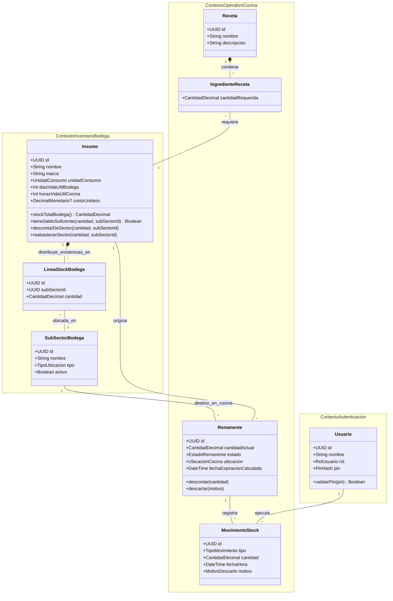
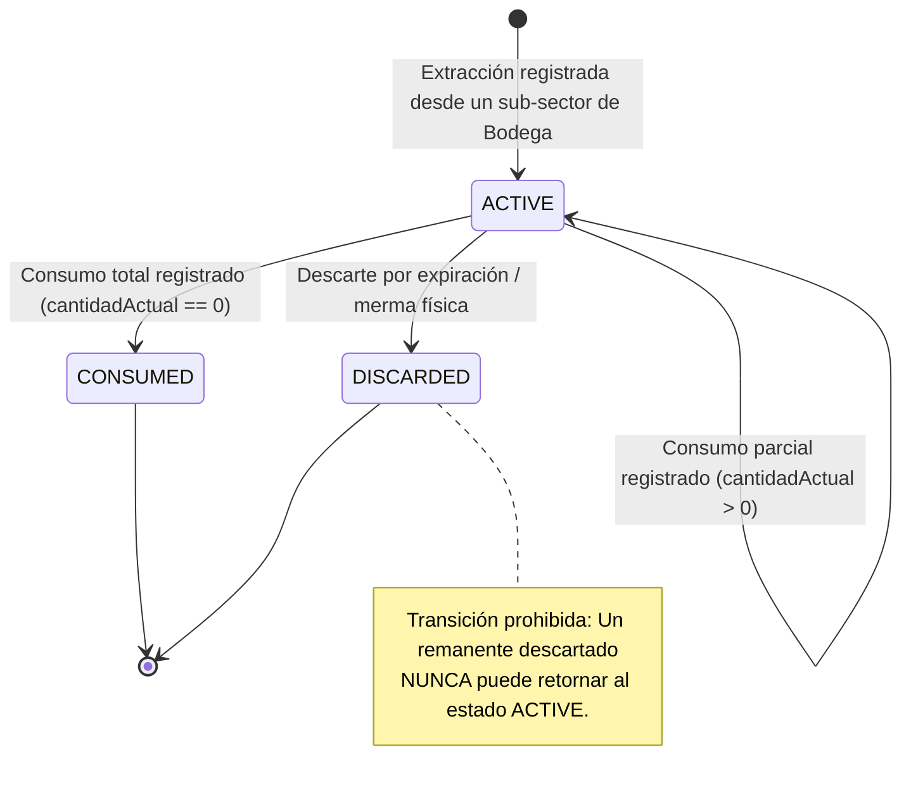

# 🧠 Modelo Conceptual de Dominio Agnóstico (RestoStock)

> **Navegación del Framework SDD:**  
> [⬅️ Volver al PRD (02_prd.md)](../01_product_definition/02_prd.md) | [📖 Glosario & Reglas](../01_product_definition/01_glosario_y_reglas_negocio.md) | [Siguiente: Diseño Técnico (04_technical_design.md) ➡️](./04_technical_design.md)

---

## 🧭 1. Contextos Delimitados (Bounded Contexts) & Agregados

---

> **Agregado `Insumo` (US-025):** el `Insumo` es la raíz del agregado y contiene sus `LineaStockBodega` (una por cada sub-sector donde tiene existencias). El stock de bodega **no** es un escalar del `Insumo` sino la suma de sus líneas. Toda extracción o reabastecimiento opera sobre una línea concreta identificada por `subSectorId`; no existe una línea "por defecto". `SubSectorBodega` (`StorageLocation`) es un agregado propio del catálogo de configuración y se referencia por identidad.

---

## 🔄 2. Ciclo de Vida y Transiciones de Estado del Remanente

---

## 💎 3. Value Objects (Objetos de Valor Inmutables)

1. **`CantidadDecimal`:** Representa un volumen, masa o cantidad física no negativa con escala explícita de **4 decimales** (ej. `"1.5000"`). Garantiza que las operaciones aritméticas de suma y resta no generen saldos en negativo ni errores flotantes.
2. **`PinOperario`:** Credencial de autenticación rápida en cocina de exactamente 4 dígitos numéricos.
3. **`RangoExpiracion`:** Modela la regla FEFO (First Expired, First Out) calculando la fecha límite entre el vencimiento industrial de bodega y el límite TRR de 24 horas de la cocina.

---

## ⚡ 4. Eventos de Dominio (Domain Events)

- **`RemanenteCreadoEvent`:** Emitido cuando un insumo cerrado se abre y pasa a cocina como remanente activo.
- **`StockDescontadoEvent`:** Emitido al registrar un consumo parcial o total por preparación o receta.
- **`RemanenteDescartadoEvent`:** Emitido cuando un remanente es dado de baja por expiración o merma física.
- **`ConciliacionTurnoCompletadaEvent`:** Emitido al cerrar el turno y auto-descartar remanentes vencidos.

---

## 🛡️ 5. Invariantes de Dominio Innegociables

- **Invariante 1 (No Saldos Negativos):** La `cantidadActual` de un `Remanente` nunca puede decrecer por debajo de `0.0000`. **Extensión US-025:** la `cantidad` de cada `LineaStockBodega` tampoco puede ser negativa; una extracción que supere el saldo del **sub-sector de origen elegido** se rechaza atómicamente (`HTTP 422`) sin descontar de ninguna otra línea del mismo insumo.
- **Invariante 4 (Sub-Sector con Existencias es Indeleble, US-025):** Un `SubSectorBodega` (`StorageLocation`) referenciado por al menos una `LineaStockBodega` con `cantidad > 0` no puede eliminarse ni marcarse como inactivo; la operación se rechaza con `HTTP 409 Conflict`.
- **Invariante 2 (Caducidad Acelerada TRR):** Todo `Remanente` abierto en cocina hereda como límite máximo de vida útil el valor menor entre su vencimiento original y 24 horas.
- **Invariante 3 (Trazabilidad e Inmutabilidad de Movimientos):** Un `MovimientoStock` registrado es inmutable.
- **Invariante 5 (Área de Cocina con Remanentes Activos es Indeleble, US-026 / ADR-003):** Un `StorageLocation` con `type = KITCHEN` referenciado por al menos un `Remanente` en estado `ACTIVE` no puede eliminarse ni desactivarse (`HTTP 409`). El `Remanente.storageLocationId` pasa a ser una FK (antes literal libre).
- **Invariante 6 (Cuadre de Preparación de Receta, ADR-003 / US-028):** Al cerrar una `RecipePreparation`, para cada ingrediente debe cumplirse exactamente `extraído = consumido + sobrante + merma` (aritmética Decimal). `merma > 0 ⇒ motivo obligatorio`.
- **Invariante 7 (Devolución de Sobrante a Bodega solo si Intacto, ADR-003 / US-028):** Un `Remanente` solo puede reingresar su sobrante a un sub-sector de bodega si `isPristine == true` (cero consumo registrado) **y** el operario lo marca "envase sin abrir". El reloj FEFO (`expirationDate`) del sobrante que queda en cocina se conserva al reubicarlo.

> **Nota — nuevo agregado `RecipePreparation` (ADR-003):** representa una tanda de preparación de una receta. Se abre automáticamente al extraer de bodega con `purpose = RECIPE` (`OPEN`), agrupa los `Remanente` de esa tanda (`Remanente.recipePreparationId`), y se resuelve con `close` (conciliación consumo/sobrante/merma → `RecipePreparationItem[]`) o `abandon`. Ver [`ADR-003`](adr/ADR-003-recipe-preparation-tracking.md).
