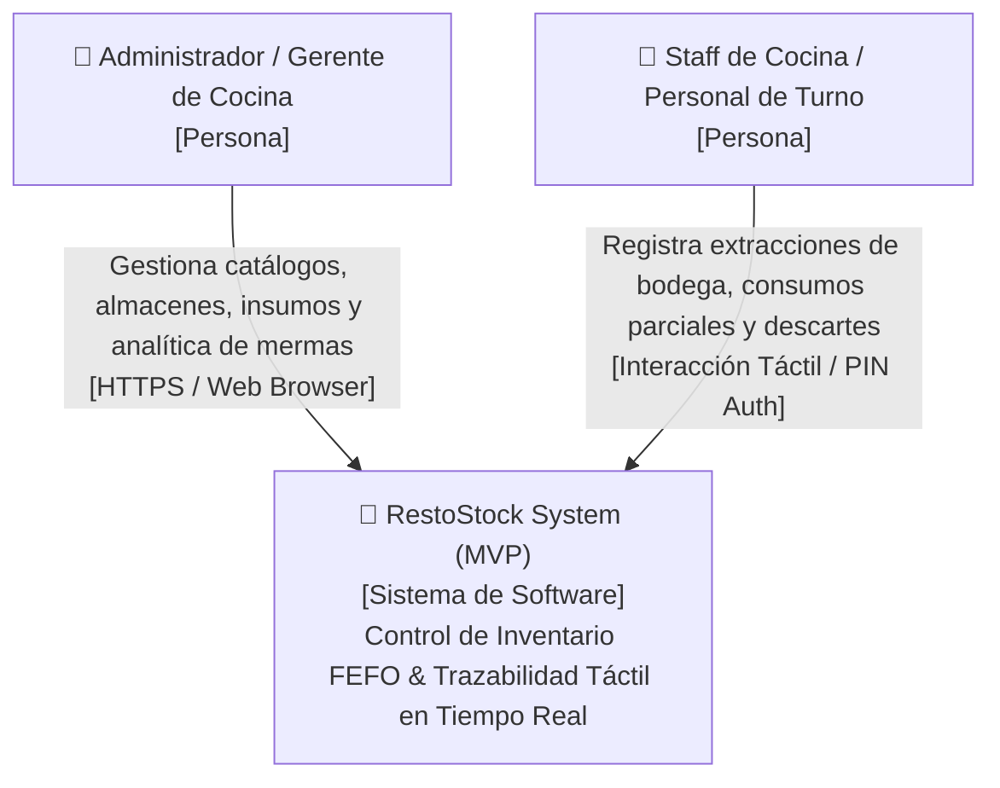
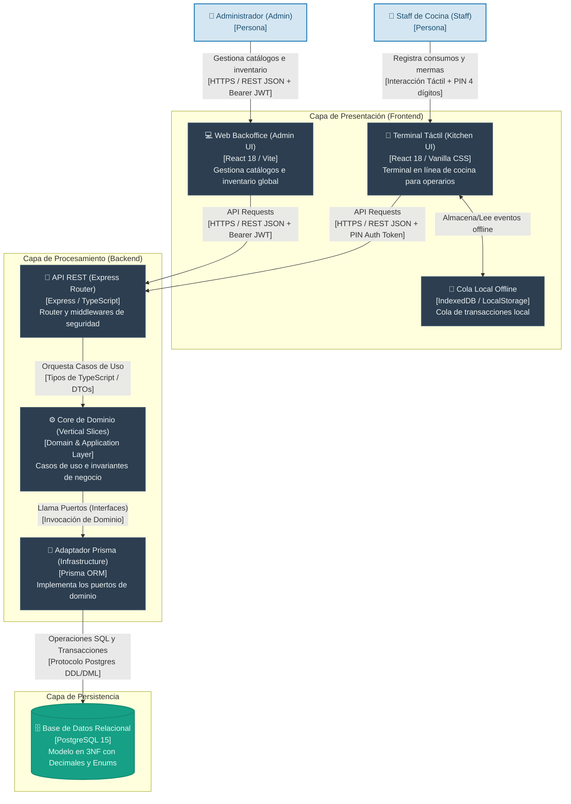
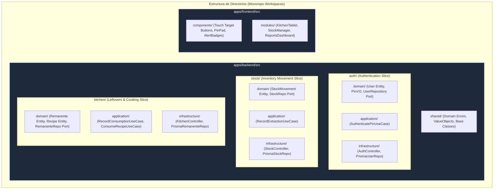
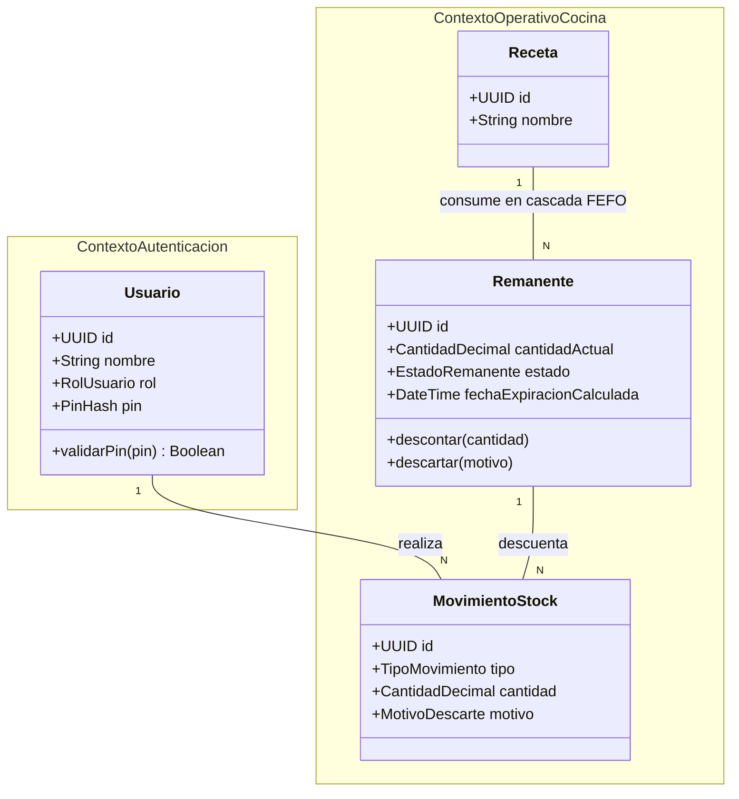
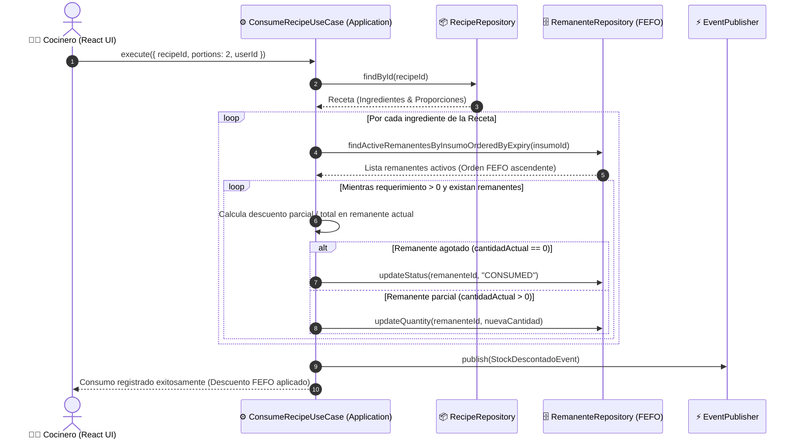
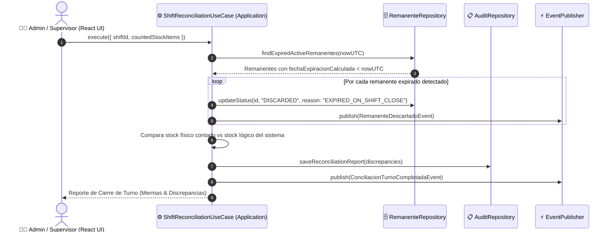
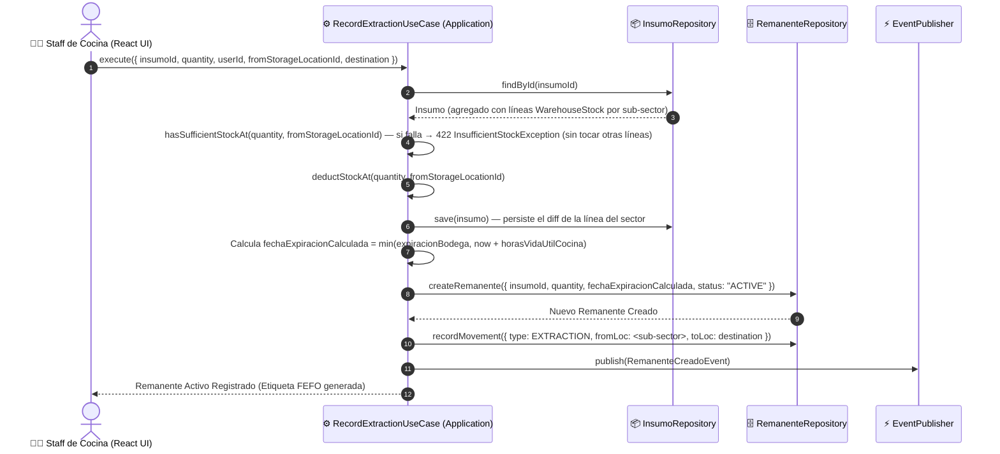

# 🏛️ Especificación de Arquitectura de Sistema y Stack Tecnológico

> **Navegación del Framework SDD:**  
> [⬅️ Volver al Modelo de Dominio (03_domain_model.md)](./03_domain_model.md) | [📖 Glosario & Reglas](../01_product_definition/01_glosario_y_reglas_negocio.md) | [Siguiente: Sistema de Diseño UI/UX (05_ui_ux_design_system.md) ➡️](./05_ui_ux_design_system.md)

---

## 🛠️ 1. Selección y Aprobación del Stack Tecnológico

### Composición del Stack Oficial
- **Core Backend:** Node.js, TypeScript 5.x, Express.js.
- **Core Frontend:** React 18, Vite, Modular Vanilla CSS (UI táctil con targets mínimos de 48px).
- **Persistencia & DB:** PostgreSQL 15, Prisma ORM 5.x, In-Memory Repositories para tests de Vitest.
- **Validación & Sanitización:** Schemas con Zod (sanitización activa en todos los HTTP endpoints).
- **Precisión Aritmética de Dominio:** `decimal.js` (obligatorio para saldos, masas, volúmenes y stock).
- **Suite de Pruebas:** Vitest / React Testing Library (TDD estricto, cobertura de mutación $\ge$ 70%).
- **Infraestructura & Contenedores:** Docker Compose (PostgreSQL 15), `pnpm` monorepo workspaces.

### Justificación Técnica & Trade-Offs
1. **Node.js + Express.js:** Ofrece latencia ultra baja para transacciones táctiles de cocina y amplia compatibilidad con middlewares de sanitización.
2. **`decimal.js` en Dominio:** Previene completamente los errores de acumulación de coma flotante de JS (IEEE 754) en las extracciones y consumos de inventario.
3. **Prisma ORM + In-Memory Fakes:** Permite iteración rápida TDD con repositorios falsos en memoria durante desarrollo/testing sin depender del contenedor Postgres encendido.

### Matriz de Riesgos y Estrategia de Mitigación
| Riesgo Técnico | Impacto | Estrategia Arquitectónica de Mitigación |
| :--- | :--- | :--- |
| **Concurrencia en Consumos en Línea:** Múltiples operarios descontando stock del mismo remanente. | Alto | Transacciones atómicas en Prisma ORM + bloqueos pesimistas / optimistas a nivel de base de datos. |
| **Pérdida de Conexión en Terminal Táctil:** Red de cocina inestable. | Medio | Cola de eventos en cliente (`IndexedDB / OfflineQueue`) con sincronización diferida idempotente. |
| **Degradación de Precisión en JSON:** Pérdida de decimales al serializar números. | Alto | **Invariante de Serialización:** Todos los valores `Decimal` se transmiten en JSON estrictamente como `string` (ej: `"150.0000"`). |

---

## 📊 2. Diagramas de Arquitectura (Modelo C4 Nivel 1, 2, 3 y 4)

### 2.1. C4 Nivel 1: Diagrama de Contexto (System Context Diagram)

### 2.2. C4 Nivel 2: Diagrama de Contenedores (Container Diagram)

---

### 2.3. C4 Nivel 3: Diagrama de Componentes (Component Diagram - Screaming Architecture)

---

### 2.4. C4 Nivel 4: Diagrama de Código y Dominio (Code Diagram - Class & Entities)

> *Ver especificación de detalle de código y modelo de clases en [`docs/02_architecture_design/03_domain_model.md`](./03_domain_model.md).*

### 2.5. Diagrama de Despliegue Físico Infraestructura Docker (Physical Deployment Topology)

```mermaid
graph TD
    subgraph HostServer ["🖥️ SERVIDOR HOST PRODUCCIÓN / DOCKER ENGINE"]
        subgraph Net ["🌐 Red Aislada Docker (resto_net)"]
            subgraph FrontendContainer ["📱 Contenedor Web Frontend (Node 18 Alpine / Vite)"]
                ReactApp["React 18 Touch UI App (Puerto 3000)"]
            end

            subgraph BackendContainer ["⚙️ Contenedor API Backend (Node 18 Alpine / Express)"]
                ExpressAPI["Express API Server (Puerto 4000)"]
                ZodGuards["Zod Input Sanitizers"]
                PrismaClient["Prisma Client ORM"]
                ExpressAPI --> ZodGuards
                ZodGuards --> PrismaClient
            end

            subgraph DBContainer ["🗄️ Contenedor Postgres (PostgreSQL 15 Alpine)"]
                PostgresEngine[("PostgreSQL 15 Engine (Puerto 5432)")]
            end
        end

        subgraph Storage ["💾 Almacenamiento Persistente Host"]
            PGData[("Volume: pgdata<br/>/var/lib/postgresql/data")]
        end
    end

    ReactApp -->|"HTTP / REST API (Puerto 4000)"| ExpressAPI
    PrismaClient -->|"TCP Connection (TLS) (Puerto 5432)"| PostgresEngine
    PostgresEngine --- PGData
```

---

### 2.6. Diagramas de Secuencia de Casos de Uso Críticos del Dominio

#### 2.6.1. Consumo por Receta en Cascada FEFO (`ConsumeRecipeUseCase`)

#### 2.6.2. Cierre de Turno y Conciliación (`ShiftReconciliationUseCase`)

#### 2.6.3. Extracción de Bodega a Cocina (`RecordExtractionUseCase`)

> **US-025 — stock por sub-sector:** el agregado `Insumo` mantiene una `WarehouseStockLine` por cada sub-sector de bodega donde tiene existencias (`WarehouseStock` es `1:N` con FK a `StorageLocation`). No hay línea "por defecto": el alta (`CreateInsumoUseCase`) y el reabastecimiento (`RestockInsumoUseCase`) reciben `storageLocationId` obligatorio, y la extracción recibe `fromStorageLocationId`. El "stock de bodega" total del insumo es la suma de sus líneas; el saldo consumible se valida siempre a nivel de línea.

---

## 🧱 4. Responsabilidades de Capas Hexagonales

*   **Capa de Dominio (`domain/`):** Contiene entidades puras, Value Objects (`DecimalQuantity`, `PinHash`), reglas inmutables de negocio e interfaces de **Puertos** (Repositories/Services). **0% dependencias de Express, Prisma o React.**
*   **Capa de Aplicación (`application/`):** Implementa los casos de uso específicos del sistema. Orquesta los flujos invocando entidades de dominio y utilizando los puertos.
*   **Capa de Infraestructura (`infrastructure/`):** Adaptadores concretos (controladores HTTP Express, validadores Zod, repositorios Prisma, integraciones).

### Frontend — Shell de Navegación (`US-023`)

El cliente React adopta `react-router-dom@7.18.3` (data router) a partir de v1.13.0 del stack manifest. El componente raíz `<AppShell>` (barra lateral tipo comanda + topbar de navegación) envuelve un `<Outlet />` con las rutas de nivel superior (`/`, `/estaciones`, `/recetas`, `/reportes`, `/ajustes`). Un componente `<ProtectedRoute requiredRole?>` centraliza el gating por sesión y por rol (`ADMIN` para `/reportes` y `/ajustes`), reemplazando el gating disperso dentro de cada pantalla del menú de Administración. Las features verticales del cliente (`features/*`) no cambian de responsabilidad — solo se montan bajo una ruta en vez de un flag de modal. Detalle en [`05_ui_ux_design_system.md`](./05_ui_ux_design_system.md) §v4.1.0.

---

## 📌 5. Próximos Pasos de Especificación (Siguiente en Cascada SDD)

Para continuar con el pipeline de construcción sin saturar el contexto:
1. **Sistema de Diseño UI/UX:** Ver [`docs/02_architecture_design/05_ui_ux_design_system.md`](./05_ui_ux_design_system.md)
2. **Modelado de Datos 3NF:** Ver [`docs/03_persistence_and_api/06_database_schema.md`](../03_persistence_and_api/06_database_schema.md)
3. **Especificación de API REST & Contratos:** Ver [`docs/03_persistence_and_api/07_api_specification.md`](../03_persistence_and_api/07_api_specification.md)
