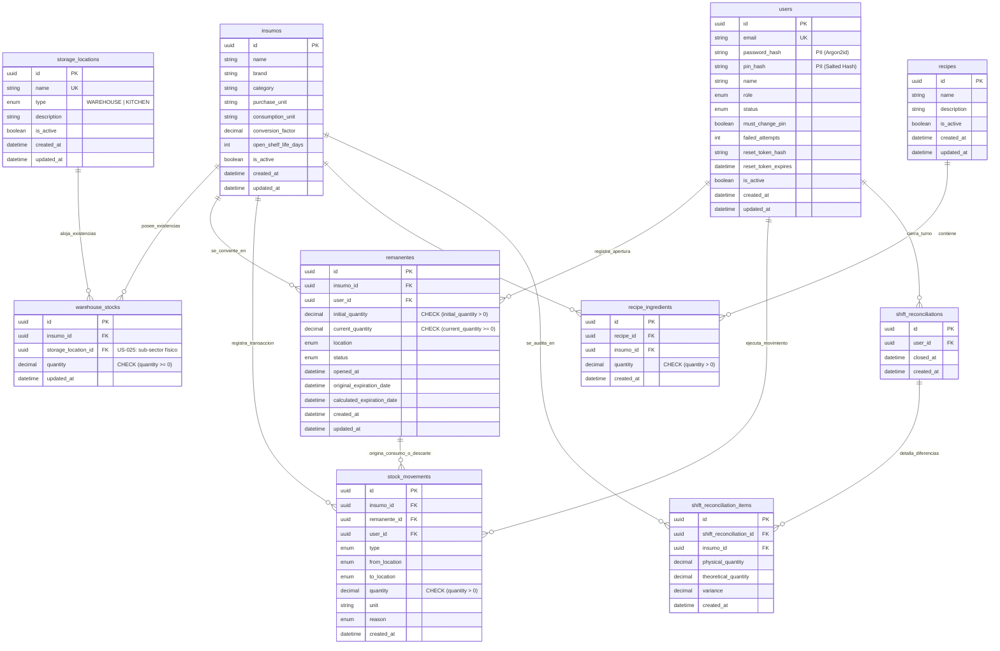

# 🗄️ Especificación del Modelo de Datos y Esquema de Persistencia

> **Navegación del Framework SDD:**  
> [⬅️ Volver a Arquitectura de Sistema (04_technical_design.md)](../02_architecture_design/04_technical_design.md) | [📖 Glosario & Reglas](../01_product_definition/01_glosario_y_reglas_negocio.md) | [Siguiente: Especificación API REST (07_api_specification.md) ➡️](./07_api_specification.md)

---

## 📐 1. Diagrama Entidad-Relación Lógico (Mermaid 3NF ERD)



---

## 🔮 1-bis. Cambios de Esquema Planificados — ADR-003 (Trazabilidad de Preparación de Recetas)

> **Estado:** 📝 Draft — se materializan al implementar `TK-102` → `TK-104` (`US-026`/`US-027`/`US-028`). El §4 (código `schema.prisma`) se actualiza en cada ticket, no aquí. Cada migración requiere aprobación humana del archivo (AGENTS §3).

| Cambio | Ticket | Migración |
| :--- | :--- | :--- |
| `remanentes.location` (`String` literal) → `storage_location_id UUID` FK a `storage_locations` (`onDelete: Restrict`); filas semilla `type = KITCHEN` para los literales `KITCHEN_FRIDGE/PREP/LINE` | `TK-102` | `remanente_location_fk` |
| `remanentes.recipe_preparation_id UUID?` FK a `recipe_preparations` (`onDelete: SetNull`) | `TK-103` | `recipe_preparation` |
| `remanentes.is_pristine BOOLEAN DEFAULT true` (→ `false` en el primer consumo) | `TK-104` | `remanente_pristine` |
| **`recipe_preparations`** (nueva): `id`, `recipe_id` FK, `planned_portions INT`, `actual_portions INT?`, `status` (`OPEN\|CLOSED\|ABANDONED`), `opened_by_operator_id` FK, `opened_at`, `closed_by_operator_id FK?`, `closed_at?`, `notes?` | `TK-103` | `recipe_preparation` |
| **`recipe_preparation_items`** (nueva): `id`, `preparation_id` FK, `insumo_id` FK, `extracted_qty Decimal(12,4)`, `consumed_qty Decimal(12,4)`, `leftover_qty Decimal(12,4)`, `leftover_location_id UUID?` FK, `leftover_remanente_id UUID?` FK, `wasted_qty Decimal(12,4)`, `waste_reason?` | `TK-104` | `recipe_preparation_items` |
| `system_settings.preparation_waste_alert_percent INT DEFAULT 5` | `TK-105` | `settings_prep_waste_pct` |
| Nuevos valores de `stock_movements.type` (columna `String`, sin enum): `CONSUMPTION_RECIPE`, `DISCARD_RECIPE_PREP`, `RETURN_TO_WAREHOUSE`, `TRANSFER_KITCHEN` | `TK-103`/`TK-104`/`TK-105` | — (dato, no DDL) |

---

## 📚 2. Diccionario Físico de Entidades & Gobernanza PII

| Tabla | Campo | Tipo Físico | Restricción / Index | Sensibilidad PII / Cifrado | Descripción |
| :--- | :--- | :--- | :--- | :--- | :--- |
| `users` | `id` | `UUID` | `PRIMARY KEY` | Ninguna | Identificador único del usuario |
| `users` | `email` | `VARCHAR(255)` | `UNIQUE` | PII (Dato Personal) | Correo de acceso administrativo |
| `users` | `password_hash` | `VARCHAR(255)` | `NULLABLE` | Alta (`Argon2id Hash`) | Contraseña cifrada con sal |
| `users` | `pin_hash` | `VARCHAR(255)` | `NULLABLE` | Alta (`Salted PIN Hash`) | PIN de 4 dígitos para cocina táctil |
| `users` | `must_change_pin` | `BOOLEAN` | `NOT NULL DEFAULT true` | Ninguna | Bandera de rotación obligatoria de PIN en primer login (Guard 36) |
| `insumos` | `conversion_factor` | `DECIMAL(10,2)` | `NOT NULL` | Ninguna | Factor de conversión entre unidad de compra y consumo |
| `warehouse_stocks` | `quantity` | `DECIMAL(12,4)` | `CHECK (quantity >= 0)` | Ninguna | Cantidad física del insumo en un sub-sector concreto de la bodega |
| `warehouse_stocks` | `storage_location_id` | `UUID` | `FK → storage_locations(id)` · `UNIQUE (insumo_id, storage_location_id)` | Ninguna | Sub-sector físico de bodega donde reside esta existencia (US-025). `ON DELETE RESTRICT` |
| `storage_locations` | `name` | `VARCHAR(120)` | `UNIQUE` | Ninguna | Nombre del sector físico (ej. `Heladera de Carnes`) |
| `storage_locations` | `type` | `ENUM(WAREHOUSE, KITCHEN)` | `NOT NULL DEFAULT KITCHEN` | Ninguna | Clasifica el sector como sub-bodega o área de cocina |
| `storage_locations` | `is_active` | `BOOLEAN` | `NOT NULL DEFAULT true` | Ninguna | Baja lógica; no puede pasar a `false` si tiene `warehouse_stocks` con saldo (US-025) |
| `remanentes` | `current_quantity` | `DECIMAL(12,4)` | `CHECK (current_quantity >= 0)` | Ninguna | Cantidad remanente utilizable en cocina |
| `remanentes` | `calculated_expiration_date` | `TIMESTAMP` | `INDEX (status, exp_date)` | Ninguna | Fecha FEFO calculada según TRR |
| `system_settings` | `idle_timeout_minutes` | `INTEGER` | `NOT NULL DEFAULT 15` | Ninguna | Minutos de inactividad táctil antes de cerrar sesión automáticamente |


---

## 🌱 3. Datos Semilla Iniciales (Seed Data Fixtures)

Al inicializar el sistema (*cold-start*), la base de datos se poblará obligatoriamente con las siguientes semillas esenciales (*Essential Seeds*) de forma $100\%$ idempotente:

```sql
-- 1. Matriz de Permisos Estándar del Sistema
INSERT INTO permissions (id, code, name, module) VALUES
('perm-1', 'stock:extract', 'Extraer Insumos de Bodega', 'STOCK'),
('perm-2', 'stock:restock', 'Reabastecer Bodega', 'STOCK'),
('perm-3', 'stock:read', 'Consultar Stock e Historial', 'STOCK'),
('perm-4', 'kitchen:recipe_prepare', 'Preparar Recetas FEFO', 'KITCHEN'),
('perm-5', 'kitchen:remanente_consume', 'Consumir/Descartar Remanentes', 'KITCHEN'),
('perm-6', 'reports:view', 'Ver Reportes y Dashboard', 'REPORTS'),
('perm-7', 'users:manage', 'Gestionar Personal', 'USERS'),
('perm-8', 'roles:manage', 'Gestionar Roles y Permisos', 'ROLES')
ON CONFLICT (id) DO UPDATE SET code = EXCLUDED.code, name = EXCLUDED.name, module = EXCLUDED.module;

-- 2. Roles Base y Asignación de Permisos
INSERT INTO roles (id, name, description) VALUES
('role-admin', 'ADMIN', 'Administrador General'),
('role-kitchen', 'KITCHEN_STAFF', 'Personal de Cocina')
ON CONFLICT (id) DO UPDATE SET name = EXCLUDED.name;

-- 3. Usuario Administrador por Defecto (bootstrap-admin)
INSERT INTO users (id, name, role_id, pin_hash, status, must_change_pin, created_at, updated_at)
VALUES (
    'bootstrap-admin',
    'Administrador',
    'role-admin',
    '$salted_hash_seed_pin',
    'ACTIVE',
    true,
    NOW(),
    NOW()
)
ON CONFLICT (id) DO UPDATE SET role_id = EXCLUDED.role_id;


-- Insumos Maestros de Prueba (Categorías Lácteos y Salsas)
INSERT INTO insumos (id, name, brand, category, purchase_unit, consumption_unit, conversion_factor, open_shelf_life_days, is_active, created_at, updated_at)
VALUES 
(
    'e2298c5d-6c17-4886-9a2d-4f1b80e8efea',
    'Queso Mozzarella',
    'La Serenísima',
    'Lácteos',
    'Horma',
    'KG',
    4.00,
    3,
    true,
    NOW(),
    NOW()
),
(
    'd9b01518-9276-46c5-84a1-db9b01518f88',
    'Salsa de Tomate',
    'Pomarola',
    'Salsas',
    'Bidón 5L',
    'L',
    5.00,
    2,
    true,
    NOW(),
    NOW()
);

-- Sectores Físicos de Almacenamiento (US-016 / US-025) — idempotentes por `name` (UNIQUE)
INSERT INTO storage_locations (id, name, type, description, is_active, created_at, updated_at)
VALUES
('loc-seed-unclassified', 'Bodega Principal – Sin clasificar', 'WAREHOUSE', 'Sector por defecto para existencias migradas desde MAIN_WAREHOUSE', true, NOW(), NOW()),
('loc-seed-dry',          'Bodega de Secos',          'WAREHOUSE', 'Estantería de secos y no perecederos', true, NOW(), NOW()),
('loc-seed-meat-fridge',  'Heladera de Carnes',       'WAREHOUSE', 'Refrigerador dedicado a proteínas', true, NOW(), NOW()),
('loc-seed-freezer',      'Cámara de Congelados',     'WAREHOUSE', 'Cámara de congelación', true, NOW(), NOW()),
('loc-seed-kitchen-fridge','Refrigerador Principal Cocina','KITCHEN','Destino de remanentes en línea de fríos', true, NOW(), NOW())
ON CONFLICT (name) DO UPDATE SET type = EXCLUDED.type, description = EXCLUDED.description;
```

> **Migración de datos (US-025):** al aplicar la migración que introduce `warehouse_stocks.storage_location_id`, cada fila existente cuyo antiguo valor `location = 'MAIN_WAREHOUSE'` se re-apunta al sector semilla `loc-seed-unclassified`. La columna `location` antigua se elimina en la misma migración. Ninguna migración aplicada previamente se modifica.

---

## 📄 4. Código del Esquema (`schema.prisma`)

```prisma
datasource db {
  provider = "postgresql"
  url      = env("DATABASE_URL")
}

generator client {
  provider = "prisma-client-js"
}

// ==========================================
// 1. DICCIONARIO DE ENUMS (Dominios Cerrados)
// ==========================================

enum Role {
  ADMIN
  OPERATOR
}

enum MovementType {
  EXTRACTION  // Salida de depósito cerrado a cocina
  CONSUMPTION // Registro de consumo parcial de remanente
  TRANSFER    // Traslado entre sububicaciones o terminales
  DISCARD     // Descarte o merma física
}

enum DiscardReason {
  EXPIRATION
  DAMAGE_OR_DROP
  CONTAMINATION
  SPOILAGE
}

enum LocationType {
  MAIN_WAREHOUSE    // Depósito central / Bodega principal
  KITCHEN_FRIDGE    // Heladera de cocina
  KITCHEN_FREEZER   // Congelador de cocina
  KITCHEN_PANTRY    // Alacena de secos
  KITCHEN_PREP      // Línea de despacho / Preparación
}

enum RemanenteStatus {
  ACTIVE      // Disponible para su uso en cocina
  EXHAUSTED   // Agotado al 100% (nombre real del enum en schema.prisma — "CONSUMED" era un error de este doc, corregido en TK-079)
  DISCARDED   // Retirado por merma/vencimiento
}

// ==========================================
// 2. MODELOS / ENTIDADES (3NF)
// ==========================================

model User {
  id                String          @id @default(uuid()) @db.Uuid
  name              String          @db.VarChar(100)
  roleId            String?         @map("role_id") @db.Uuid
  role              Role?           @relation(fields: [roleId], references: [id], onDelete: SetNull)
  pinHash           String          @map("pin_hash") @db.VarChar(255)
  status            UserStatus      @default(ACTIVE)
  mustChangePin     Boolean         @default(true) @map("must_change_pin")
  failedAttempts    Int             @default(0) @map("failed_attempts")
  email             String?         @unique @db.VarChar(255)
  resetTokenHash    String?         @map("reset_token_hash") @db.VarChar(255)
  resetTokenExpires DateTime?       @map("reset_token_expires")
  isActive          Boolean         @default(true) @map("is_active")
  createdAt         DateTime        @default(now()) @map("created_at")
  updatedAt         DateTime        @updatedAt @map("updated_at")

  // Relaciones
  remanentes           Remanente[]
  stockMovements       StockMovement[]
  shiftReconciliations ShiftReconciliation[]
  temperatureLogs      TemperatureLog[]

  @@map("users")
}

model Insumo {
  id                String   @id @default(uuid()) @db.Uuid
  name              String   @db.VarChar(100)
  brand             String?  @db.VarChar(100)
  category          String   @db.VarChar(50)
  purchaseUnit      String   @map("purchase_unit") @db.VarChar(20)
  consumptionUnit   String   @map("consumption_unit") @db.VarChar(20)
  conversionFactor  Decimal  @map("conversion_factor") @db.Decimal(10, 2)
  unitCost          Decimal? @map("unit_cost") @db.Decimal(12, 2) // US-019: costo por unidad de compra (purchaseUnit), nullable — insumos preexistentes sin costo capturado no bloquean el reporte de mermas, solo quedan fuera de su valorización monetaria.
  openShelfLifeDays Int?     @map("open_shelf_life_days")
  barcode           String?  @unique @db.VarChar(64) // US-032: código de barras (UPC/EAN) escaneado con la cámara del dispositivo; nullable — insumos preexistentes no tienen código capturado. Único cuando presente (evita 2 insumos con el mismo código).
  isActive          Boolean  @default(true) @map("is_active")
  createdAt         DateTime @default(now()) @map("created_at")
  updatedAt         DateTime @updatedAt @map("updated_at")

  // Relaciones
  warehouseStocks          WarehouseStock[]
  remanentes               Remanente[]
  stockMovements           StockMovement[]
  recipeIngredients        RecipeIngredient[]
  shiftReconciliationItems ShiftReconciliationItem[]

  @@map("insumos")
}

model Permission {
  id          String           @id @default(uuid())
  code        String           @unique
  name        String
  module      String
  description String?
  roles       RolePermission[]
}

model RolePermission {
  roleId       String
  permissionId String
  role         Role       @relation(fields: [roleId], references: [id], onDelete: Cascade)
  permission   Permission @relation(fields: [permissionId], references: [id], onDelete: Cascade)

  @@id([roleId, permissionId])
}

model StorageLocation {
  id          String       @id @default(uuid()) @db.Uuid
  name        String       @unique
  type        LocationType @default(KITCHEN)
  description String?
  isActive    Boolean      @default(true)
  createdAt   DateTime     @default(now())
  updatedAt   DateTime     @updatedAt

  // US-025: existencias de bodega alojadas en este sub-sector
  warehouseStocks WarehouseStock[]
  // AUDIT-DEV-006 F-7 / TK-101: movimientos con este sub-sector como origen
  stockMovements  StockMovement[]
  // US-033: lecturas de temperatura registradas para este sub-sector (si es un refrigerador/congelador)
  temperatureLogs TemperatureLog[]

  @@map("storage_locations")
}

// US-033: clasificación del equipo al momento de registrar la lectura — desacoplada de
// StorageLocation.type (WAREHOUSE/KITCHEN, que responde a otra pregunta: dónde está físicamente,
// no si es frío/congelado). Determina el umbral seguro validado en backend (Guard estándar FDA
// Food Code): REFRIGERATOR <= 4.00°C, FREEZER <= -18.00°C.
enum TemperatureUnitType {
  REFRIGERATOR
  FREEZER
}

// US-033: registro manual de temperatura al iniciar turno. El operario lee el termómetro físico
// del equipo y tipea el valor — no hay integración de sensor (Non-Goal #4 del PRD). Un valor fuera
// del umbral seguro NUNCA bloquea el inicio de turno — solo se marca isWithinSafeRange=false para
// que quede visible en el reporte de auditoría (decisión de negocio consultada con el humano).
model TemperatureLog {
  id                 String              @id @default(uuid()) @db.Uuid
  storageLocationId  String              @map("storage_location_id") @db.Uuid
  unitType           TemperatureUnitType @map("unit_type")
  temperatureCelsius Decimal             @map("temperature_celsius") @db.Decimal(5, 2)
  isWithinSafeRange  Boolean             @map("is_within_safe_range")
  recordedByUserId   String              @map("recorded_by_user_id") @db.Uuid
  recordedAt         DateTime            @default(now()) @map("recorded_at")

  storageLocation StorageLocation @relation(fields: [storageLocationId], references: [id], onDelete: Restrict, onUpdate: Cascade)
  recordedBy      User            @relation(fields: [recordedByUserId], references: [id], onDelete: Restrict, onUpdate: Cascade)

  @@index([storageLocationId])
  @@index([recordedAt])
  @@map("temperature_logs")
}

model SystemSettings {
  id                       String   @id @default("default")
  restaurantName           String   @default("RestoStock Kitchen")
  taxId                    String?
  currencySymbol           String   @default("$")
  criticalAlertHours       Int      @default(24)
  defaultRemanenteHours    Int      @default(24)
  varianceTolerancePercent Decimal  @default(5.0) @db.Decimal(5, 2)
  preparationWasteAlertPercent Int  @default(5) // US-029 / TK-105
  updatedAt                DateTime @updatedAt
}

// US-034 / TK-121: Configuración de agente de IA y conectividad
model AiConfiguration {
  id              String   @id @default("default")
  provider        String   @default("HEURISTIC") // GEMINI, OPENAI_COMPATIBLE, HEURISTIC
  modelName       String   @default("gemini-2.5-flash")
  endpointUrl     String?
  encryptedApiKey String?
  temperature     Decimal  @default(0.0) @db.Decimal(3, 2)
  replenishmentOn Boolean  @default(true)
  rescueRecipesOn Boolean  @default(true)
  anomalyAuditOn  Boolean  @default(false)
  updatedAt       DateTime @updatedAt
  updatedBy       String?

  @@map("ai_configurations")
}

model WarehouseStock {
  id                String   @id @default(uuid()) @db.Uuid
  insumoId          String   @map("insumo_id") @db.Uuid
  storageLocationId String   @map("storage_location_id") @db.Uuid
  quantity          Decimal  @db.Decimal(12, 4)
  updatedAt         DateTime @updatedAt @map("updated_at")

  // Relaciones e Integridad Referencial
  insumo          Insumo          @relation(fields: [insumoId], references: [id], onDelete: Cascade, onUpdate: Cascade)
  // US-025: RESTRICT — un sub-sector con existencias no puede borrarse (Invariante 4 de dominio)
  storageLocation StorageLocation @relation(fields: [storageLocationId], references: [id], onDelete: Restrict, onUpdate: Cascade)

  // Restricciones e Índices
  @@unique([insumoId, storageLocationId], name: "idx_unique_insumo_storage_location")
  @@index([storageLocationId])
  @@map("warehouse_stocks")
}

model Remanente {
  id                       String          @id @default(uuid()) @db.Uuid
  insumoId                 String          @map("insumo_id") @db.Uuid
  userId                   String          @map("user_id") @db.Uuid
  initialQuantity          Decimal         @map("initial_quantity") @db.Decimal(12, 4)
  currentQuantity          Decimal         @map("current_quantity") @db.Decimal(12, 4)
  location                 LocationType
  sublocation              String?         @db.VarChar(100)
  status                   RemanenteStatus @default(ACTIVE)
  isPristine               Boolean         @default(true) @map("is_pristine") // US-028 / TK-104: false tras el primer consumo. Habilita "devolver a bodega" junto con el marcado manual "envase sin abrir".
  recipePreparationId      String?         @map("recipe_preparation_id") @db.Uuid // US-027 / TK-103: FK a recipe_preparations (onDelete: SetNull).
  openedAt                 DateTime        @default(now()) @map("opened_at")
  originalExpirationDate   DateTime        @map("original_expiration_date")
  calculatedExpirationDate DateTime        @map("calculated_expiration_date")
  createdAt                DateTime        @default(now()) @map("created_at")
  updatedAt                DateTime        @updatedAt @map("updated_at")
  terminalAt               DateTime?       @map("terminal_at") // US-020: instante exacto de la transicion a EXHAUSTED/DISCARDED — nunca se infiere de updatedAt, que tambien muta por operaciones no terminales (conciliacion de turno).

  // Relaciones
  insumo Insumo @relation(fields: [insumoId], references: [id], onDelete: Cascade, onUpdate: Cascade)
  user   User   @relation(fields: [userId], references: [id], onDelete: Restrict, onUpdate: Cascade)

  stockMovements StockMovement[]

  // Índices
  @@index([status, calculatedExpirationDate])
  @@index([insumoId])
  @@index([userId])
  @@map("remanentes")
}

model StockMovement {
  id           String         @id @default(uuid()) @db.Uuid
  insumoId     String         @map("insumo_id") @db.Uuid
  remanenteId  String?        @map("remanente_id") @db.Uuid
  userId       String         @map("user_id") @db.Uuid
  type         MovementType
  fromLocation LocationType   @map("from_location")
  toLocation   LocationType   @map("to_location")
  quantity     Decimal        @db.Decimal(12, 4)
  unit         String         @db.VarChar(20)
  reason       DiscardReason?
  // ADR-004 / TK-108 / TK-109: motivo estructurado del catálogo ConsumptionReason
  // (CONSUMPTION / SHIFT_RECONCILIATION_VARIANCE). Nullable — histórico previo a la
  // migración, o si el motivo se borrase manualmente en BD (la app solo desactiva).
  reasonId     String?        @map("reason_id") @db.Uuid
  // AUDIT-DEV-006 F-7 / TK-101: id del sub-sector de bodega de origen (FK). `fromLocation`
  // se conserva como snapshot de display para movimientos sin FK (históricos, sin sub-sector).
  fromStorageLocationId String? @map("from_storage_location_id") @db.Uuid
  createdAt    DateTime       @default(now()) @map("created_at")

  // Relaciones
  insumo             Insumo             @relation(fields: [insumoId], references: [id], onDelete: Cascade, onUpdate: Cascade)
  remanente          Remanente?         @relation(fields: [remanenteId], references: [id], onDelete: SetNull, onUpdate: Cascade)
  user               User               @relation(fields: [userId], references: [id], onDelete: Restrict, onUpdate: Cascade)
  consumptionReason  ConsumptionReason? @relation(fields: [reasonId], references: [id], onDelete: SetNull, onUpdate: Cascade)
  fromStorageLocation StorageLocation?  @relation(fields: [fromStorageLocationId], references: [id], onDelete: SetNull, onUpdate: Cascade)

  // Índices
  @@index([createdAt, insumoId])
  @@index([userId])
  @@index([fromStorageLocationId])
  @@index([remanenteId])
  @@index([reasonId])
  @@map("stock_movements")
}

model Recipe {
  id          String             @id @default(uuid()) @db.Uuid
  name        String             @db.VarChar(100)
  description String?            @db.VarChar(500)
  isActive    Boolean            @default(true) @map("is_active")
  createdAt   DateTime           @default(now()) @map("created_at")
  updatedAt   DateTime           @updatedAt @map("updated_at")
  ingredients RecipeIngredient[]
  preparations RecipePreparation[]

  @@map("recipes")
}

// US-027 / US-028 / ADR-003: tanda de preparación de una receta (apertura al extraer
// con purpose=RECIPE; cierre concilia consumo/sobrante/merma).
enum RecipePreparationStatus {
  OPEN
  CLOSED
  ABANDONED
}

model RecipePreparation {
  id                 String                  @id @default(uuid())
  recipeId           String                  @map("recipe_id")
  plannedPortions    Int                     @map("planned_portions")
  status             RecipePreparationStatus @default(OPEN)
  openedByOperatorId String?                 @map("opened_by_operator_id")
  openedAt           DateTime                @default(now()) @map("opened_at")
  actualPortions     Int?                    @map("actual_portions")
  closedByOperatorId String?                 @map("closed_by_operator_id")
  closedAt           DateTime?               @map("closed_at")
  notes              String?
  recipe             Recipe                  @relation(fields: [recipeId], references: [id], onDelete: Restrict)
  remanentes         Remanente[]
  items              RecipePreparationItem[]

  @@index([status])
  @@index([recipeId])
  @@map("recipe_preparations")
}

model RecipePreparationItem {
  id                  String            @id @default(uuid())
  preparationId       String            @map("preparation_id")
  insumoId            String            @map("insumo_id")
  extractedQty        Decimal           @map("extracted_qty") @db.Decimal(12, 4)
  consumedQty         Decimal           @map("consumed_qty") @db.Decimal(12, 4)
  leftoverQty         Decimal           @default(0) @map("leftover_qty") @db.Decimal(12, 4)
  leftoverLocationId  String?           @map("leftover_location_id")
  leftoverRemanenteId String?           @map("leftover_remanente_id")
  wastedQty           Decimal           @default(0) @map("wasted_qty") @db.Decimal(12, 4)
  wasteReason         String?           @map("waste_reason")
  preparation         RecipePreparation @relation(fields: [preparationId], references: [id], onDelete: Cascade)

  @@index([preparationId])
  @@map("recipe_preparation_items")
}

// ADR-004 / US-030: catálogo administrable de motivos de consumo (US-004) y de
// varianza negativa de conciliación de turno (US-008). Se desactiva, nunca se borra.
model ConsumptionReason {
  id        String   @id @default(uuid())
  label     String
  isActive  Boolean  @default(true) @map("is_active")
  createdAt DateTime @default(now()) @map("created_at")
  updatedAt DateTime @updatedAt @map("updated_at")

  movements StockMovement[]

  @@map("consumption_reasons")
}

model RecipeIngredient {
  id        String   @id @default(uuid()) @db.Uuid
  recipeId  String   @map("recipe_id") @db.Uuid
  insumoId  String   @map("insumo_id") @db.Uuid
  quantity  Decimal  @db.Decimal(12, 4)
  createdAt DateTime @default(now()) @map("created_at")

  // Relaciones
  recipe Recipe @relation(fields: [recipeId], references: [id], onDelete: Cascade, onUpdate: Cascade)
  insumo Insumo @relation(fields: [insumoId], references: [id], onDelete: Cascade, onUpdate: Cascade)

  // Restricciones
  @@unique([recipeId, insumoId], name: "idx_unique_recipe_insumo")
  @@index([insumoId])
  @@map("recipe_ingredients")
}

model ShiftReconciliation {
  id        String                    @id @default(uuid()) @db.Uuid
  userId    String                    @map("user_id") @db.Uuid
  closedAt  DateTime                  @default(now()) @map("closed_at")
  createdAt DateTime                  @default(now()) @map("created_at")
  user      User                      @relation(fields: [userId], references: [id], onDelete: Restrict, onUpdate: Cascade)
  items     ShiftReconciliationItem[]

  @@index([userId])
  @@map("shift_reconciliations")
}

model ShiftReconciliationItem {
  id                    String   @id @default(uuid()) @db.Uuid
  shiftReconciliationId String   @map("shift_reconciliation_id") @db.Uuid
  insumoId              String   @map("insumo_id") @db.Uuid
  physicalQuantity      Decimal  @map("physical_quantity") @db.Decimal(12, 4)
  theoreticalQuantity   Decimal  @map("theoretical_quantity") @db.Decimal(12, 4)
  variance              Decimal  @db.Decimal(12, 4)
  createdAt             DateTime @default(now()) @map("created_at")

  // Relaciones
  shiftReconciliation ShiftReconciliation @relation(fields: [shiftReconciliationId], references: [id], onDelete: Cascade, onUpdate: Cascade)
  insumo              Insumo              @relation(fields: [insumoId], references: [id], onDelete: Restrict, onUpdate: Cascade)

  // Restricciones
  @@unique([shiftReconciliationId, insumoId], name: "idx_unique_reconciliation_insumo")
  @@index([insumoId])
  @@map("shift_reconciliation_items")
}
```

---

## 📈 5. Estrategia y Justificación de Índices Físicos

Para garantizar el rendimiento óptimo del motor PostgreSQL ante alta concurrencia de consultas en la cocina táctil y reportes del backoffice, se implementan los siguientes índices:

1. **Índice FEFO en `remanentes (status, calculated_expiration_date)`**:
   - *Justificación:* La pantalla táctil del cocinero consulta constantemente los insumos abiertos y utilizables (`status = 'ACTIVE'`) ordenados del de vencimiento más próximo al más lejano (política FEFO). Un índice compuesto ordenado permite resolver esta consulta con un costo de búsqueda logarítmico $O(\log N)$ directo sobre el índice.

2. **Índice Único en `warehouse_stocks (insumo_id, storage_location_id)`** (US-025):
   - *Justificación:* Asegura que exista **como máximo una** línea de stock por par insumo/sub-sector — el reabastecimiento sobre un sector ya existente hace `UPDATE` de esa fila, no `INSERT` de una duplicada. El índice secundario en `storage_location_id` resuelve en $O(\log N)$ la comprobación "¿este sub-sector tiene existencias?" que bloquea su borrado/desactivación (Invariante 4).

3. **Índice Cronológico Compuesto en `stock_movements (created_at, insumo_id)`**:
   - *Justificación:* Las consultas en el panel administrativo del backoffice suelen listar transacciones de inventario filtrando por rangos de fecha y agrupando por insumo.
