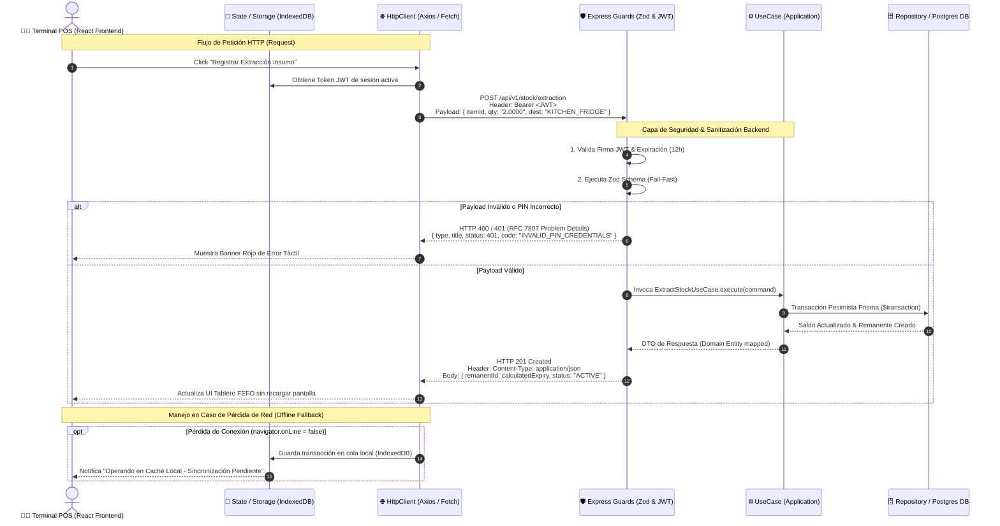

# 🔌 Especificación de API REST y Contratos de Dominio

> **Navegación del Framework SDD:**  
> [⬅️ Volver a Esquema de Base de Datos (06_database_schema.md)](./06_database_schema.md) | [📖 Glosario & Reglas](../01_product_definition/01_glosario_y_reglas_negocio.md) | [Siguiente: Estrategia de Seguridad (08_security_strategy.md) ➡️](../04_governance_and_quality/08_security_strategy.md)

---


## 📊 1. Tabla de Endpoints del MVP

| Método | Endpoint | Payload (Input) | Respuesta (Output) | Descripción |
| :--- | :--- | :--- | :--- | :--- |
| **POST** | `/api/v1/auth/pin` | `AuthPinRequest` | `AuthPinResponse` | Autenticación de operarios de cocina en la tablet mediante PIN de 4 dígitos. |
| **POST** | `/api/v1/stock/extraction` | `RecordExtractionRequest` | `RecordExtractionResponse` | Registra el traslado de insumos cerrados desde la bodega principal hacia la cocina. |
| **GET** | `/api/v1/kitchen/remanentes` | *Ninguno (Query Params)* | `GetRemanentesResponse` | Obtiene la lista de remanentes activos en cocina ordenados bajo el principio FEFO. |
| **POST** | `/api/v1/kitchen/remanentes/{id}/consume` | `ConsumeRemanenteRequest` | `ConsumeRemanenteResponse` | Registra consumos parciales de insumos abiertos (remanentes) durante el servicio. Desde `ADR-004`/`TK-108`: `reasonId` obligatorio (path/payload corregidos — ver nota en §2.4). |
| **POST** | `/api/v1/kitchen/remanentes/:id/discard`| `DiscardRemanenteRequest` | `DiscardRemanenteResponse` | Registra el descarte físico total de un remanente activo por merma o expiración. |
| **POST** | `/api/v1/recipes` | `CreateRecipeRequest` | `CreateRecipeResponse` | Crea una nueva receta con sus ingredientes y proporciones (`TK-057`, ruta actual desde `TK-069` — módulo `recipes` independiente de `catalog`). |
| **GET** | `/api/v1/recipes` | *Ninguno* | `ListRecipesResponse` | Obtiene la lista de recetas (`TK-057`, ruta actual desde `TK-069`). |
| **GET** | `/api/v1/kitchen/recipes` 🚧 | *Ninguno* | `ListRecipesResponse` | *(Nunca implementado)* Reemplazado por `GET /api/v1/recipes` (`TK-057`/`TK-069`) — ver §2.7. |
| **POST** | `/api/v1/kitchen/recipes/:id/consume` | `ConsumeRecipeRequest` | `ConsumeRecipeResponse` | Descuenta stock en cocina en cascada FEFO basado en los ingredientes de la receta. |
| **GET** | `/api/v1/kitchen/recipes/:id/availability` | `?portions=` | `RecipeAvailabilityResponse` | ✅ Done (`TK-111`, `US-007` v1.1.0). Vista previa de solo lectura: requerido vs. disponible por ingrediente, antes de confirmar. Reutiliza el mismo cálculo que `consume`, sin mutar nada. |
| **POST** | `/api/v1/kitchen/shift-reconciliation` | `ShiftReconciliationRequest` | `ShiftReconciliationResponse` | Ejecuta el cierre de turno, auto-descarta vencidos y reporta auditoría de discrepancias. Desde `ADR-004`/`TK-109`: `items[].reasonId` obligatorio en varianza negativa. |
| **POST** | `/api/v1/stock/insumos` | `CreateInsumoRequest` | `CreateInsumoResponse` | Da de alta un insumo nuevo en el catálogo maestro con stock inicial en 0 (`TK-057`). |
| **GET** | `/api/v1/stock/insumos` | *Ninguno* | `ListInsumosResponse` | Obtiene la lista de insumos del catálogo maestro (`TK-057`). |
| **GET** | `/api/v1/stock/insumos/by-barcode/{barcode}` | *Ninguno* | `InsumoResponse` \| `404` | Busca un insumo por código de barras escaneado con la cámara del dispositivo (`TK-119`/`US-032`). |
| **POST** | `/api/v1/kitchen/temperature-logs` | `CreateTemperatureLogRequest` | `TemperatureLogResponse` | Registra la lectura manual de temperatura de un sub-sector al iniciar turno (`TK-120`/`US-033`). Nunca bloquea — un valor fuera de rango solo marca `isWithinSafeRange: false`. |
| **GET** | `/api/v1/kitchen/temperature-logs` | `?storageLocationId=&startDate=&endDate=` | `TemperatureLogResponse[]` | Histórico de lecturas de temperatura para auditoría (`TK-120`/`US-033`). Rol `ADMIN`. |
| **PATCH** | `/api/v1/stock/insumos/{id}/restock` | `RestockInsumoRequest` | `RestockInsumoResponse` | Suma la cantidad recibida a un sub-sector de bodega de un insumo existente (`TK-060` / `US-025`). |
| **GET** | `/api/v1/stock/movements` | `?insumoId=&startDate=&endDate=` | `StockMovementHistoryItem[]` | Histórico de movimientos de stock, auditoría (`TK-050`). Rol `ADMIN`. Desde `TK-101`: cada ítem expone `fromStorageLocationId` — `fromLoc` refleja el nombre ACTUAL del sub-sector si aún existe (join), no un snapshot desincronizable por renombrar. |
| **GET** | `/api/v1/locations` | *Ninguno* | `ListStorageLocationsResponse` | Lista los sectores físicos de almacenamiento (`US-016`). Cualquier rol autenticado. |
| **POST** | `/api/v1/locations` | `CreateStorageLocationRequest` | `StorageLocationResponse` | Da de alta un sector físico (`US-016`). Rol `ADMIN`. |
| **PUT** | `/api/v1/locations/{id}` | `UpdateStorageLocationRequest` | `StorageLocationResponse` | Edita o activa/desactiva un sector (`US-016`). Rol `ADMIN`. `409` si se desactiva un sector con existencias (`US-025`). |
| **DELETE** | `/api/v1/locations/{id}` | *Ninguno* | `204 No Content` | Elimina un sector (`US-016`). Rol `ADMIN`. `409` si tiene existencias asociadas (`US-025`). |
| **GET** | `/api/v1/reports/rotation-metrics` | *Ninguno (Query Params)* | `RotationMetricsResponse` | Retorna la TRR promedio real (`US-020`), el único endpoint que mide directamente el KPI de rotación del PRD. |
| **GET** | `/api/v1/kitchen/recipe-preparations` | `?status=` | `RecipePreparationSummary[]` | ✅ Done ([ADR-003](../02_architecture_design/adr/ADR-003-recipe-preparation-tracking.md) / `TK-103`). Tablero de preparaciones de receta (`OPEN`/`CLOSED`/`ABANDONED`). |
| **GET** | `/api/v1/kitchen/recipe-preparations/{id}` | *Ninguno* | `RecipePreparationDetail` | ✅ Done (`TK-103`). Detalle de una preparación con sus remanentes vinculados (incluye `isPristine` por remanente, `TK-104`). |
| **POST** | `/api/v1/kitchen/recipe-preparations/{id}/close` | `CloseRecipePreparationRequest` | `CloseRecipePreparationResponse` | ✅ Done (`TK-104`/`TK-104-FE`). Concilia la preparación: consumo por cuadre, sobrante con ubicación, merma con motivo. Transaccional. |
| **POST** | `/api/v1/kitchen/recipe-preparations/{id}/abandon` | *Ninguno* | `AbandonRecipePreparationResponse` | ✅ Done (`TK-104`/`TK-104-FE`). Cierra sin conciliar; los remanentes quedan `ACTIVE` sin etiqueta de preparación. |
| **GET** | `/api/v1/reports/preparation-waste` | *Query Params* | `PreparationWasteReportResponse` | ✅ Done (`TK-105`). Merma de preparación por receta/ingrediente/motivo (cantidad + `$` + % + `overThreshold`) + consumo real vs. teórico por receta/ingrediente. Rol `ADMIN`. |
| **GET** | `/api/v1/consumption-reasons` | `?includeInactive=` | `ListConsumptionReasonsResponse` | ✅ Done ([ADR-004](../02_architecture_design/adr/ADR-004-consumption-reason-catalog.md) / `TK-107`, `US-030`). Catálogo administrable de motivos de consumo. Sin filtro: solo activos, cualquier autenticado. `includeInactive=true`: rol `ADMIN`. |
| **POST** | `/api/v1/consumption-reasons` | `CreateConsumptionReasonRequest` | `ConsumptionReason` | ✅ Done (`TK-107`). Crea un motivo (activo por defecto). Rol `ADMIN`. |
| **PUT** | `/api/v1/consumption-reasons/{id}` | `UpdateConsumptionReasonRequest` | `ConsumptionReason` | ✅ Done (`TK-107`). Renombra y/o activa/desactiva un motivo — desactivar, nunca borrar (preserva referencias históricas en `StockMovement.reasonId`). Rol `ADMIN`. |

> **Nota — cambios en endpoints existentes ([ADR-003](../02_architecture_design/adr/ADR-003-recipe-preparation-tracking.md)):**
> - `POST /api/v1/stock/extraction`: `toLocation` (literal) → `toStorageLocationId` (FK a `StorageLocation type=KITCHEN`, `TK-102`); `+ plannedPortions`, `+ recipePreparationId` y `recipeId` obligatorio cuando `purpose=RECIPE` (`TK-103`); `RecordExtractionResponse + recipePreparationId`.
> - `GET /api/v1/kitchen/remanentes` / `remanentes-activos`: `+ storageLocationName` (`TK-102`).
> - `POST /api/v1/kitchen/recipes/:id/consume`: se conserva (consumo ad-hoc) — ✅ Done (`TK-105`): ahora corre dentro de una frontera transaccional (`IStockUnitOfWork.runAdhocConsumption`, revierte por completo ante stock insuficiente de cualquier ingrediente) y emite un `StockMovement` `CONSUMPTION_RECIPE` por cada remanente afectado.
> - `DELETE`/`PUT /api/v1/locations/{id}`: `409` también si un área `type=KITCHEN` tiene remanentes `ACTIVE` (`TK-102`).
> - `GET`/`PUT /api/v1/settings`: ✅ Done (`TK-105`) — `+ preparationWasteAlertPercent` (int, 0-100, default 5).

> **Nota — trazabilidad de consumo ([ADR-004](../02_architecture_design/adr/ADR-004-consumption-reason-catalog.md)):**
> - `/api/v1/consumption-reasons` (`GET`/`POST`/`PUT`): ✅ Done (`TK-107`, `US-030`) — catálogo administrable descrito arriba.
> - `POST /api/v1/kitchen/remanentes/{id}/consume` (consumo de remanente): ✅ Done (`TK-108`) — exige `reasonId` (FK al catálogo activo; `404` si no existe, `400` si está desactivado) `+ notes?` (texto libre siempre opcional). `StockMovement.reasonId` nullable, `onDelete: SetNull`. Breaking change deliberado (`reasonId` es un campo requerido nuevo) — `openapi.yaml` `version: 5.0.0`.
> - `POST /api/v1/kitchen/shift-reconciliation`: ✅ Done (`TK-109`) — cada línea de varianza **negativa** exige `reasonId` (400/404 y **ninguna línea del cierre se aplica** si alguna falla, incluidas las positivas del mismo lote); varianza **positiva** no exige motivo y corrige un bug existente (`Remanente.currentQuantity` ahora se sincroniza con el sobrante vía `Remanente.increaseQuantity`, antes solo quedaba en el `StockMovement` de auditoría).

---

## 📡 1.5. Diagrama de Comunicación Frontend ↔ Backend (Data Flow Sequence)




---

## 🛠️ 2. Detalle Técnico por Endpoint (OpenAPI Spec Blueprint)

### 2.1. `POST /api/v1/auth/pin`
*   **Descripción:** Permite a un operario de cocina iniciar su turno en la tablet táctil ingresando su código PIN de 4 dígitos asociado a su identificador de usuario.
*   **Cabeceras Requeridas:**
    *   `Content-Type: application/json`
*   **Request Payload (`AuthPinRequest`):**
    ```json
    {
      "userId": "c596e191-230d-45db-99ff-411a2f6412b1",
      "pin": "1234"
    }
    ```
*   **Response Success (`200 OK` - `AuthPinResponse`):**
    ```json
    {
      "token": "eyJhbGciOiJIUzI1NiIsInR5cCI6IkpXVCJ9.eyJ1c2VySWQiOiJjNTk2ZTE5MS0yMzBkLTQ1ZGItOTlmZi00MTFhMmY2NDEyYjEiLCJyb2xlIjoiT1BFUkFUT1IifQ.signature",
      "user": {
        "id": "c596e191-230d-45db-99ff-411a2f6412b1",
        "name": "Carlos Gomez",
        "role": "OPERATOR"
      }
    }
    ```
*   **Response Error (`401 Unauthorized`):**
    *   *Causa:* El PIN ingresado no coincide con el hash almacenado o la cuenta del operario se encuentra desactivada.
    ```json
    {
      "error": "UNAUTHORIZED",
      "message": "Invalid PIN credentials or inactive user profile",
      "timestamp": "2026-07-03T16:36:12Z"
    }
    ```
*   **Response Error (`422 Unprocessable Entity`):**
    *   *Causa:* El payload de entrada no cumple con los formatos requeridos por Zod.
    ```json
    {
      "error": "VALIDATION_FAILED",
      "message": "Input validation failed",
      "details": [
        {
          "field": "pin",
          "message": "PIN must be exactly 4 digits"
        }
      ]
    }
    ```

---

### 2.2. `POST /api/v1/stock/extraction`
*   **Descripción:** Registra la salida física de un insumo desde un **sub-sector concreto de la bodega** (`fromStorageLocationId`, obligatorio desde `US-025`). Permite especificar el propósito de la extracción (`KITCHEN_STOCK`, `RECIPE` o `DIRECT_DISCARD`), el motivo descriptivo (`reason`), la receta asociada (`recipeId` si aplica) y la ubicación de destino (`toLocation`), registrando la autoría del operario autenticado (`operatorId`). El backend valida el saldo **de la línea `(insumoId, fromStorageLocationId)`**; si es insuficiente rechaza con `422` sin tocar otras líneas del mismo insumo.
*   **Cabeceras Requeridas:**
    *   `Content-Type: application/json`
    *   `Authorization: Bearer <token_jwt>` (Rol mínimo: `KITCHEN_STAFF` u `ADMIN`)
*   **Request Payload (`RecordExtractionRequest`):**
    ```json
    {
      "insumoId": "e2298c5d-6c17-4886-9a2d-4f1b80e8efea",
      "quantity": "2.0000",
      "fromStorageLocationId": "loc-seed-meat-fridge",
      "toLocation": "KITCHEN_FRIDGE",
      "purpose": "RECIPE",
      "reason": "Preparación menú ejecutivo del día",
      "recipeId": "rec-12345678-90ab-cdef-1234-567890abcdef"
    }
    ```
    *   `fromStorageLocationId` **(obligatorio, US-025)**: id de un `StorageLocation` con `type = WAREHOUSE` y `isActive = true`. `404` si no existe; `422` si el insumo no tiene línea de stock en ese sector.
*   **Response Success (`201 Created` - `RecordExtractionResponse`):**
    ```json
    {
      "remanenteId": "f8a9e223-92b0-464a-93cd-9bc64e22340b",
      "insumoId": "e2298c5d-6c17-4886-9a2d-4f1b80e8efea",
      "insumoName": "Queso Mozzarella",
      "quantityExtracted": "2.0000",
      "fromStorageLocationId": "loc-seed-meat-fridge",
      "remainingSectorStock": "10.0000",
      "remainingWarehouseStock": "18.0000",
      "location": "KITCHEN_FRIDGE",
      "expirationDate": "2026-07-05T16:36:12.000Z",
      "status": "ACTIVE"
    }
    ```
    *   `remainingSectorStock` **(US-025)**: saldo restante en el sub-sector de origen. `remainingWarehouseStock` sigue siendo el total del insumo sumando todos sus sub-sectores.
*   **Response Error (`422 Unprocessable Entity`):**
    *   *Causa:* Cantidad insuficiente en la bodega principal o violación de restricciones.
    ```json
    {
      "error": "INSUFFICIENT_STOCK",
      "message": "Requested quantity (2.0000) exceeds available warehouse stock (0.5000)",
      "timestamp": "2026-07-03T16:36:12Z"
    }
    ```

---

### 2.3. `GET /api/v1/kitchen/remanentes`
*   **Descripción:** Retorna el inventario activo actualmente disponible en la cocina para su uso en preparaciones. La salida está ordenada estrictamente bajo el principio FEFO (First Expired, First Out) según `calculatedExpirationDate` de menor a mayor para evitar mermas por vencimiento.
*   **Cabeceras Requeridas:**
    *   `Authorization: Bearer <token_jwt>` (Rol mínimo: `OPERATOR` u `ADMIN`)
*   **Query Parameters:**
    *   `location` (Opcional): Filtra por ubicación específica (`KITCHEN_FRIDGE`, `KITCHEN_FREEZER`, `KITCHEN_PANTRY`, `KITCHEN_PREP`).
    *   `insumoId` (Opcional, `US-021`): Filtra a los remanentes activos de un único insumo, **en cualquier ubicación de cocina** (no se combina con `location`). Usado por la pantalla de extracción de bodega para advertir de una posible apertura duplicada antes de confirmar una nueva extracción del mismo insumo.
*   **Response Success (`200 OK` - `GetRemanentesResponse`):**
    ```json
    [
      {
        "id": "f8a9e223-92b0-464a-93cd-9bc64e22340b",
        "insumo": {
          "id": "e2298c5d-6c17-4886-9a2d-4f1b80e8efea",
          "name": "Queso Mozzarella",
          "consumptionUnit": "KG"
        },
        "currentQuantity": "1.7500",
        "location": "KITCHEN_FRIDGE",
        "sublocation": "Cámara Lácteos",
        "status": "ACTIVE",
        "calculatedExpirationDate": "2026-07-05T16:30:00Z"
      },
      {
        "id": "31b2e1a3-23ab-41c1-92b1-bb901518f88c",
        "insumo": {
          "id": "d9b01518-9276-46c5-84a1-db9b01518f88",
          "name": "Salsa de Tomate",
          "consumptionUnit": "L"
        },
        "currentQuantity": "5.0000",
        "location": "KITCHEN_PANTRY",
        "sublocation": "Estante Salsas",
        "status": "ACTIVE",
        "calculatedExpirationDate": "2026-07-08T12:00:00Z"
      }
    ]
    ```

---

### 2.4. `POST /api/v1/kitchen/remanentes/{id}/consume`
> **Corrección (`TK-108`):** esta sección documentaba un path (`/kitchen/consumption`), un payload (`remanenteId` en el body) y una respuesta (`RecordConsumptionResponse`) que nunca coincidieron con el controller real (`consumeRemanente` en `kitchen.controller.ts`, `id` en la URL, `ConsumeRemanenteDTO`/`ConsumptionResponseDTO`) — deuda de documentación preexistente, corregida de paso al tocar este endpoint para `ADR-004`.

*   **Descripción:** Registra el consumo parcial (o total) de un remanente activo para la elaboración de platos en cocina. Si el consumo deja la cantidad remanente en `0.000`, el estado del remanente cambia automáticamente a `EXHAUSTED`. Desde `ADR-004`/`TK-108`, exige un motivo estructurado del catálogo (`US-030`).
*   **Cabeceras Requeridas:**
    *   `Content-Type: application/json`
    *   `Authorization: Bearer <token_jwt>` (Rol: `ADMIN` o `KITCHEN_STAFF`)
*   **Request Payload (`ConsumeRemanenteRequest`):**
    ```json
    {
      "quantity": "0.2500",
      "reasonId": "reason-seed-1",
      "notes": "Se sirvió de más en la mesa 4"
    }
    ```
*   **Response Success (`200 OK` - `ConsumeRemanenteResponse`):**
    ```json
    {
      "remanenteId": "f8a9e223-92b0-464a-93cd-9bc64e22340b",
      "consumedQuantity": "0.250",
      "remainingQuantity": "1.500",
      "status": "ACTIVE",
      "isExhausted": false
    }
    ```
*   **Response Error (`400 Bad Request`):** `reasonId` ausente, o referencia un motivo desactivado (`InactiveConsumptionReasonException`).
*   **Response Error (`404 Not Found`):** el remanente no existe, o `reasonId` no matchea ningún `ConsumptionReason`.
*   **Response Error (`422 Unprocessable Entity`):** la cantidad a consumir supera las existencias físicas actuales del remanente (`ExcessConsumptionException`).
    ```json
    {
      "error": "ExcessConsumptionException",
      "message": "No es posible consumir 5.000. La cantidad disponible en el remanente es de 1.750.",
      "timestamp": "2026-07-03T16:36:12Z"
    }
    ```

---

### 2.5. `POST /api/v1/kitchen/remanentes/:id/discard`
*   **Descripción:** Registra la merma física (descarte) total del remanente especificado en el parámetro de la URL. Al realizar esta acción, el remanente cambia su estado a `DISCARDED` y sus existencias se ajustan a `0.0000`, guardando un registro de auditoría en la tabla de movimientos indicando la causa del desperdicio.
*   **Cabeceras Requeridas:**
    *   `Content-Type: application/json`
    *   `Authorization: Bearer <token_jwt>` (Rol mínimo: `OPERATOR`)
*   **Request Payload (`DiscardRemanenteRequest`):** `reason` es un catálogo fijo (no administrable, a diferencia de `ConsumptionReason`/ADR-004), validado por el backend desde `TK-118`: `EXPIRATION`, `DAMAGED` o `QUALITY_FAIL`.
    ```json
    {
      "reason": "EXPIRATION"
    }
    ```
*   **Response Success (`200 OK` - `DiscardRemanenteResponse`):**
    ```json
    {
      "message": "Remanente discarded successfully",
      "remanenteId": "f8a9e223-92b0-464a-93cd-9bc64e22340b",
      "discardedQuantity": "1.5000",
      "status": "DISCARDED"
    }
    ```
*   **Response Error (`404 Not Found`):**
    *   *Causa:* El ID del remanente provisto no existe en la base de datos.
    ```json
    {
      "error": "REMANENTE_NOT_FOUND",
      "message": "Active remanente with ID f8a9e223-92b0-464a-93cd-9bc64e22340b was not found",
      "timestamp": "2026-07-03T16:36:12Z"
    }
    ```

### 2.6. `POST /api/v1/recipes`
*   **Descripción:** Permite al administrador crear una nueva receta asociándole una lista de ingredientes e indicando las porciones necesarias expresadas en la unidad de consumo del ingrediente. Cada `insumoId` referenciado debe existir en el catálogo (`GET /api/v1/stock/insumos`); si no existe, la API responde `404 Not Found` (`TK-057`; ruta movida de `/api/v1/catalog/recipes` a `/api/v1/recipes` en `TK-069`, al extraer `recipes` como módulo independiente de `catalog`).
*   **Cabeceras Requeridas:**
    *   `Content-Type: application/json`
    *   `Authorization: Bearer <token_jwt>` (Rol requerido: `ADMIN`)
*   **Request Payload (`CreateRecipeRequest`):**
    ```json
    {
      "name": "Pizza Margarita",
      "description": "Pizza tradicional con salsa de tomate y mozzarella",
      "ingredients": [
        {
          "insumoId": "e2298c5d-6c17-4886-9a2d-4f1b80e8efea",
          "quantity": "0.1500"
        },
        {
          "insumoId": "d9b01518-9276-46c5-84a1-db9b01518f88",
          "quantity": "0.1000"
        }
      ]
    }
    ```
*   **Response Success (`201 Created` - `CreateRecipeResponse`):**
    ```json
    {
      "message": "Recipe created successfully",
      "recipeId": "aa9f88d1-12cd-41e2-b9e1-bb901518f88c"
    }
    ```

---

### 2.7. `GET /api/v1/kitchen/recipes` 🚧 *(Nunca implementado — hallazgo de `TK-057`: esta sección documentaba un endpoint que jamás tuvo controller/router activo; el frontend de consumo de recetas usa una lista hardcodeada `DEFAULT_RECIPES` como fallback en su lugar. Reemplazado por §2.7-bis, `GET /api/v1/recipes`, real y verificado en `TK-057`/`TK-069`)*
*   **Descripción:** Retorna la lista de recetas activas configuradas en el catálogo maestro para su visualización y selección en la pantalla táctil de cocina.
*   **Cabeceras Requeridas:**
    *   `Authorization: Bearer <token_jwt>` (Rol mínimo: `OPERATOR`)
*   **Response Success (`200 OK` - `ListRecipesResponse`):**
    ```json
    [
      {
        "id": "aa9f88d1-12cd-41e2-b9e1-bb901518f88c",
        "name": "Pizza Margarita",
        "description": "Pizza tradicional con salsa de tomate y mozzarella"
      }
    ]
    ```

### 2.7-bis. `GET /api/v1/recipes`
*   **Descripción:** Retorna la lista de recetas del catálogo maestro con sus ingredientes, implementado en `TK-057` (ruta movida de `/api/v1/catalog/recipes` a `/api/v1/recipes` en `TK-069`, al extraer `recipes` como módulo independiente de `catalog`).
*   **Cabeceras Requeridas:**
    *   `Authorization: Bearer <token_jwt>` (cualquier rol autenticado)
*   **Response Success (`200 OK` - `ListRecipesResponse`):**
    ```json
    [
      {
        "id": "aa9f88d1-12cd-41e2-b9e1-bb901518f88c",
        "name": "Pizza Margarita",
        "category": "Pizzas",
        "description": "Pizza tradicional con salsa de tomate y mozzarella",
        "ingredients": [
          { "insumoId": "e2298c5d-6c17-4886-9a2d-4f1b80e8efea", "quantity": "0.150" }
        ]
      }
    ]
    ```

---

### 2.8. `POST /api/v1/kitchen/recipes/:id/consume`
> **Corrección (`TK-111`):** el ejemplo de respuesta de esta sección no coincidía con `ConsumeRecipeResponse` real — corregido de paso al tocar este endpoint para agregar §2.8-bis.

*   **Descripción:** Ejecuta el descuento de stock rápido basado en la receta provista. El sistema buscará de manera automática todos los remanentes activos de los ingredientes requeridos y los debitará en orden FEFO (fecha de vencimiento más antigua primero). Desde `US-007` v1.1.0, el frontend consulta `GET .../availability` (§2.8-bis) antes de confirmar — este endpoint sigue siendo la autoridad final (`422` si de verdad falta stock).
*   **Cabeceras Requeridas:**
    *   `Content-Type: application/json`
    *   `Authorization: Bearer <token_jwt>` (Rol: `ADMIN` o `KITCHEN_STAFF`)
*   **Request Payload (`ConsumeRecipeRequest`):**
    ```json
    {
      "portions": 2
    }
    ```
*   **Response Success (`200 OK` - `ConsumeRecipeResponse`):**
    ```json
    {
      "recipeId": "aa9f88d1-12cd-41e2-b9e1-bb901518f88c",
      "recipeName": "Pizza Margarita",
      "portions": 2,
      "ingredientsConsumed": [
        { "insumoId": "ins-queso", "totalConsumed": "0.300", "remanentesAffectedCount": 2 }
      ]
    }
    ```

---

### 2.8-bis. `GET /api/v1/kitchen/recipes/:id/availability`
*   **Descripción:** Vista previa de solo lectura (`US-007` v1.1.0 / `TK-111`) — para cada ingrediente de la receta, muestra la cantidad requerida (`RecipeIngredient.quantity × portions`) contra la disponible (suma de remanentes activos de ese insumo). No muta nada; reutiliza exactamente el mismo cálculo que `consume` antes de decidir si el consumo procede. Abierto a cualquier autenticado (dato operativo, igual que `/remanentes-activos`).
*   **Cabeceras Requeridas:**
    *   `Authorization: Bearer <token_jwt>` (cualquier rol autenticado)
*   **Query Params:** `portions` (entero ≥ 1, default `1`).
*   **Response Success (`200 OK` - `RecipeAvailabilityResponse`):**
    ```json
    {
      "recipeId": "aa9f88d1-12cd-41e2-b9e1-bb901518f88c",
      "recipeName": "Pizza Margarita",
      "portions": 2,
      "ingredients": [
        {
          "insumoId": "ins-queso",
          "insumoName": "Queso Mozzarella",
          "unitOfMeasure": "KG",
          "requiredQuantity": "0.300",
          "availableQuantity": "0.500",
          "isSufficient": true
        }
      ],
      "isFullyAvailable": true
    }
    ```
*   **Response Error (`404 Not Found`):** la receta no existe.

---

### 2.9. `POST /api/v1/kitchen/shift-reconciliation`
> **Corrección (`TK-109`):** el payload/respuesta de ejemplo de esta sección no coincidían con `PerformShiftReconciliationUseCase` real (`operatorId` faltante, `insumoId` en vez de `remanenteId`, forma de respuesta distinta) — corregido de paso al tocar este endpoint para `ADR-004`.

*   **Descripción:** Procesa el cierre de turno y la conciliación física de inventario de cocina. Auto-descarta todos los remanentes que hayan excedido el tiempo de vida TRR y registra las desviaciones reportadas por el conteo del operario. Desde `ADR-004`/`TK-109`: cada línea con varianza **negativa** (conteo físico < teórico) exige `reasonId`; si falta, **nada del cierre se aplica** (ni siquiera las líneas con varianza positiva del mismo lote). La varianza **positiva** (superávit) sincroniza `Remanente.currentQuantity` sin exigir motivo.
*   **Cabeceras Requeridas:**
    *   `Content-Type: application/json`
    *   `Authorization: Bearer <token_jwt>` (Rol: `ADMIN` o `KITCHEN_STAFF`)
*   **Request Payload (`ShiftReconciliationRequest`):**
    ```json
    {
      "operatorId": "usr-op-1",
      "notes": "Cierre de turno noche",
      "items": [
        {
          "remanenteId": "e2298c5d-6c17-4886-9a2d-4f1b80e8efea",
          "physicalQuantity": "1.200",
          "reasonId": "reason-seed-1"
        }
      ]
    }
    ```
*   **Response Success (`201 Created` - `ShiftReconciliationResponse`):**
    ```json
    {
      "reconciliationId": "recon-1735900000000",
      "autoDiscardedCount": 3,
      "processedItemsCount": 1,
      "items": [
        {
          "remanenteId": "e2298c5d-6c17-4886-9a2d-4f1b80e8efea",
          "insumoId": "ins-salsa",
          "physicalQuantity": "1.200",
          "theoreticalQuantity": "1.500",
          "variance": "-0.300"
        }
      ]
    }
    ```
*   **Response Error (`400 Bad Request`):** una línea con varianza negativa sin `reasonId`, o con un motivo desactivado.
*   **Response Error (`404 Not Found`):** el `reasonId` de una línea con varianza negativa no matchea ningún `ConsumptionReason`.

---

### 2.10. `GET /api/v1/reports/waste`
*   **Descripción:** Retorna el acumulado consolidado de existencias descartadas (mermas) en un rango de fechas especificado, agrupando el volumen físico total por ingrediente y motivo del descarte.
*   **Cabeceras Requeridas:**
    *   `Authorization: Bearer <token_jwt>` (Rol requerido: `ADMIN`)
*   **Query Parameters:**
    *   `startDate` (String, opcional): Fecha de inicio en formato ISO 8601 (ej: `2026-07-01T00:00:00Z`).
    *   `endDate` (String, opcional): Fecha de fin en formato ISO 8601 (ej: `2026-07-11T23:59:59Z`).
*   **Response Success (`200 OK` - `WasteReportResponse`):**
    ```json
    [
      {
        "insumoId": "e2298c5d-6c17-4886-9a2d-4f1b80e8efea",
        "name": "Queso Mozzarella",
        "brand": "La Serenísima",
        "category": "Lácteos",
        "consumptionUnit": "KG",
        "reason": "EXPIRATION",
        "totalDiscardedQuantity": "3.5000",
        "totalDiscardedCost": "12600.00"
      },
      {
        "insumoId": "d9b01518-9276-46c5-84a1-db9b01518f88",
        "name": "Salsa de Tomate",
        "brand": "Pomarola",
        "category": "Salsas",
        "consumptionUnit": "L",
        "reason": "DAMAGE_OR_DROP",
        "totalDiscardedQuantity": "1.0000",
        "totalDiscardedCost": null
      }
    ]
    ```
    *   `totalDiscardedCost` (`US-019`): `totalDiscardedQuantity × insumo.unitCost`, en la moneda configurada en `SystemSettings.currencySymbol`. Es `null` (no `"0.00"`) cuando el insumo no tiene `unitCost` registrado — la UI debe distinguir "sin costo registrado" de "costo cero" para no subestimar la merma financiera real.
*   **Response Error (`400 Bad Request`):**
    *   *Causa:* Formato incorrecto o no-ISO de las fechas `startDate` o `endDate`.
    ```json
    {
      "error": "BAD_REQUEST",
      "message": "Invalid date format for startDate. Must be ISO 8601 standard",
      "timestamp": "2026-07-11T11:51:30Z"
    }
    ```

---

### 2.11. `POST /api/v1/stock/insumos`
*   **Descripción:** Da de alta un insumo nuevo en el catálogo maestro de bodega, con stock inicial en `0` (`TK-057`). `unitOfMeasure` es una lista cerrada (`KG` | `L` | `UNITS`) — valores fuera de ese set responden `400`.
*   **Cabeceras Requeridas:**
    *   `Content-Type: application/json`
    *   `Authorization: Bearer <token_jwt>` (Rol requerido: `ADMIN`)
*   **Request Payload (`CreateInsumoRequest`):**
    ```json
    {
      "name": "Harina 000",
      "unitOfMeasure": "KG",
      "unitCost": "1800.00",
      "initialWarehouseStock": "25.0000",
      "storageLocationId": "loc-seed-dry"
    }
    ```
    *   `unitCost` (Opcional, `US-019`): Costo expresado **por unidad de compra** (ej. costo de 1 KG completo, no por gramo) — coincide con `unitOfMeasure`, sin factor de conversión intermedio. Máximo 2 decimales y 10 dígitos enteros (coincide exactamente con la columna `Decimal(12,2)` — a diferencia de otros campos `DecimalString` de hasta 4 decimales). Si se omite, el insumo queda sin costo registrado (`unitCost: null`) y su merma no se valoriza en `$` en los reportes hasta que un Administrador lo complete.
    *   `storageLocationId` **(obligatorio, US-025)**: id de un `StorageLocation` con `type = WAREHOUSE` y `isActive = true` donde queda depositado el stock inicial. `400` si falta; `404` si no existe o no es de tipo `WAREHOUSE`.
    *   `initialWarehouseStock` (Opcional, default `"0"`): crea la línea `WarehouseStock (insumo, storageLocationId, initialWarehouseStock)`.
*   **Response Success (`201 Created` - `CreateInsumoResponse`):**
    ```json
    {
      "id": "f3a1c2e0-1234-4abc-9def-0123456789ab",
      "name": "Harina 000",
      "unitOfMeasure": "KG",
      "warehouseStock": "25.0000",
      "stockByLocation": [
        { "storageLocationId": "loc-seed-dry", "storageLocationName": "Bodega de Secos", "quantity": "25.0000" }
      ],
      "unitCost": "1800.00"
    }
    ```
*   **Response Error (`403 Forbidden`):**
    *   *Causa:* El solicitante autenticado no tiene rol `ADMIN`.

---

### 2.12. `GET /api/v1/stock/insumos`
*   **Descripción:** Retorna la lista completa de insumos del catálogo maestro, usada para poblar selectores en extracción de bodega y alta de recetas (`TK-057`).
*   **Cabeceras Requeridas:**
    *   `Authorization: Bearer <token_jwt>` (cualquier rol autenticado)
*   **Response Success (`200 OK` - `ListInsumosResponse`):**
    ```json
    [
      {
        "id": "f3a1c2e0-1234-4abc-9def-0123456789ab",
        "name": "Harina 000",
        "unitOfMeasure": "KG",
        "warehouseStock": "25.0000",
        "stockByLocation": [
          { "storageLocationId": "loc-seed-dry", "storageLocationName": "Bodega de Secos", "quantity": "25.0000" }
        ],
        "unitCost": "1800.00"
      }
    ]
    ```
    *   `warehouseStock` es la suma de `stockByLocation[].quantity` (US-025). Un insumo sin existencias devuelve `stockByLocation: []`.

---

### 2.13. `PATCH /api/v1/stock/insumos/{id}/restock`
*   **Descripción:** Suma la cantidad recibida a la línea de stock del insumo en el **sub-sector indicado** (`TK-060`, ampliado `US-025`) — semántica **incremental**, nunca fija un total absoluto. Si el insumo aún no tenía existencias en ese sub-sector, se crea la línea `WarehouseStock`.
*   **Cabeceras Requeridas:**
    *   `Content-Type: application/json`
    *   `Authorization: Bearer <token_jwt>` (Rol requerido: `ADMIN`)
*   **Request Payload (`RestockInsumoRequest`):**
    ```json
    {
      "quantity": 20,
      "storageLocationId": "loc-seed-freezer"
    }
    ```
    *   `storageLocationId` **(obligatorio, US-025)**: `StorageLocation` de `type = WAREHOUSE` y activo. `400` si falta; `404` si no existe o no es `WAREHOUSE`.
*   **Response Success (`200 OK` - `RestockInsumoResponse`):**
    ```json
    {
      "insumoId": "f3a1c2e0-1234-4abc-9def-0123456789ab",
      "insumoName": "Harina 000",
      "storageLocationId": "loc-seed-freezer",
      "quantityAdded": "20.0000",
      "newSectorStock": "20.0000",
      "newWarehouseStock": "45.0000"
    }
    ```
*   **Response Error (`404 Not Found`):**
    *   *Causa:* El `id` de insumo no existe en el catálogo, o `storageLocationId` no existe / no es de tipo `WAREHOUSE`.
*   **Response Error (`400 Bad Request`):**
    *   *Causa:* `quantity` es cero, negativo o no numérico.
*   **Response Error (`403 Forbidden`):**
    *   *Causa:* El solicitante autenticado no tiene rol `ADMIN`.

---

### 2.14. `GET /api/v1/reports/rotation-metrics`
*   **Descripción:** Retorna la Tasa de Rotación de Remanentes (TRR) promedio real, calculada sobre todos los remanentes que alcanzaron un estado terminal (`EXHAUSTED` o `DISCARDED` — el enum real de `Remanente.status`; la redacción original de este ticket decía "CONSUMED", copiado por error del modelo aspiracional de `06_database_schema.md`, que no coincide con el schema implementado) dentro del rango de fechas indicado. Es el único endpoint que mide directamente el KPI de éxito del producto (`docs/01_product_definition/02_prd.md §1.3`) — hasta `US-020` el sistema forzaba la ventana de 72h pero nunca reportaba si el objetivo se cumplía en la práctica.
*   **Cabeceras Requeridas:**
    *   `Authorization: Bearer <token_jwt>` (Rol requerido: `ADMIN`)
*   **Query Parameters:**
    *   `startDate` (String, requerido): Fecha de inicio en formato ISO 8601.
    *   `endDate` (String, requerido): Fecha de fin en formato ISO 8601.
*   **Response Success (`200 OK` - `RotationMetricsResponse`):**
    ```json
    {
      "averageTrrHours": 48.3,
      "targetTrrHours": 72,
      "sampleSize": 134
    }
    ```
    *   `averageTrrHours` (`US-020`): Promedio de horas transcurridas entre `Remanente.createdAt` y su timestamp terminal. **Decisión de negocio confirmada:** los remanentes descartados (merma) cuentan en el promedio con el tiempo hasta su descarte — el TRR mide el ciclo de vida completo (éxito o fracaso), no solo el consumo exitoso.
    *   `targetTrrHours`: Refleja el umbral de 72h del PRD, para que el frontend renderice un estado visual de cumplimiento sin hardcodear el número.
    *   `sampleSize`: Si es `0`, el frontend debe mostrar un estado vacío explícito — nunca `"0h"`, que se leería engañosamente como un resultado perfecto.
*   **Response Error (`400 Bad Request`):**
    *   *Causa:* Formato incorrecto o no-ISO de las fechas `startDate` o `endDate`.
*   **Response Error (`403 Forbidden`):**
    *   *Causa:* El solicitante autenticado no tiene rol `ADMIN`.

---

### 2.15. `GET /api/v1/stock/insumos/by-barcode/{barcode}`
*   **Descripción:** Busca un insumo del catálogo maestro por su código de barras (UPC/EAN), capturado escaneando con la cámara integrada del dispositivo táctil — sin ningún lector físico dedicado (`US-032`; aclaración del Non-Goal #4 del PRD). Usado por `WarehouseExtractionModal` para preseleccionar el insumo a extraer sin que el operario tenga que buscarlo por nombre.
*   **Cabeceras Requeridas:**
    *   `Authorization: Bearer <token_jwt>` (Cualquier rol autenticado)
*   **Path Parameters:**
    *   `barcode` (String, requerido): código de barras escaneado, tal cual lo decodifica la librería de escaneo del frontend.
*   **Response Success (`200 OK` - `InsumoResponse`):** el insumo cuyo campo `barcode` coincide exactamente.
*   **Response Error (`404 Not Found`):**
    *   *Causa:* Ningún insumo del catálogo tiene ese `barcode` registrado. **Decisión de negocio confirmada:** el frontend NUNCA crea el insumo automáticamente en este caso — solo `ADMIN` puede completar el alta (mismo patrón de rol que `POST /api/v1/stock/insumos`), reutilizando el formulario de alta ya existente con el campo `barcode` pre-rellenado.

---

### 2.16. `POST /api/v1/kitchen/temperature-logs`
*   **Descripción:** Registra la lectura manual de temperatura de un sub-sector (refrigerador o congelador) al iniciar turno (`US-033`). El operario lee el termómetro físico del equipo y tipea el valor — no existe integración de sensor (Non-Goal #4 del PRD).
*   **Cabeceras Requeridas:**
    *   `Authorization: Bearer <token_jwt>` (Cualquier rol autenticado)
*   **Request Body (`CreateTemperatureLogRequest`):**
    ```json
    {
      "storageLocationId": "loc-seed-fridge-a",
      "unitType": "REFRIGERATOR",
      "temperatureCelsius": "3.5"
    }
    ```
*   **Response Success (`201 Created` - `TemperatureLogResponse`):**
    ```json
    {
      "id": "b2c3d4e5-...",
      "storageLocationId": "loc-seed-fridge-a",
      "unitType": "REFRIGERATOR",
      "temperatureCelsius": "3.5",
      "isWithinSafeRange": true,
      "recordedByUserId": "user-seed-001",
      "recordedAt": "2026-09-05T08:00:00Z"
    }
    ```
    *   `isWithinSafeRange`: calculado en backend contra el umbral estándar FDA Food Code — `REFRIGERATOR`: `temperatureCelsius <= 4.00`; `FREEZER`: `temperatureCelsius <= -18.00`. **Decisión de negocio confirmada:** un valor fuera de rango **nunca bloquea** la creación del registro ni el inicio de turno — el campo queda en `false` únicamente para visibilidad en el reporte de auditoría.
*   **Response Error (`404 Not Found`):**
    *   *Causa:* `storageLocationId` no existe.
*   **Response Error (`400 Bad Request`):**
    *   *Causa:* `temperatureCelsius` no es numérico, o `unitType` no es `REFRIGERATOR`/`FREEZER`.

---

### 2.17. `GET /api/v1/kitchen/temperature-logs`
*   **Descripción:** Histórico de lecturas de temperatura para auditoría de cumplimiento (`US-033`).
*   **Cabeceras Requeridas:**
    *   `Authorization: Bearer <token_jwt>` (Rol requerido: `ADMIN`)
*   **Query Parameters:**
    *   `storageLocationId` (String, opcional): filtra por sub-sector.
    *   `startDate` / `endDate` (String, opcionales): rango ISO 8601.
*   **Response Success (`200 OK` - `TemperatureLogResponse[]`):** lista de lecturas, más reciente primero.
*   **Response Error (`403 Forbidden`):**
    *   *Causa:* El solicitante autenticado no tiene rol `ADMIN`.

---


## 📐 3. Mapeo de Tipos de Datos y Preservación de Precisión


Para evitar desajustes y errores en el redondeo financiero y control de stock físico:
1.  **Tipos Decimales de Alta Precisión:** Las cantidades físicas (`quantity`, `initialQuantity`, `currentQuantity`, `quantityConsumed`, `physicalQuantity`) se serializan de forma consistente y determinista exclusivamente como cadenas de texto decimales en formato JSON (ej. `"2.0000"` o `"0.1500"`) para evitar pérdida de precisión por redondeo flotante de JavaScript (IEEE 754). Estas cadenas son validadas en la frontera mediante esquemas de Zod con el patrón `^\d+(\.\d{1,4})?$` y posteriormente convertidas al objeto de valor `DecimalValue` de dominio.
2.  **Formato de Tiempos e Hitos Temporales:** Todas las fechas y vencimientos (`openedAt`, `originalExpirationDate`, `calculatedExpirationDate`) se transmiten obligatoriamente bajo el estándar **ISO 8601** con soporte de huso horario UTC (ej. `YYYY-MM-DDTHH:mm:ssZ`), garantizando total coherencia temporal entre la tablet, la API y la base de datos PostgreSQL.
3.  **Identificadores Únicos Universales:** Todas las entidades lógicas de entrada y salida utilizan exclusivamente identificadores **UUIDv4** para prevenir predecibilidad y asegurar la unicidad entre la base de datos local IndexedDB (desconectada en la cocina) y la base de datos central PostgreSQL.
