# 🗺️ Mapa Jerárquico del Backlog (RestoStock)

> **Navegación del Framework SDD:**  
> [⬅️ Volver a Matriz de Trazabilidad (13_matriz_trazabilidad.md)](./13_matriz_trazabilidad.md) | [📖 Glosario & Reglas](../01_product_definition/01_glosario_y_reglas_negocio.md) | [Siguiente: Registro de Pull Requests (15_history.md) ➡️](./15_history.md)

---

## 📊 Jerarquía de Trazabilidad del MVP

```mermaid
graph TD
    %% Nodos Principales (Roadmap & Epics)
    Roadmap["🎯 RESTOSTOCK MVP<br/>(02_prd.md)"]
    
    EpicAuth["🔐 EPIC: Autenticación y Sesiones<br/>(modules/auth)"]
    EpicStock["📦 EPIC: Control de Bodega<br/>(modules/stock)"]
    EpicKitchen["🍳 EPIC: Operaciones de Cocina<br/>(modules/kitchen)"]
    EpicReports["📊 EPIC: Reportes y Analíticas<br/>(modules/reports)"]
    EpicCatalog["📖 EPIC: Catálogo Maestro<br/>(modules/catalog)"]
    EpicShared["🛠️ Cross-Cutting Shared Kernel"]

    %% Relaciones de Roadmap a Epics
    Roadmap --> EpicAuth
    Roadmap --> EpicStock
    Roadmap --> EpicKitchen
    Roadmap --> EpicReports
    Roadmap --> EpicCatalog
    Roadmap --> EpicShared

    %% Habilitador Técnico Base
    TK001["🎫 TK-001: Configuración Core y BD"]
    EpicShared --> TK001

    %% Epic Auth -> US -> TK
    US001["📝 US-001: Autenticación por PIN"]
    TK002["🎫 TK-002: Auth PIN (Backend)"]
    TK007B["🎫 TK-007-B: Login por PIN (Frontend)"]
    EpicAuth --> US001
    US001 --> TK002
    US001 --> TK007B

    %% Epic Stock -> US -> TK
    US002["📝 US-002: Extracción de Bodega"]
    TK003["🎫 TK-003: Extracciones (Backend)"]
    TK007F["🎫 TK-007-F: Registro Extracción (Frontend)"]
    EpicStock --> US002
    US002 --> TK003
    US002 --> TK007F

    %% Epic Kitchen -> US -> TK
    US003["📝 US-003: Consulta Remanentes FEFO"]
    US004["📝 US-004: Consumo Parcial"]
    US005["📝 US-005: Registro de Descartes"]
    US006["📝 US-006: Consulta de Alertas"]
    US007["📝 US-007: Consumo por Recetas"]
    US008["📝 US-008: Cierre y Conciliación"]

    TK004["🎫 TK-004: Consulta Remanentes (Backend)"]
    TK005["🎫 TK-005: Consumo Parcial (Backend)"]
    TK006["🎫 TK-006: Descarte y Mermas (Backend)"]
    TK007["🎫 TK-007: Alertas y Notificaciones (Frontend)"]
    TK008["🎫 TK-008: Recetas y Cascada (Backend)"]
    TK007C["🎫 TK-007-C: Consumo Recetas (Frontend)"]
    TK009["🎫 TK-009: Cierre y Conciliación (Backend)"]
    TK007D["🎫 TK-007-D: Conciliación Turno (Frontend)"]

    EpicKitchen --> US003
    EpicKitchen --> US004
    EpicKitchen --> US005
    EpicKitchen --> US006
    EpicKitchen --> US007
    EpicKitchen --> US008

    US003 --> TK004
    US004 --> TK005
    US005 --> TK006
    US006 --> TK007
    US007 --> TK008
    US007 --> TK007C
    US008 --> TK009
    US008 --> TK007D

    %% Epic Reports -> US -> TK
    US009["📝 US-009: Dashboard de Mermas"]
    TK010["🎫 TK-010: Módulo Reportes (Backend)"]
    TK007E["🎫 TK-007-E: Dashboard Reportes (Frontend)"]
    EpicReports --> US009
    US009 --> TK010
    US009 --> TK007E

    %% Cierre de Deuda / Post-MVP (TK-048 a TK-051)
    TK048["🎫 TK-048: Cierre Persistencia Parcial (Backend)"]
    EpicShared --> TK048

    US010["📝 US-010: Gestión de Personal"]
    TK049["🎫 TK-049: Gestión Personal (Backend)"]
    TK049FE["🎫 TK-049-FE: Panel Gestión Personal (Frontend)"]
    TK056["🎫 TK-056: Listado de Operarios (Backend)"]
    EpicAuth --> US010
    US010 --> TK049
    US010 --> TK049FE
    US010 --> TK056

    US011["📝 US-011: Trazabilidad de Movimientos"]
    TK050["🎫 TK-050: Trazabilidad Movimientos (Backend)"]
    TK050FE["🎫 TK-050-FE: Panel Auditoría Movimientos (Frontend)"]
    EpicStock --> US011
    US011 --> TK050
    US011 --> TK050FE

    TK051["🎫 TK-051: Bootstrap Primer Admin (Backend)"]
    EpicShared --> TK051

    US012["📝 US-012: Gestión de Catálogo Maestro"]
    TK057["🎫 TK-057: Alta de Insumos y Recetas (Backend)"]
    TK057FE["🎫 TK-057-FE: Panel de Gestión de Catálogo (Frontend)"]
    EpicCatalog --> US012
    US012 --> TK057
    US012 --> TK057FE

    US013["📝 US-013: Reabastecimiento de Bodega"]
    TK060["🎫 TK-060: Reabastecimiento de Bodega (Backend)"]
    TK060FE["🎫 TK-060-FE: Panel de Reabastecimiento (Frontend)"]
    EpicStock --> US013
    US013 --> TK060
    US013 --> TK060FE

    US014["📝 US-014: Trazabilidad Completa Extracciones"]
    TK072["🎫 TK-072: Trazabilidad Extracciones (Backend)"]
    TK072FE["🎫 TK-072-FE: Interfaz Extracciones (Frontend)"]
    EpicStock --> US014
    US014 --> TK072
    US014 --> TK072FE

    US016["📝 US-016: Sectores de Almacenamiento"]
    TK074["🎫 TK-074: Storage Locations API (Backend)"]
    TK074FE["🎫 TK-074-FE: Storage Locations UI (Frontend)"]
    EpicStock --> US016
    US016 --> TK074
    US016 --> TK074FE

    US025["📝 US-025: Stock Multi-Sector de Bodega"]
    TK096["🎫 TK-096: Stock Multi-Sector (Backend)"]
    TK096FE["🎫 TK-096-FE: Selectores de Sub-Sector (Frontend)"]
    EpicStock --> US025
    US016 --> US025
    US025 --> TK096
    US025 --> TK096FE
    TK074 --> TK096

    %% Mejoras derivadas de comparacion competitiva/AppSec externa (2026-09-05)
    US032["📝 US-032: Escaneo de Codigo de Barras"]
    TK119["🎫 TK-119: Busqueda por Barcode (Backend)"]
    TK119FE["🎫 TK-119-FE: Escaneo por Camara (Frontend)"]
    EpicStock --> US032
    US032 --> TK119
    US032 --> TK119FE

    US033["📝 US-033: Registro Manual de Temperatura"]
    TK120["🎫 TK-120: TemperatureLog (Backend)"]
    TK120FE["🎫 TK-120-FE: Panel de Registro + Reporte (Frontend)"]
    EpicKitchen --> US033
    US033 --> TK120
    US033 --> TK120FE

    %% Gap Analysis del PRD (US-019 a US-021) — cierran los 3 KPIs del producto
    US019["📝 US-019: Costeo y Valorización de Mermas"]
    TK078["🎫 TK-078: Costeo de Insumos (Backend)"]
    TK078FE["🎫 TK-078-FE: Valorización en Dashboard (Frontend)"]
    EpicReports --> US019
    US019 --> TK078
    US019 --> TK078FE

    US020["📝 US-020: Indicador TRR Real"]
    TK079["🎫 TK-079: Rotation Metrics (Backend)"]
    TK079FE["🎫 TK-079-FE: Card de KPI TRR (Frontend)"]
    EpicReports --> US020
    US020 --> TK079
    US020 --> TK079FE

    US021["📝 US-021: Advertencia Apertura Duplicada"]
    TK080["🎫 TK-080: Filtro insumoId (Backend)"]
    TK080FE["🎫 TK-080-FE: Advertencia en Extracción (Frontend)"]
    EpicStock --> US021
    US021 --> TK080
    US021 --> TK080FE

    %% Sistema de Diseño FEFO (Turno Dia/Noche) — reemplaza "Senal Industrial" v3.0.0
    US022["📝 US-022: Sistema FEFO Dia/Noche"]
    TK081FE["🎫 TK-081-FE: Nucleo Tokens + Interruptor"]
    TK082FE["🎫 TK-082-FE: Modales de Operacion"]
    TK083FE["🎫 TK-083-FE: Autenticacion Tactil (PIN)"]
    TK084FE["🎫 TK-084-FE: Backoffice y Administracion"]
    EpicShared --> US022
    US022 --> TK081FE
    US022 --> TK082FE
    US022 --> TK083FE
    US022 --> TK084FE
    TK081FE --> TK082FE
    TK081FE --> TK083FE
    TK081FE --> TK084FE

    %% Navegacion por Rutas y Shell FEFO (lamina "Aplicacion" de la propuesta Sistema FEFO)
    US023["📝 US-023: Navegacion por Rutas y Shell FEFO"]
    TK085FE["🎫 TK-085-FE: react-router + AppShell + ProtectedRoute"]
    TK086FE["🎫 TK-086-FE: Boton Circular + Chip 4 Niveles + Boton de Fila"]
    TK087FE["🎫 TK-087-FE: Panel Estado 3 Cubetas + Leyenda Numerica"]
    TK088FE["🎫 TK-088-FE: Auditoria Contraste AAA 7:1"]
    EpicShared --> US023
    US023 --> TK085FE
    US023 --> TK086FE
    US023 --> TK087FE
    US023 --> TK088FE
    TK084FE --> TK085FE
    TK085FE --> TK086FE
    TK086FE --> TK087FE
    TK087FE --> TK088FE

    %% Correccion de consistencia de US-023: contenido de ruta inline
    US024["📝 US-024: Contenido de Ruta Inline"]
    TK089FE["🎫 TK-089-FE: Reportes Inline"]
    TK090FE["🎫 TK-090-FE: Ajustes Sub-Rutas Inline"]
    EpicShared --> US024
    US024 --> TK089FE
    US024 --> TK090FE
    TK085FE --> TK089FE
    TK089FE --> TK090FE

    %% Estilos de Diseño
    classDef default fill:#F2F3F4,stroke:#BDC3C7,stroke-width:1px,color:#2C3E50;
    classDef roadmap fill:#FFC300,stroke:#FF5733,stroke-width:2px,color:#000;
    classDef epic fill:#F9E79F,stroke:#F39C12,stroke-width:2px,color:#000;
    classDef us fill:#EBF5FB,stroke:#3498DB,stroke-width:1.5px,color:#1B4F72;
    classDef tk fill:#F2F3F4,stroke:#7F8C8D,stroke-width:1.5px,color:#2C3E50;

    class Roadmap roadmap;
    class EpicAuth,EpicStock,EpicKitchen,EpicReports,EpicCatalog,EpicShared epic;
    class US001,US002,US003,US004,US005,US006,US007,US008,US009,US010,US011,US012,US013,US014,US016,US019,US020,US021,US022,US023,US024,US025,US032,US033 us;
    class TK001,TK002,TK003,TK004,TK005,TK006,TK007,TK008,TK009,TK010,TK007B,TK007C,TK007D,TK007E,TK007F,TK048,TK049,TK049FE,TK050,TK050FE,TK051,TK056,TK057,TK057FE,TK060,TK060FE,TK072,TK072FE,TK078,TK078FE,TK079,TK079FE,TK080,TK080FE,TK081FE,TK082FE,TK083FE,TK084FE,TK085FE,TK086FE,TK087FE,TK088FE,TK089FE,TK090FE,TK119,TK119FE,TK120,TK120FE tk;
```

---

## 🔗 Tabla de Navegación del Backlog (Alternativa)

| Epic / Módulo | Historia de Usuario (US) | Ticket Técnico (Backend) | Ticket Técnico (Frontend) | Estado |
| :--- | :--- | :--- | :--- | :---: |
| **🛠️ Shared Kernel** | *N/A (Habilitador Técnico)* | [TK-001: Configuración Core y BD](12_tickets/shared/backend/TK-001.md) | N/A | ✅ Done |
| **🔐 Autenticación (`auth`)** | [US-001: Autenticación por PIN](11_user_stories/auth/US-001.md) | [TK-002: Implementación Auth PIN](12_tickets/auth/backend/TK-002.md) | [TK-007-B: Login por PIN](12_tickets/auth/frontend/TK-007-B.md) | ✅ Done |
| **📦 Bodega (`stock`)** | [US-002: Extracción de Bodega](11_user_stories/stock/US-002.md) | [TK-003: Implementación Extracciones](12_tickets/stock/backend/TK-003.md) | [TK-007-F: Registro Extracciones](12_tickets/stock/frontend/TK-007-F.md) | ✅ Done |
| **🍳 Cocina (`kitchen`)** | [US-003: Consulta Remanentes FEFO](11_user_stories/kitchen/US-003.md) | [TK-004: Consulta Remanentes](12_tickets/kitchen/backend/TK-004.md) | [TK-007: Alertas y Notificaciones](12_tickets/kitchen/frontend/TK-007.md) | ✅ Done |
| | [US-004: Consumo Parcial](11_user_stories/kitchen/US-004.md) | [TK-005: Consumo Parcial](12_tickets/kitchen/backend/TK-005.md) | [TK-007: Alertas y Notificaciones](12_tickets/kitchen/frontend/TK-007.md) | ✅ Done |
| | [US-005: Registro de Descartes](11_user_stories/kitchen/US-005.md) | [TK-006: Descarte y Mermas](12_tickets/kitchen/backend/TK-006.md) | [TK-007: Alertas y Notificaciones](12_tickets/kitchen/frontend/TK-007.md) | ✅ Done |
| | [US-006: Consulta de Alertas](11_user_stories/kitchen/US-006.md) | N/A *(Cross-cutting)* | [TK-007: Alertas y Notificaciones](12_tickets/kitchen/frontend/TK-007.md) | ✅ Done |
| | [US-007: Consumo por Recetas](11_user_stories/kitchen/US-007.md) | [TK-008: Recetas y Cascada FEFO](12_tickets/kitchen/backend/TK-008.md) | [TK-007-C: Consumo Recetas](12_tickets/kitchen/frontend/TK-007-C.md) | ✅ Done |
| | [US-008: Cierre y Conciliación](11_user_stories/kitchen/US-008.md) | [TK-009: Cierre y Conciliación](12_tickets/kitchen/backend/TK-009.md) | [TK-007-D: Conciliación Turno](12_tickets/kitchen/frontend/TK-007-D.md) | ✅ Done |
| **📊 Reportes (`reports`)** | [US-009: Dashboard de Mermas](11_user_stories/reports/US-009.md) | [TK-010: Módulo de Reportes](12_tickets/reports/backend/TK-010.md) | [TK-007-E: Dashboard Reportes](12_tickets/reports/frontend/TK-007-E.md) | ✅ Done |
| **🛠️ Shared Kernel** | *N/A (Cierre de Deuda)* | [TK-048: Cierre Persistencia Parcial](12_tickets/shared/backend/TK-048.md) | N/A | ✅ Done |
| **🔐 Autenticación (`auth`)** | [US-010: Gestión de Personal](11_user_stories/auth/US-010.md) | [TK-049](12_tickets/auth/backend/TK-049.md) + [TK-056: Listado de Operarios](12_tickets/auth/backend/TK-056.md) | [TK-049-FE: Panel de Gestión de Personal](12_tickets/auth/frontend/TK-049-FE.md) | ✅ Done |
| **📦 Bodega (`stock`)** | [US-011: Trazabilidad de Movimientos](11_user_stories/stock/US-011.md) | [TK-050: Trazabilidad de Movimientos](12_tickets/stock/backend/TK-050.md) | [TK-050-FE: Panel de Auditoría de Movimientos](12_tickets/stock/frontend/TK-050-FE.md) | ✅ Done |
| **🛠️ Shared Kernel** | *N/A (Habilitador de Despliegue)* | [TK-051: Bootstrap Primer Administrador](12_tickets/shared/backend/TK-051.md) | N/A | ✅ Done |
| **📖 Catálogo (`catalog`)** | [US-012: Gestión de Catálogo Maestro](11_user_stories/catalog/US-012.md) | [TK-057: Alta de Insumos y Recetas](12_tickets/catalog/backend/TK-057.md) | [TK-057-FE: Panel de Gestión de Catálogo](12_tickets/catalog/frontend/TK-057-FE.md) | ✅ Done |
| **📦 Bodega (`stock`)** | [US-013: Reabastecimiento de Bodega](11_user_stories/stock/US-013.md) | [TK-060: Reabastecimiento de Bodega](12_tickets/stock/backend/TK-060.md) | [TK-060-FE: Panel de Reabastecimiento](12_tickets/stock/frontend/TK-060-FE.md) | ✅ Done |
| **📦 Bodega (`stock`)** | [US-014: Trazabilidad Completa Extracciones](11_user_stories/stock/US-014.md) | [TK-072: Trazabilidad Extracciones](12_tickets/stock/backend/TK-072.md) | [TK-072-FE: Interfaz Extracciones](12_tickets/stock/frontend/TK-072-FE.md) | ✅ Done |
| **🔐 Seguridad (`security`)** | [US-015: Permisos y Roles Dinámicos](11_user_stories/security/US-015.md) | [TK-073: Backend Dynamic RBAC](12_tickets/security/backend/TK-073.md) | [TK-073-FE: Dynamic RBAC UI](12_tickets/security/frontend/TK-073-FE.md) | 📋 Approved Spec |
| **📦 Bodega (`stock`)** | [US-016: Sectores de Almacenamiento](11_user_stories/stock/US-016.md) | [TK-074: Storage Locations API](12_tickets/stock/backend/TK-074.md) | [TK-074-FE: Storage Locations UI](12_tickets/stock/frontend/TK-074-FE.md) | ✅ Backend Done · FE parcial |
| **📦 Bodega (`stock`)** | [US-025: Stock Multi-Sector de Bodega](11_user_stories/stock/US-025.md) | [TK-096: Stock Multi-Sector (Backend)](12_tickets/stock/backend/TK-096.md) | [TK-096-FE: Selectores de Sub-Sector (Frontend)](12_tickets/stock/frontend/TK-096-FE.md) | ✅ Done |
| **⚙️ Configuración (`settings`)** | [US-017: Configuración del Restaurante](11_user_stories/settings/US-017.md) | [TK-075: System Settings API](12_tickets/settings/backend/TK-075.md) | [TK-075-FE: System Settings UI](12_tickets/settings/frontend/TK-075-FE.md) | 📋 Approved Spec |
| **🔐 Autenticación (`auth`)** | [US-018: Recuperación de PIN de Administrador](11_user_stories/auth/US-018.md) | [TK-077: Admin PIN Recovery API](12_tickets/auth/backend/TK-077.md) | [TK-077-FE: Admin PIN Recovery UI](12_tickets/auth/frontend/TK-077-FE.md) | ✅ Done |
| **📊 Reportes (`reports`)** | [US-019: Costeo y Valorización de Mermas](11_user_stories/reports/US-019.md) | [TK-078: Costeo de Insumos](12_tickets/reports/backend/TK-078.md) | [TK-078-FE: Valorización en Dashboard](12_tickets/reports/frontend/TK-078-FE.md) | ✅ Done |
| **📊 Reportes (`reports`)** | [US-020: Indicador TRR Real](11_user_stories/reports/US-020.md) | [TK-079: Rotation Metrics](12_tickets/reports/backend/TK-079.md) | [TK-079-FE: Card de KPI TRR](12_tickets/reports/frontend/TK-079-FE.md) | ✅ Done |
| **📦 Bodega (`stock`)** | [US-021: Advertencia Apertura Duplicada](11_user_stories/stock/US-021.md) | [TK-080: Filtro `insumoId`](12_tickets/stock/backend/TK-080.md) | [TK-080-FE: Advertencia en Extracción](12_tickets/stock/frontend/TK-080-FE.md) | ✅ Done |
| **🛠️ Shared (`shared`)** | [US-022: Sistema FEFO Día/Noche](11_user_stories/shared/US-022.md) | N/A | [TK-081-FE](12_tickets/shared/frontend/TK-081-FE.md) → [082](12_tickets/shared/frontend/TK-082-FE.md) → [083](12_tickets/shared/frontend/TK-083-FE.md) → [084](12_tickets/shared/frontend/TK-084-FE.md) | ✅ Done |
| **🛠️ Shared (`shared`)** | [US-023: Navegación por Rutas y Shell FEFO](11_user_stories/shared/US-023.md) | N/A | ✅ [TK-085-FE](12_tickets/shared/frontend/TK-085-FE.md) → [086](12_tickets/shared/frontend/TK-086-FE.md) → [087](12_tickets/shared/frontend/TK-087-FE.md) → [088](12_tickets/shared/frontend/TK-088-FE.md) | ✅ Done |
| **🛠️ Shared (`shared`)** | [US-024: Contenido de Ruta Inline](11_user_stories/shared/US-024.md) | N/A | ✅ [TK-089-FE](12_tickets/shared/frontend/TK-089-FE.md) → [090](12_tickets/shared/frontend/TK-090-FE.md) | ✅ Done |
| **📦 Bodega (`stock`)** | [US-014](11_user_stories/stock/US-014.md) · [US-025](11_user_stories/stock/US-025.md) — remediación [AUDIT-DEV-006](../audits/AUDIT-DEV-006-warehouse-extraction-quality-report.md) | [TK-098: Integridad Transaccional + Decremento Atómico](12_tickets/stock/backend/TK-098.md) → [TK-099: Reloj/ID + Auditoría](12_tickets/stock/backend/TK-099.md) → [TK-101: fromStorageLocationId (F-7)](12_tickets/stock/backend/TK-101.md) | [TK-100-FE: Propagación de Errores + Aritmética Decimal](12_tickets/stock/frontend/TK-100-FE.md) | ✅ Done (TK-101 📝 Draft) |
| **📦 Bodega (`stock`)** | [US-026: Áreas de Cocina como Catálogo + Destino Dinámico](11_user_stories/stock/US-026.md) — [ADR-003](../02_architecture_design/adr/ADR-003-recipe-preparation-tracking.md) | [TK-102: Áreas KITCHEN + `Remanente.location` → FK](12_tickets/stock/backend/TK-102.md) | [TK-102-FE: Destino Dinámico + Gestión de Áreas](12_tickets/stock/frontend/TK-102-FE.md) | ✅ Done |
| **🍳 Cocina (`kitchen`)** | [US-027: Apertura de Preparación de Receta al Extraer](11_user_stories/kitchen/US-027.md) — [ADR-003](../02_architecture_design/adr/ADR-003-recipe-preparation-tracking.md) | [TK-103: Agregado `RecipePreparation`](12_tickets/kitchen/backend/TK-103.md) | [TK-103-FE: Extracción + Tablero de Preparaciones](12_tickets/kitchen/frontend/TK-103-FE.md) | 🏗️ Backend Done · FE pendiente |
| **🍳 Cocina (`kitchen`)** | [US-028: Cierre de Preparación — Sobrante con Ubicación + Merma con Motivo](11_user_stories/kitchen/US-028.md) — [ADR-003](../02_architecture_design/adr/ADR-003-recipe-preparation-tracking.md) | [TK-104: Cierre y Abandono de Preparación](12_tickets/kitchen/backend/TK-104.md) | [TK-104-FE: Pantalla "Cerrar Preparación"](12_tickets/kitchen/frontend/TK-104-FE.md) | 📝 Draft |
| **📊 Reportes (`reports`)** | [US-029: Reporte de Mermas de Preparación + Auditoría del Consumo Ad-hoc](11_user_stories/reports/US-029.md) — [ADR-003](../02_architecture_design/adr/ADR-003-recipe-preparation-tracking.md) | [TK-105: Reporte + `CONSUMPTION_RECIPE`](12_tickets/reports/backend/TK-105.md) | [TK-105-FE: Panel de Reporte](12_tickets/reports/frontend/TK-105-FE.md) | 📝 Draft (diferible) |
| **📦 Bodega (`stock`)** | [US-032: Escaneo de Código de Barras en Extracción de Bodega](11_user_stories/stock/US-032.md) — comparación competitiva/AppSec externa (2026-09-05) | [TK-119: Búsqueda por Barcode](12_tickets/stock/backend/TK-119.md) | [TK-119-FE: Escaneo por Cámara](12_tickets/stock/frontend/TK-119-FE.md) — librería pendiente (Guard 24) | 📋 Spec aprobada |
| **🍳 Cocina (`kitchen`)** | [US-033: Registro de Temperatura de Refrigeración al Iniciar Turno](11_user_stories/kitchen/US-033.md) — comparación competitiva/AppSec externa (2026-09-05) | [TK-120: `TemperatureLog`](12_tickets/kitchen/backend/TK-120.md) | [TK-120-FE: Panel de Registro + Reporte](12_tickets/kitchen/frontend/TK-120-FE.md) | 📋 Spec aprobada |
| **⚙️ Configuración (`settings`)** | [US-034: Panel de Configuración de Agentes IA](11_user_stories/settings/US-034_configuracion_agente_ia.md) | [TK-123: Persistencia y API de Configuración IA](12_tickets/settings/backend/TK-123.md) | [TK-123-FE: Panel /ajustes/ia (Frontend)](12_tickets/settings/frontend/TK-123-FE.md) | ✅ Done |
| | remediación [AUDIT-DEV-012](../audits/AUDIT-DEV-012-ai-config-leakage-and-crud-coverage.md) L-3/L-4/L-5 | [TK-129: Saneamiento del Módulo de Configuración de IA](12_tickets/settings/backend/TK-129.md) | [TK-129-FE: Quitar Toggle de Reabastecimiento Inerte](12_tickets/settings/frontend/TK-129-FE.md) | ✅ Done |
| **📖 Catálogo (`catalog`)** | [US-036: Edición de un Insumo del Catálogo Maestro](11_user_stories/catalog/US-036_edicion_insumo.md) — [AUDIT-DEV-012](../audits/AUDIT-DEV-012-ai-config-leakage-and-crud-coverage.md) C-1 | [TK-130: PUT /stock/insumos/:id](12_tickets/stock/backend/TK-130.md) | [TK-130-FE: Modal de Edición de Insumo](12_tickets/stock/frontend/TK-130-FE.md) | ✅ Done |
| **📖 Catálogo / Recetas (`catalog`/`recipes`)** | [US-037: Edición y Baja de una Receta del Recetario](11_user_stories/catalog/US-037_edicion_baja_receta.md) — [AUDIT-DEV-012](../audits/AUDIT-DEV-012-ai-config-leakage-and-crud-coverage.md) C-2 | [TK-131: PUT / DELETE /api/v1/recipes/:id](12_tickets/recipes/backend/TK-131.md) | [TK-131-FE: Edición y Baja de Recetas en el Recetario](12_tickets/recipes/frontend/TK-131-FE.md) | ✅ Done |
| **📊 Reportes / Recetas (`reports`)** | [US-035: Recetas de Aprovechamiento Anti-Desperdicio](11_user_stories/reports/US-035_recetas_aprovechamiento_ia.md) | [TK-122: Inferencia IA y Use Case de Rescate](12_tickets/recipes/backend/TK-122.md) | [TK-122-FE: Modal y Conversión a Receta](12_tickets/recipes/frontend/TK-122-FE.md) | ✅ Done |
| | | [TK-124: Modo Dual de Rescate (Catálogo Propio Zero-Leakage & Creativo IA)](12_tickets/recipes/backend/TK-124.md) | [TK-124-FE: Selector de Modo Dual y Badge de Privacidad Zero-Leakage](12_tickets/recipes/frontend/TK-124-FE.md) | ✅ Done |
| | remediación [AUDIT-DEV-007](../audits/AUDIT-DEV-007-recipes-module-quality-report.md) G-A | [TK-125: Aislamiento Hexagonal y De-duplicación del Use Case de Rescate (F-2/F-6/F-13)](12_tickets/recipes/backend/TK-125.md) | N/A *(backend-only)* | ✅ Done |
| | remediación [AUDIT-DEV-007](../audits/AUDIT-DEV-007-recipes-module-quality-report.md) G-B | [TK-126: Frontera de Confianza y Endurecimiento de Adapters de IA (F-3/F-4/F-11/F-14)](12_tickets/recipes/backend/TK-126.md) | N/A *(backend-only)* | ✅ Done |
| | remediación [AUDIT-DEV-007](../audits/AUDIT-DEV-007-recipes-module-quality-report.md) G-C | [TK-127: Deuda de Calidad y Eficiencia del Módulo de Recetas (F-5/F-7/F-8/F-10)](12_tickets/recipes/backend/TK-127.md) | N/A *(backend-only)* | ✅ Done |
| | [US-035](11_user_stories/reports/US-035_recetas_aprovechamiento_ia.md) Esc. 5/6 · [AUDIT-DEV-007](../audits/AUDIT-DEV-007-recipes-module-quality-report.md) G-D | [TK-128: Valorización Monetaria de la Merma Evitada (F-1/F-16)](12_tickets/recipes/backend/TK-128.md) | [TK-128-FE: Badge de Valor Monetario en el Modal](12_tickets/recipes/frontend/TK-128-FE.md) | ✅ Done |
| **🔐 Seguridad (`security`)** | remediación [AUDIT-SEC-003](../audits/AUDIT-SEC-003-rate-limiter-shared-bucket.md) F-1 (C-DEV-006-4) | [TK-132: `trust proxy` + Rate Limiting por Cliente Real](12_tickets/security/backend/TK-132.md) | Frontend: `errorMessageMapper` caso `429` (mismo ticket) | ✅ Done |
| **🔐 Seguridad (`security`)** | remediación [AUDIT-SEC-004](../audits/AUDIT-SEC-004-hardcoded-credentials-and-auth.md) F-1/F-2/F-3 (C-DEV-006-4) | [TK-133: Clave de Cifrado Dedicada + Origin del Reset Validado + Email de Producción Explícito](12_tickets/security/backend/TK-133.md) | N/A *(backend-only)* | ✅ Done |
| **🔐 Seguridad (`security`)** | refresh pre-entrega — `ci_local.sh` destapó CVEs de sept-2026 (C-DEV-006-4 / TK-064) | [TK-134: Refresh de Seguridad Pre-Entrega — `fast-uri`/`mysql2` + Base Alpine](12_tickets/security/backend/TK-134.md) | N/A *(backend/infra)* | ✅ Done |
| **🔐 Seguridad (`security`)** | regresión de TK-133 — smoke test de la Fase 0.2 pre-entrega (C-DEV-006-4) | [TK-135: `CLIENT_ORIGIN`/`ENCRYPTION_KEY` Vacíos Abortan el Arranque en `docker compose`](12_tickets/security/backend/TK-135.md) | N/A *(backend/infra)* | ✅ Done |
| **🔐 Seguridad (`security`)** | barrido de CVEs pre-push — continuación de TK-134 (C-DEV-006-4) | [TK-136: Barrido de CVEs de Dependencias en la Ventana Pre-Push (`js-yaml`)](12_tickets/security/backend/TK-136.md) | N/A *(backend/infra)* | ✅ Done |

