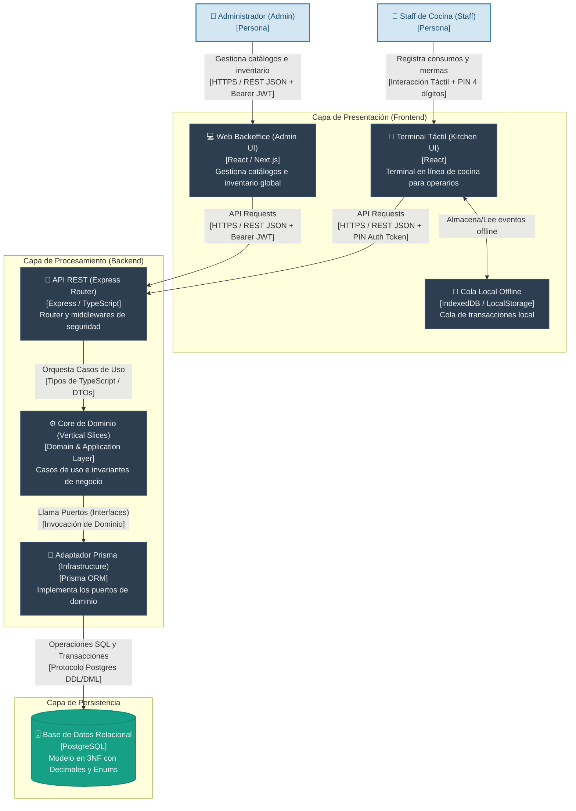
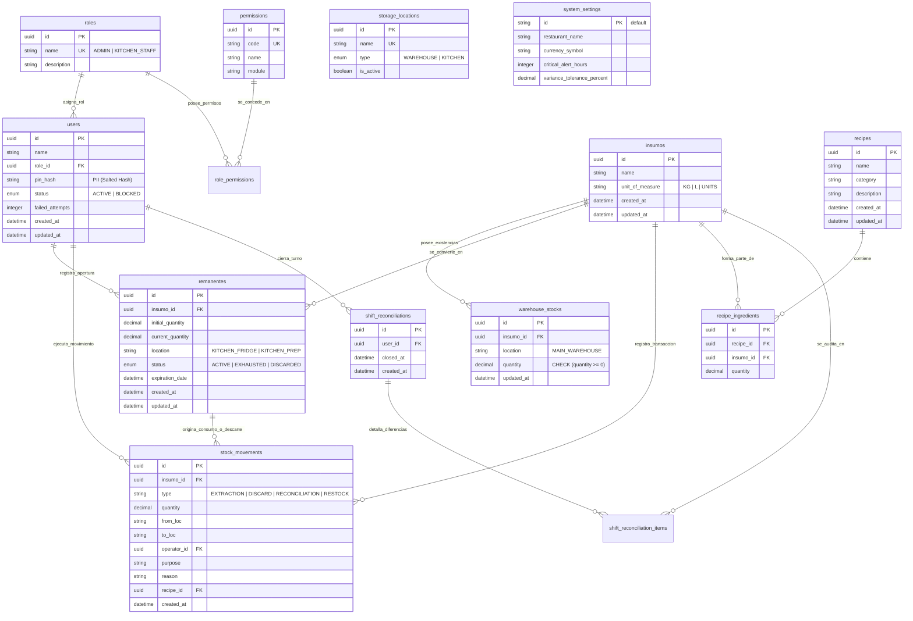

## Índice

0. [Ficha del proyecto](#0-ficha-del-proyecto)
1. [Descripción general del producto](#1-descripción-general-del-producto)
2. [Arquitectura del sistema](#2-arquitectura-del-sistema)
3. [Modelo de datos](#3-modelo-de-datos)
4. [Especificación de la API](#4-especificación-de-la-api)
5. [Historias de usuario](#5-historias-de-usuario)
6. [Tickets de trabajo](#6-tickets-de-trabajo)
7. [Pull requests](#7-pull-requests)

---

## 0. Ficha del proyecto

### **0.1. Tu nombre completo:** Jose David Lacruz Mora

### **0.2. Nombre del proyecto:** RestoStock

### **0.3. Descripción breve del proyecto:**
RestoStock es un sistema inteligente y ágil de trazabilidad e inventario para cocinas de restaurantes. Está diseñado para mitigar la merma de alimentos mediante la ordenación FEFO (First Expired, First Out) de remanentes e insumos abiertos en tiempo real, calculando dinámicamente la fecha de expiración acelerada tras su apertura.

### **0.4. URL del proyecto:**
No hay despliegue público en vivo — el proyecto corre localmente vía `pnpm dev` o `docker compose up` (ver sección de arquitectura y `docs/00_stack_manifest.md` para instrucciones).

### **0.5. URL o archivo comprimido del repositorio:**
https://github.com/lacruzjd/AI4Devs-finalproject

---

## 1. Descripción general del producto

### **1.1. Objetivo:**
RestoStock tiene como propósito eliminar las mermas invisibles y desperdicios de alimentos en restaurantes de alta rotación, automatizando el control de insumos abiertos (remanentes). El sistema aporta valor al:
1.  **Reducir pérdidas financieras** forzando un flujo operativo basado en FEFO (First Expired, First Out).
2.  **Facilitar la operación** mediante una interfaz táctil optimizada para operarios de cocina.
3.  **Garantizar la inocuidad alimentaria** calculando dinámicamente fechas de expiración acelerada tras la apertura de empaques originales de fábrica (ventanas TRR y vidas útiles acotadas).

### **1.2. Características y funcionalidades principales:**
*   **Autenticación Táctil con PIN:** Inicio de sesión en tablets de cocina en menos de 5 segundos utilizando un código PIN numérico de 4 dígitos.
*   **Gestión de Extracciones de Bodega:** Registro del traslado de unidades cerradas desde el depósito central a las áreas de preparación, inicializando el remanente activo de cocina con fecha de vencimiento acelerado.
*   **Tablero de Remanentes FEFO:** Panel visual interactivo que prioriza automáticamente los ingredientes más próximos a vencer.
*   **Consumo Parcial y Agotamiento:** Descuento de stock en cocina conforme se elaboran preparaciones, marcando automáticamente como `CONSUMED` los insumos agotados.
*   **Registro de Descartes y Mermas:** Declaración explícita de descartes por daño, contaminación u obsolescencia cronológica para alimentar reportes analíticos de merma.
*   **Feed Táctil de Alertas Críticas (Notificaciones):** Tablero visual e instantáneo con tarjetas semafóricas que alertan al personal de cocina sobre vencimientos inminentes (FEFO), roturas de stock de seguridad por ingrediente y avisos de pérdida de red en la terminal.
*   **Descuento Rápido de Stock por Recetas:** Consumo ágil en cocina descontando de forma automática del remanente más antiguo activo (FEFO) según las porciones requeridas por los platos.
*   **Cierre de Turno y Conciliación Rápida:** Flujo de fin de jornada para reportar conteo físico real, auto-descartar insumos vencidos de forma masiva y registrar variaciones de stock.
*   **Dashboard y Reporte de Mermas Visibles:** Panel web administrativo para visualizar de forma consolidada las pérdidas físicas (mermas) por ingrediente y motivo en un rango de fechas, haciendo visible el desperdicio.
*   **Gestión Mínima de Personal:** Panel de administración para dar de alta operarios y bloquear/reactivar cuentas (rol `ADMIN`), sin depender de un redeploy de código.
*   **Trazabilidad de Movimientos de Stock:** Panel de auditoría para consultar el historial de extracciones, consumos y descartes filtrado por insumo, para saber quién movió qué y cuándo.
*   **Persistencia Real en Producción:** Todos los repositorios (incluyendo recetas, conciliaciones de turno y reportes) están respaldados por PostgreSQL en producción, con bootstrap idempotente del primer administrador en cada despliegue nuevo.
*   **Gestión de Catálogo Maestro:** Panel de administración para dar de alta insumos y recetas (rol `ADMIN`) sin depender del script de seed, permitiendo operar con el inventario real del restaurante.
*   **Reabastecimiento de Bodega:** Un Administrador puede sumar stock a un insumo existente cuando llega una entrega del proveedor, para que el restaurante siga operando más allá de la carga inicial de inventario.
*   **Sectores Físicos de Almacenamiento y Stock Multi-Sector** (`US-016` / `US-025`): la bodega se subdivide en sub-sectores reales administrables (Heladera de Carnes, Cámara de Congelados, Bodega de Secos); cada insumo se deposita en un sub-sector concreto al darlo de alta o reabastecerlo, su stock se rastrea por par `(insumo, sub-sector)`, y la extracción a cocina exige elegir el sector de origen validando su saldo.
*   **Trazabilidad Completa de Extracciones:** cada salida de bodega registra propósito (`stock de cocina`, `receta` o `descarte directo`), motivo o receta asociada y la identidad del operario, distinguiendo mermas directas de bodega de los traslados a cocina.
*   **Roles y Permisos Dinámicos (RBAC):** un Administrador crea roles personalizados (Bodeguero, Cocinero, Sub-Chef…) con una matriz granular de permisos desde la web; la UI se habilita por permiso, no por nombre de rol, y el usuario se autoredirige a su pantalla al autenticarse.
*   **Recuperación de PIN por Email:** el Administrador solicita el reseteo de su PIN por correo verificado y recibe un enlace con token de un solo uso y expiración de 15 minutos.
*   **Trazabilidad de Preparación de Recetas y Mermas** (`US-026`–`US-029`): extraer insumos "para una receta" abre una preparación que agrupa la tanda; al cerrarla se declaran porciones producidas, sobrante (con ubicación) y merma (con motivo), y el reporte cruza consumo real vs. teórico por receta.
*   **Catálogo Administrable de Motivos de Consumo:** el consumo manual y las varianzas negativas de conciliación exigen elegir un motivo de una lista consistente y mantenible, en vez de texto libre.
*   **Escaneo de Código de Barras:** al registrar una extracción, el operario escanea el código de barras del insumo con la cámara de la tablet para seleccionarlo sin buscarlo por nombre.
*   **Registro de Temperatura de Refrigeración:** al iniciar el turno se registra la temperatura leída en cada refrigerador/congelador, como evidencia de cumplimiento de seguridad alimentaria.
*   **Reportes de Costeo y Rotación:** costo unitario por insumo y valor monetario de las mermas en el dashboard; indicador TRR real (tiempo medio de rotación de remanentes) contra el objetivo de 72 h; advertencia de apertura duplicada al extraer un insumo ya abierto en cocina.
*   **Recetas de Aprovechamiento Anti-Desperdicio (IA opcional):** el sistema propone recetas para consumir remanentes próximos a caducar usando solo ingredientes disponibles, con un motor heurístico interno o un LLM configurable — **sin que las recetas ni los datos del restaurante salgan al modelo** — y estima la merma monetaria evitada.
*   **Configuración del Agente de IA:** pantalla de ajustes para elegir proveedor (Gemini, OpenAI/Ollama o motor heurístico interno), guardar credenciales cifradas (AES-256-GCM) en base de datos y probar la conectividad.
*   **Edición y Baja del Catálogo Maestro:** un Administrador corrige un insumo (`nombre`, `costo`, `código de barras`) o edita/da de baja una receta; la composición de una receta se congela si ya tiene preparaciones cerradas, para no distorsionar la trazabilidad histórica.
*   **Sistema de Diseño FEFO (Turno Día/Noche):** Interruptor de tema persistido por dispositivo — turno Día (comanda de papel, alto contraste sobre fondo claro) y turno Noche (pizarra de turno, fondo oscuro con acentos en tiza), aplicado a toda la aplicación.
*   **Navegación por Rutas (Shell de Aplicación):** Barra de navegación de nivel superior con direcciones propias (Inventario, Estaciones, Recetas, Reportes, Ajustes) y acceso por rol (Reportes y Ajustes solo `ADMIN`), con soporte de deep-link y botón "atrás" del navegador.


### **1.3. Diseño y experiencia de usuario:**
La aplicación sigue el **Sistema de Diseño FEFO** (`US-022`/`US-023`, ver [`DESIGN.md`](./DESIGN.md) y [`docs/02_architecture_design/05_ui_ux_design_system.md`](./docs/02_architecture_design/05_ui_ux_design_system.md)): superficies opacas de alto contraste con dos turnos conmutables — **Día** (comanda de papel sobre fondo claro) y **Noche** (pizarra de turno sobre fondo oscuro) — optimizada para pantallas táctiles de tablets de 10 pulgadas resistentes a la grasa de cocina:
*   Botones y controles de gran tamaño (mínimo 48px, PIN Pad 64px) para evitar errores de selección.
*   Navegación en un shell de rutas (barra lateral tipo comanda + topbar) con secciones enlazables y acceso por rol; el contenido de cada ruta se muestra inline y Ajustes tiene sub-rutas propias (Configuración, Personal, Roles, Movimientos, Catálogo).
*   Indicadores de urgencia con **color + texto** (nunca solo color): chip de 4 niveles (`Hoy` / `Mañana` / `2 Días` / `4 Días`) y barra "Salud FEFO" con leyenda numérica.
*   PIN Pad digital integrado para autenticación instantánea sin teclados físicos.

### **1.4. Instrucciones de instalación:**
#### Prerrequisitos
*   Node.js (versión 24 LTS o superior)
*   Manejador de paquetes `pnpm` (versión 9 o superior)
*   OpenTofu (versión 1.6 o superior) / Docker Compose (PostgreSQL 15)

#### Pasos para la puesta en marcha local
1.  **Clonar el repositorio y situarse en la rama de la entrega final:**
    ```bash
    git clone https://github.com/lacruzjd/AI4Devs-finalproject.git
    cd AI4Devs-finalproject
    git checkout finalproject-JDLM
    ```
2.  **Instalar dependencias del monorepo:**
    ```bash
    pnpm install
    ```
3.  **Configurar Variables de Entorno:**
    Copie la plantilla de variables de entorno en el backend y frontend:
    ```bash
    cp apps/backend/.env.example apps/backend/.env
    cp apps/frontend/.env.example apps/frontend/.env
    ```
4.  **Ejecutar Pruebas Automatizadas:**
    ```bash
    pnpm test
    ```
5.  **Compilación del Proyecto:**
    ```bash
    pnpm build
    ```
6.  **Iniciar Servidores en modo Desarrollo:**
    Desde la raíz del monorepo (inicia concurrentemente backend y frontend):
    ```bash
    pnpm dev
    ```

---

#### 🚀 Puesta en marcha con Docker (recomendado — la vía verificada)

Es el camino probado end-to-end: levanta PostgreSQL 15, el backend (que aplica las migraciones al arrancar) y nginx sirviendo el frontend.

1.  **Configurar el entorno.** `docker-compose.yml` arranca con `NODE_ENV=production`, así que la validación *Fail-Fast* (Guard 14) **aborta el arranque si falta alguna clave**:
    ```bash
    cp .env.example .env
    ```
    Edita `.env` y sustituye **todos** los `YOUR_KEY_HERE`. Tres son obligatorios y no tienen valor por defecto:

    | Variable | Requisito |
    | :--- | :--- |
    | `JWT_SECRET` | ≥ 32 caracteres de entropía real |
    | `ENCRYPTION_KEY` | ≥ 16 caracteres y **distinta de `JWT_SECRET`** (`AUDIT-SEC-004`) |
    | `SEED_ADMIN_PIN` | 4–6 dígitos. **Sin ella no se crea ningún administrador y no podrás iniciar sesión** |

2.  **Levantar la pila completa:**
    ```bash
    docker compose up --build
    ```

3.  **Abrir la aplicación** en `http://localhost:8080` e iniciar sesión con el PIN definido en `SEED_ADMIN_PIN`. En el primer acceso el sistema **exige rotar el PIN** (Guard 36).

> **Comprobación rápida de salud:** `curl http://localhost:3000/health` debe responder `200`. Los tres contenedores deben figurar como `healthy` en `docker compose ps`.

---

### **1.5. Evidencia de despliegue**

### 🌐 Entorno público

> ## **https://restostock-frontend.onrender.com**

**Acceso:** usuario `bootstrap-admin` con el PIN facilitado por separado. En el primer acceso el sistema **exige rotar el PIN** (Guard 36).

Desplegado con el Blueprint de [`render.yaml`](render.yaml) según la topología decidida en [`ADR-006`](docs/02_architecture_design/adr/ADR-006-render-deployment-topology.md) e implementada en [`TK-142`](docs/05_agile_planning/12_tickets/shared/frontend/TK-142.md): **el backend es un servicio privado**, no alcanzable desde internet. La única puerta pública es el SPA, y `nginx` hace de proxy inverso hacia el backend por la red interna — lo que preserva el **mismo origen** del que dependen [`ADR-005`](docs/02_architecture_design/adr/ADR-005-session-token-storage.md) y la política `connect-src 'self'` de la CSP.

**Verificado contra el despliegue real (2026-09-09):**

| Comprobación | Resultado |
| :--- | :--- |
| `GET /` | `200` |
| Fallback de rutas del SPA (`/estaciones`) | `200`, no 404 |
| Proxy `/api/` → backend privado | `401` — el backend responde y exige autenticación (un `502` habría significado que el proxy no llega) |
| Cabeceras de seguridad de `TK-141` bajo HTTPS | Las 5 presentes: CSP, `X-Content-Type-Options`, `Referrer-Policy`, `X-Frame-Options`, `Permissions-Policy` |
| `camera=(self)` | Presente — sin ella el escáner de códigos de barras (`US-032`) no funcionaría en HTTPS |

---

### 🖥️ Despliegue local reproducible

**Verificado end-to-end el 2026-09-09.** No es una afirmación de documentación: se ejecutó el recorrido exacto de §1.4 partiendo de una base de datos vacía y de un `.env` recién copiado de `.env.example`.

| Comprobación | Resultado |
| :--- | :--- |
| `docker compose config` con un `.env` derivado de la plantilla | ✅ válido, 14/14 variables declaradas |
| Arranque del backend con `NODE_ENV=production` | ✅ `healthy` — la validación *Fail-Fast* (Guard 14) acepta la configuración |
| Migraciones de base de datos | ✅ **18 migraciones aplicadas automáticamente** por `docker-entrypoint.sh` sobre una BD vacía |
| `GET /health` | ✅ `200` |
| `POST /api/v1/auth/login-pin` con `bootstrap-admin` | ✅ devuelve un JWT válido con la matriz de permisos del rol `ADMIN` |
| Cabeceras de seguridad del SPA | ✅ CSP + `X-Content-Type-Options` + `Referrer-Policy` + `X-Frame-Options` + `Permissions-Policy` |
| Fallback de rutas del SPA (`/estaciones`) | ✅ `200`, no 404 |

**Pila desplegada:** 3 contenedores (`restostock_postgres`, `restostock_backend`, `restostock_frontend`), los tres `healthy`. La aplicación queda en `http://localhost:8080`.

> ⚠️ **`SEED_ADMIN_PIN` es obligatoria.** El *bootstrap* del primer administrador se **omite** si no está definida (`seedProductionAdmin`), y sin administrador no es posible iniciar sesión — `POST /api/v1/auth/users` exige ya ser `ADMIN`. En el primer acceso el sistema fuerza la rotación del PIN (Guard 36).

---

## 2. Arquitectura del Sistema

### **2.1. Diagrama de arquitectura:**
El sistema sigue un patrón de **Arquitectura Hexagonal (Ports & Adapters)** y **Vertical Slicing** (Auth, Catalog, Stock, Kitchen). A continuación se muestra el diagrama de contenedores de C4:



### **2.2. Descripción de componentes principales:**
*   **Presentation Layer (Frontend):** SPA única en React 18 + Vite con `react-router-dom` 7 (shell de rutas `AppShell` + `ProtectedRoute` por rol). Implementa llamadas seguras interceptando y enviando los tokens JWT/PIN. En la tablet, incluye una cola local en **IndexedDB** para encolar transacciones en escenarios de inestabilidad de red (conmutación offline).
*   **API & Processing Layer (Backend):** Servidor HTTP Express estructurado en TypeScript. Implementa la lógica de puertos de entrada a través de controladores Express y middlewares de sanitización activa (`Zod`).
*   **Domain & Application Layer:** Capa pura libre de librerías de infraestructura. Define las entidades (`Remanente`, `Insumo`, `User`) y los casos de uso (`RecordExtraction`, `RecordConsumption`, `AuthenticatePin`).
*   **Persistence Layer:** PostgreSQL y Prisma ORM encargados del mapeo físico e integridad transaccional (CASCADE y RESTRICT).

### **2.3. Descripción de alto nivel del proyecto y estructura de ficheros:**
El proyecto está estructurado como un Monorepo utilizando workspaces de `pnpm`. Sigue el **Principio de Cierre Común (CCP)** de modo que la lógica de backend y frontend de una misma feature residen encapsuladas en sus respectivos slices verticales:

```
restostock-monorepo/
├── apps/
│   ├── frontend/             # Frontend React 18 + Vite + react-router-dom 7
│   │   └── src/
│       │       ├── app/          # Shell de rutas: router.tsx, AppShell, ProtectedRoute, routes/ (Inventario, Estaciones, Recetas, Reportes, Ajustes/{configuracion,personal,roles,movimientos,catalogo})
│       │       ├── shared/       # UI reutilizable (ActionButton, UrgencyChip, RowButton, Modal…)
│       │       └── features/     # Slices del Cliente (auth, catalog, stock, kitchen, recipes, reports, security, settings)
│       │
│       └── backend/              # API Express / Node.js
│           ├── prisma/           # schema.prisma y migraciones SQL
│           └── src/
│               ├── shared/       # Shared Kernel (Prisma client, validation middlewares)
│               ├── auth/         # Slice de Autenticación
│               ├── catalog/      # Slice de Catálogo de Insumos
│               ├── stock/        # Slice de Extracciones y Bodega
│               ├── kitchen/      # Slice de Operaciones de Cocina
│               └── reports/      # Slice de Reportes y Analíticas
```

### **2.4. Infraestructura y despliegue:**
El despliegue y aprovisionamiento están automatizados mediante **GitHub Actions 2026 SOTA** (`.github/workflows/ci.yml`) y módulos declarativos de **OpenTofu** (`infrastructure/opentofu/main.tf` bajo licencia MPL-2.0). El pipeline de CI ejecuta:
1.  Verificación de gobernanza agéntica con `bash .agents/scripts/validate_agents.sh` (0 enlaces rotos).
2.  Entorno de ejecución Node 24 LTS con caché optimizada de `pnpm 9`.
3.  Servicio PostgreSQL efímero y aislado en contenedor Docker para tests de integración.
4.  Comprobación de tipos con TypeScript, auditoría estática con linters (`pnpm run lint`), detección de duplicación (`jscpd`, 1.48 % sobre un umbral del 3 %), linter de especificaciones `DESIGN.md` y ejecución de la suite completa de **830 pruebas** automatizadas (587 backend + 243 frontend).
5.  **Seguridad (Job 2, Guard 25/33):** `gitleaks` (secretos), **Semgrep** (SAST sobre el código de la aplicación — distinto y adicional a `gitleaks`), construcción de ambas imágenes Docker y escaneo de CVEs con `trivy`, más auditoría de dependencias con riesgo residual documentado.
6.  Generación y publicación del **SBOM** en formato CycloneDX (`cdxgen`) como artefacto verificable — requisito de OWASP Top 10:2025 A03.
7.  Autenticación segura en la nube mediante OpenID Connect (OIDC) sin almacenamiento de llaves estáticas.

**Entornos de ejecución:**

| Entorno | Declaración | Estado |
| :--- | :--- | :--- |
| Local / Docker | [`docker-compose.yml`](docker-compose.yml) + [`infrastructure/opentofu/main.tf`](infrastructure/opentofu/main.tf) | ✅ Verificado end-to-end (ver §1.5) |
| Revisión en la nube | [`render.yaml`](render.yaml) — 3 servicios, topología decidida en [`ADR-006`](docs/02_architecture_design/adr/ADR-006-render-deployment-topology.md) | ⚠️ Declarado; despliegue real pendiente ([`TK-142`](docs/05_agile_planning/12_tickets/shared/frontend/TK-142.md)) |

El `nginx` que sirve el SPA hace de proxy inverso hacia el backend (`/api/`), preservando el **mismo origen** — premisa de la que dependen la decisión de almacenamiento de sesión ([`ADR-005`](docs/02_architecture_design/adr/ADR-005-session-token-storage.md)) y la política `connect-src 'self'` de la CSP. Su upstream y puerto están parametrizados (`${BACKEND_ORIGIN}` / `${NGINX_PORT}`) para que el mismo artefacto sirva en local y en la nube sin cambios de código.

### **2.5. Seguridad:**
*   **Validación Activa:** Todos los payloads que ingresan a la API son parseados síncronamente con **Zod** para prevenir inyección de payloads malformados (*Mass Assignment*).
*   **Gobernanza de Secretos:** Implementación de wrapper de entorno síncrono Fail-Fast para detener el sistema si falta algún secreto.
*   **Cifrado de Datos:** PINs hasheados con `crypto.scryptSync` y salt aleatorio por usuario (formato `salt:hash`) en base de datos — nunca en texto plano.
*   **Mitigación SQLi:** Uso obligatorio de sentencias preparadas (Prepared Statements) a través del motor relacional de Prisma.

### **2.6. Tests y Gobernanza Agéntica:**
El proyecto sigue la directiva de **Desarrollo Guiado por Pruebas (TDD)** y **Gobernanza Agéntica v2.15.0**:
*   Se prohíbe escribir código de producción sin un test unitario/integración que falle previamente (`RED` a `GREEN`).
*   Suite completa verificada: **830/830 tests al 100 % de éxito (587 backend + 243 frontend)**, ejecutados en cada corrida de CI.
*   Patrón de **3 Oráculos** (UI, RED, ESTADO) para aserciones deterministas en Playwright E2E y pruebas unitarias/integración.
*   Uso de **Fake Repositories** en memoria para pruebas de la capa de aplicación con sincronización dinámica entre modelos de lectura y escritura.
*   **Mutation testing (Stryker) — alcance real, declarado sin adornos ([`TK-138`](docs/05_agile_planning/12_tickets/shared/backend/TK-138.md)):** el gate corre **acotado al diff** y aplica el umbral del 70 % **por archivo**, nunca agregado — agrupar dejaría que un archivo con tests fuertes compense estadísticamente a uno débil, algo confirmado en vivo en `AUDIT-DEV-002`. Funciona igual en local (archivos sin commitear) y en CI (`git diff <base>...HEAD`), con **una sola implementación** para ambos.
    *   **Lo que NO acredita:** en CI el paso es **informativo** (`continue-on-error`) por decisión explícita —primero recoger datos reales de duración en el runner—, así que **el repositorio no certifica un score ≥ 70 % global**. Lo que sí garantiza es que ningún archivo tocado por un ticket baje de 70 % sin que alguien lo vea.
    *   **El frontend queda fuera del gate automático, por medición y no por olvido:** una corrida real sobre `errorMessageMapper.ts` tardó **10 min 42 s en un solo fichero** (backend: 2:42) y **24 de sus 89 mutantes fueron *timeouts***, que Stryker contabiliza como detectados — el mismo patrón que invalidó la medición de 2026-09-06. La configuración se conserva para análisis manual (`--with-frontend`). Ver [`docs/00_stack_manifest.md`](docs/00_stack_manifest.md) §5.

---

## 3. Modelo de Datos

### **3.1. Diagrama del modelo de datos:**


### **3.2. Descripción de entidades principales:**
*   **`users` & `roles` & `permissions`**: Almacena credenciales de administradores y operarios (PIN hash salted) con control de acceso basado en roles (RBAC) y bloqueo preventivo por intentos fallidos.
*   **`insumos`**: Catálogo maestro de ingredientes. Define la unidad de medida estándar (`KG`, `L`, `UNITS`) y su relación con existencias y recetas.
*   **`warehouse_stocks`**: Existencias de insumos cerrados en depósito, una línea por par insumo/sub-sector. Restricción `UNIQUE (insumo_id, storage_location_id)` y FK `RESTRICT` a `storage_locations` (`US-025` — un sector con existencias no puede borrarse).
*   **`remanentes`**: Registro de ingredientes abiertos en cocina. Posee índice compuesto FEFO `(status, expiration_date)` para optimizar consultas táctiles de vencimiento acelerado.
*   **`stock_movements`**: Log transaccional inmutable para auditoría. Almacena extracciones, consumos, descartes y reabastecimientos (`RESTOCK`).
*   **`recipes` & `recipe_ingredients`**: Definición de preparaciones maestras y porciones necesarias de insumos para el descuento automatizado en cascada FEFO.
*   **`shift_reconciliations` & `items`**: Registro del cierre de jornada de cocina, comparando stock teórico vs. recuento físico e identificando varianzas.
*   **`storage_locations` & `system_settings`**: Catálogo de sub-sectores físicos del restaurante (`WAREHOUSE` / `KITCHEN`, `US-016`) referenciado por `warehouse_stocks`, y parámetros globales de alertas de expiración y tolerancia.

---

## 4. Especificación de la API

La API REST opera bajo el estándar OpenAPI 3.1.0. A continuación se detallan los 4 endpoints críticos de negocio del MVP original (el contrato completo, incluyendo los endpoints añadidos en la entrega 2, vive en [`docs/03_persistence_and_api/openapi.yaml`](docs/03_persistence_and_api/openapi.yaml)):

### **4.1. POST `/api/v1/auth/login-pin` (Autenticación)**
*   **Propósito:** Valida el PIN de 4-6 dígitos de un operario y genera un token JWT temporal.
*   **Request Body (application/json):**
    ```json
    {
      "userId": "usr-maria-2",
      "pin": "1234"
    }
    ```
*   **Response Success (`200 OK`):**
    ```json
    {
      "accessToken": "eyJhbGciOiJIUzI1NiIsIn...",
      "user": {
        "id": "usr-maria-2",
        "name": "Maria Gomez",
        "role": "KITCHEN_STAFF"
      }
    }
    ```

### **4.2. POST `/api/v1/stock/extraction` (Registro de Extracción)**
*   **Propósito:** Registra traslado de bodega a cocina y crea un remanente activo calculando su vencimiento acelerado.
*   **Headers:** `Authorization: Bearer <JWT_TOKEN>`
*   **Request Body (application/json):**
    ```json
    {
      "insumoId": "e2298c5d-6c17-4886-9a2d-4f1b80e8efea",
      "quantity": "2.0000",
      "toLocation": "KITCHEN_FRIDGE"
    }
    ```
*   **Response Success (`201 Created`):**
    ```json
    {
      "remanenteId": "f8a9e223-92b0-464a-93cd-9bc64e22340b",
      "insumoId": "e2298c5d-6c17-4886-9a2d-4f1b80e8efea",
      "insumoName": "Queso Mozzarella",
      "quantityExtracted": "2.0000",
      "remainingWarehouseStock": "3.0000",
      "location": "KITCHEN_FRIDGE",
      "expirationDate": "2026-07-05T16:36:12Z",
      "status": "ACTIVE"
    }
    ```

### **4.3. GET `/api/v1/kitchen/remanentes-activos` (Listar Remanentes FEFO)**
*   **Propósito:** Retorna la lista de ingredientes abiertos en cocina ordenados por fecha de expiración acelerada de menor a mayor.
*   **Headers:** `Authorization: Bearer <JWT_TOKEN>`
*   **Response Success (`200 OK`):**
    ```json
    [
      {
        "id": "f8a9e223-92b0-464a-93cd-9bc64e22340b",
        "insumoId": "e2298c5d-6c17-4886-9a2d-4f1b80e8efea",
        "insumoName": "Queso Mozzarella",
        "unitOfMeasure": "KG",
        "currentQuantity": "1.7500",
        "initialQuantity": "2.0000",
        "location": "KITCHEN_FRIDGE",
        "expirationDate": "2026-07-05T16:30:00Z",
        "hoursRemaining": 3,
        "isCriticalAlert": true,
        "status": "ACTIVE"
      }
    ]
    ```

### **4.4. GET `/api/v1/reports/waste` (Reporte de Mermas)**
*   **Propósito:** Consulta y consolidación agregada de mermas físicas descartadas en un rango temporal.
*   **Headers:** `Authorization: Bearer <JWT_TOKEN>` (Rol requerido: `ADMIN`)
*   **Query Parameters:**
    *   `startDate` (opcional): Fecha inicial ISO 8601 (ej. `2026-07-01T00:00:00Z`).
    *   `endDate` (opcional): Fecha final ISO 8601 (ej. `2026-07-11T23:59:59Z`).
*   **Response Success (`200 OK`):**
    ```json
    [
      {
        "insumoId": "e2298c5d-6c17-4886-9a2d-4f1b80e8efea",
        "insumoName": "Queso Mozzarella",
        "unitOfMeasure": "KG",
        "totalDiscardedQuantity": "3.5000",
        "reason": "EXPIRATION"
      }
    ]
    ```

### **4.5. POST `/api/v1/auth/users` (Alta de Operario — Rol `ADMIN`)**
*   **Propósito:** Crea una cuenta de operario nueva (nombre, rol, PIN), reutilizando el mismo hash con salt de `US-001`.
*   **Headers:** `Authorization: Bearer <JWT_TOKEN>` (Rol requerido: `ADMIN`)
*   **Request Body (application/json):**
    ```json
    {
      "name": "Nuevo Operario",
      "role": "KITCHEN_STAFF",
      "pin": "4321"
    }
    ```
*   **Response Success (`201 Created`):**
    ```json
    {
      "id": "d4e5f678-90ab-4cde-8f12-345678901bcd",
      "name": "Nuevo Operario",
      "role": "KITCHEN_STAFF",
      "status": "ACTIVE"
    }
    ```

### **4.6. PATCH `/api/v1/auth/users/{id}/status` (Bloqueo/Reactivación — Rol `ADMIN`)**
*   **Propósito:** Bloquea o reactiva la cuenta de un operario existente.
*   **Headers:** `Authorization: Bearer <JWT_TOKEN>` (Rol requerido: `ADMIN`)
*   **Request Body (application/json):**
    ```json
    {
      "action": "BLOCK"
    }
    ```
*   **Response Success (`200 OK`):**
    ```json
    {
      "id": "d4e5f678-90ab-4cde-8f12-345678901bcd",
      "status": "BLOCKED"
    }
    ```

### **4.7. GET `/api/v1/stock/movements` (Historial de Movimientos — Rol `ADMIN`)**
*   **Propósito:** Consulta el historial de movimientos de stock (extracciones, consumos, descartes) con filtros opcionales.
*   **Headers:** `Authorization: Bearer <JWT_TOKEN>` (Rol requerido: `ADMIN`)
*   **Query Parameters:**
    *   `insumoId` (opcional): filtra por insumo.
    *   `startDate` / `endDate` (opcional): rango de fechas ISO 8601.
*   **Response Success (`200 OK`):**
    ```json
    [
      {
        "id": "8bf9f8a3-231a-4c22-b91c-22340bb95a31",
        "insumoId": "e2298c5d-6c17-4886-9a2d-4f1b80e8efea",
        "insumoName": "Queso Mozzarella",
        "type": "EXTRACTION",
        "quantity": "2.0000",
        "fromLoc": "MAIN_WAREHOUSE",
        "toLoc": "KITCHEN_FRIDGE",
        "createdAt": "2026-08-21T14:02:11Z"
      }
    ]
    ```

### **4.8. POST `/api/v1/stock/insumos` (Alta de Insumo — Rol `ADMIN`)**
*   **Propósito:** Da de alta un insumo nuevo en el catálogo maestro con stock inicial en `0`.
*   **Headers:** `Authorization: Bearer <JWT_TOKEN>` (Rol requerido: `ADMIN`)
*   **Request Body** (`unitOfMeasure` es lista cerrada: `KG` | `L` | `UNITS`):
    ```json
    { "name": "Harina 000", "unitOfMeasure": "KG" }
    ```
*   **Response Success (`201 Created`):**
    ```json
    { "id": "f3a1c2e0-1234-4abc-9def-0123456789ab", "name": "Harina 000", "unitOfMeasure": "KG", "warehouseStock": "0.000" }
    ```

### **4.9. POST `/api/v1/catalog/recipes` (Alta de Receta — Rol `ADMIN`)**
*   **Propósito:** Crea una receta nueva con sus ingredientes, validando que cada `insumoId` exista en el catálogo (`GET /api/v1/stock/insumos`).
*   **Headers:** `Authorization: Bearer <JWT_TOKEN>` (Rol requerido: `ADMIN`)
*   **Request Body:**
    ```json
    {
      "name": "Pizza Margarita",
      "category": "Pizzas",
      "ingredients": [{ "insumoId": "f3a1c2e0-1234-4abc-9def-0123456789ab", "quantity": "0.150" }]
    }
    ```
*   **Response Success (`201 Created`):**
    ```json
    { "message": "Recipe created successfully", "recipeId": "aa9f88d1-12cd-41e2-b9e1-bb901518f88c" }
    ```
*   **Response Error (`404 Not Found`):** si algún `insumoId` referenciado no existe en el catálogo.

### **4.10. PATCH `/api/v1/stock/insumos/{id}/restock` (Reabastecimiento de Bodega — Rol `ADMIN`)**
*   **Propósito:** Suma la cantidad recibida al `warehouseStock` actual de un insumo ya existente (incremental, no un total absoluto) cuando llega una entrega nueva del proveedor.
*   **Headers:** `Authorization: Bearer <JWT_TOKEN>` (Rol requerido: `ADMIN`)
*   **Request Body:**
    ```json
    { "quantity": 20 }
    ```
*   **Response Success (`200 OK`):**
    ```json
    { "insumoId": "f3a1c2e0-1234-4abc-9def-0123456789ab", "insumoName": "Harina 000", "quantityAdded": "20.000", "newWarehouseStock": "20.000" }
    ```
*   **Response Error (`404 Not Found`):** si el insumo no existe. **(`400 Bad Request`):** si `quantity` es cero o negativo.

---

## 5. Historias de Usuario

Se detallan a continuación las 13 historias de usuario críticas del MVP (§5.1–5.13). El desarrollo posterior (Entrega Final) añadió otras 24, resumidas en §5.14. Todas las fichas completas están en el [Índice de Historias de Usuario](docs/05_agile_planning/11_user_stories/indice_user_stories.md):

### **5.1. US-001: Autenticación por PIN del Personal de Cocina**
*   **Formato de Negocio:** Como operario de cocina (Staff), quiero autenticarme en la terminal táctil ingresando mi PIN personal de 4 dígitos, para registrar mis movimientos de insumos y consumos de forma rápida y segura sin interrumpir el ritmo del servicio.
*   **Criterio de Aceptación (Gherkin):**
    *   *Given* que la terminal de cocina está en la pantalla de PIN,
    *   *When* el operario con ID `c596e191-230d-45db-99ff-411a2f6412b1` ingresa su PIN correcto `1234`,
    *   *Then* el sistema le autoriza el acceso a la cocina y le asigna un token JWT por 8 horas.

### **5.2. US-002: Registro de Extracciones de Bodega**
*   **Formato de Negocio:** Como operario de cocina (Staff), quiero registrar la extracción física de un insumo desde la bodega principal, para transferir la materia prima al inventario activo de cocina e iniciar su ciclo de vida y control de expiración dinámica.
*   **Criterio de Aceptación (Gherkin):**
    *   *Given* un insumo `Queso Mozzarella` con stock de `5.0` en `MAIN_WAREHOUSE`,
    *   *When* el operario registra una extracción de `2.0` Hormas,
    *   *Then* el stock de bodega se reduce a `3.0` y se genera un remanente activo de `2.0` en cocina con fecha de vencimiento acelerada.

### **5.3. US-003: Consulta Táctil de Remanentes Activos en Orden FEFO**
*   **Formato de Negocio:** Como operario de cocina (Staff), quiero visualizar en la terminal táctil la lista de insumos abiertos y activos de forma ordenada por fecha de vencimiento acelerado, para priorizar el uso de los ingredientes más próximos a expirar (FEFO) y minimizar el desperdicio.
*   **Criterio de Aceptación (Gherkin):**
    *   *Given* un remanente A que expira el `2026-07-05` y un remanente B que expira el `2026-07-04`,
    *   *When* el operario accede al panel táctil,
    *   *Then* el sistema ordena en primer lugar el remanente B.

### **5.4. US-004: Registro de Consumo Parcial de Remanentes**
*   **Formato de Negocio:** Como operario de cocina (Staff), quiero registrar la cantidad parcial de un ingrediente que he consumido de un remanente activo durante el servicio, para mantener actualizadas las existencias físicas en tiempo real y permitir al sistema calcular mermas correctas.
*   **Criterio de Aceptación (Gherkin):**
    *   *Given* que el operario está autenticado en el sistema y existe un remanente activo de `Queso Mozzarella` con cantidad de `"1.7500"` KG en cocina,
    *   *When* el operario registra un consumo parcial de `"0.2500"` KG,
    *   *Then* el sistema descuenta la cantidad y actualiza las existencias del remanente a `"1.5000"` KG, quedando en estado activo.

### **5.5. US-005: Registro de Descartes y Mermas**
*   **Formato de Negocio:** Como operario de cocina (Staff), quiero registrar el descarte total de un remanente activo indicando la causa específica del desperdicio (vencimiento, caída, contaminación, etc.), para retirar el insumo del inventario de forma segura y proveer datos precisos para el reporte de mermas administrativas.
*   **Criterio de Aceptación (Gherkin):**
    *   *Given* que el operario está autenticado en el sistema y existe un remanente activo de `Queso Mozzarella` con cantidad de `"1.5000"` KG en cocina,
    *   *When* el operario registra un descarte con la razón `EXPIRATION` (vencido),
    *   *Then* el sistema actualiza la cantidad del remanente a `"0.0000"` KG, cambia su estado a `DISCARDED` y guarda un registro de tipo `DISCARD`.

### **5.6. US-006: Consulta de Alertas y Notificaciones Críticas en Cocina**
*   **Formato de Negocio:** Como operario de cocina (Staff), quiero visualizar un feed visual de notificaciones y alertas críticas en la terminal táctil, para ser alertado inmediatamente sobre vencimientos de remanentes (FEFO), existencias bajas de insumos en la línea y estados de red sin conexión, evitando pérdidas y fallos operacionales.
*   **Criterio de Aceptación (Gherkin):**
    *   *Given* que el operario de cocina ha iniciado sesión en la terminal táctil y existe un remanente activo de `Queso Mozzarella` con vencimiento dentro de 3 horas,
    *   *When* el operario abre la pantalla de notificaciones,
    *   *Then* el sistema muestra una tarjeta de alerta de color ROJO (Urgencia Crítica) detallando el nombre del insumo y el tiempo restante.

### **5.7. US-007: Consumo Rápido de Stock por Recetas**
*   **Formato de Negocio:** Como operario de cocina (Staff), quiero registrar el consumo de ingredientes seleccionando una receta preconfigurada, para descontar automáticamente en cascada FEFO las porciones de todos los ingredientes asociados a los platos elaborados en un solo paso.
*   **Criterio de Aceptación (Gherkin):**
    *   *Given* que la receta `Pizza Margarita` requiere `"0.1500"` KG de `Queso Mozzarella` y existen remanentes de `Queso Mozzarella` A (`"0.1000"` KG, vence hoy) y B (`"0.2000"` KG, vence mañana),
    *   *When* el operario registra el consumo de 1 porción de `Pizza Margarita`,
    *   *Then* el sistema consume la totalidad del remanente A (estado `CONSUMED`) y `"0.0500"` KG del remanente B (estado `ACTIVE` con `"0.1500"` KG restantes).

### **5.8. US-008: Cierre de Turno y Conciliación de Cocina**
*   **Formato de Negocio:** Como operario de cocina (Staff), quiero realizar un proceso guiado de cierre de turno al final de la jornada laboral, para auto-descartar los insumos vencidos de forma masiva y registrar las cantidades físicas de ingredientes restantes, conciliando el inventario teórico con el real.
*   **Criterio de Aceptación (Gherkin):**
    *   *Given* que el operario inicia el cierre de turno y existen 3 remanentes activos en cocina que superaron las 24 horas de vida útil TRR,
    *   *When* el operario confirma la conciliación,
    *   *Then* el sistema actualiza automáticamente el estado de esos 3 remanentes a `DISCARDED` con motivo `EXPIRATION` y registra los movimientos de descarte.

### **5.9. US-009: Dashboard y Reporte de Mermas Visibles**
*   **Formato de Negocio:** Como Administrador del restaurante, quiero visualizar un reporte agrupado de las existencias descartadas (mermas) registradas en cocina durante un periodo de tiempo, para identificar los ingredientes que más se desperdician y sus causas exactas, permitiendo tomar decisiones informadas para optimizar costos.
*   **Criterio de Aceptación (Gherkin):**
    *   *Given* que se han registrado descartes de `Queso Mozzarella` por `EXPIRATION` (`"3.5000"` KG total) y `Salsa de Tomate` por `DAMAGE_OR_DROP` (`"1.0000"` L total),
    *   *When* el administrador consulta el endpoint de reporte de mermas para hoy,
    *   *Then* el sistema responde con una lista consolidada agrupando por ingrediente y motivo mostrando las cantidades exactas en formato de string.

### **5.10. US-010: Gestión Mínima de Personal (Alta y Bloqueo de Operarios)**
*   **Formato de Negocio:** Como Administrador del restaurante, quiero dar de alta operarios y bloquear/reactivar cuentas existentes vía API, para mantener el control de acceso al día sin depender de un redeploy de código.
*   **Criterio de Aceptación (Gherkin):**
    *   *Given* que un Administrador autenticado envía nombre, rol `KITCHEN_STAFF` y PIN `"4321"`,
    *   *When* invoca `POST /api/v1/auth/users`,
    *   *Then* el sistema crea la cuenta y el operario puede autenticarse de inmediato con ese PIN.
*   **Estado:** ✅ Backend y Frontend implementados y verificados, incluyendo el listado real de operarios (`TK-056`).

### **5.11. US-011: Trazabilidad y Auditoría de Movimientos de Stock**
*   **Formato de Negocio:** Como Administrador del restaurante, quiero consultar el historial de movimientos de stock filtrado por insumo y rango de fechas, para auditar quién movió qué y cuándo.
*   **Criterio de Aceptación (Gherkin):**
    *   *Given* que se registró una extracción real de `Queso Mozzarella`,
    *   *When* el Administrador invoca `GET /api/v1/stock/movements`,
    *   *Then* el sistema retorna el movimiento con su tipo, cantidad, ubicaciones y fecha de creación.
*   **Estado:** ✅ Backend y Frontend implementados y verificados, incluyendo el filtro por rango de fechas.

### **5.12. US-012: Gestión de Catálogo Maestro (Alta de Insumos y Recetas)**
*   **Formato de Negocio:** Como Administrador del restaurante, quiero dar de alta insumos y recetas en el catálogo maestro vía API, para operar con el inventario real del restaurante sin depender del script de seed.
*   **Criterio de Aceptación (Gherkin):**
    *   *Given* que un Administrador autenticado envía nombre `"Harina 000"` y unidad de medida `"KG"`,
    *   *When* invoca `POST /api/v1/stock/insumos`,
    *   *Then* el sistema crea el insumo con stock inicial `0` y este aparece inmediatamente en `GET /api/v1/stock/insumos`.
*   **Estado:** ✅ Backend y Frontend implementados y verificados.

### **5.13. US-013: Reabastecimiento de Bodega**
*   **Formato de Negocio:** Como Administrador del restaurante, quiero sumar la cantidad recibida al stock de bodega de un insumo ya existente cuando llega una entrega del proveedor, para que el restaurante pueda operar más allá de la carga inicial de inventario.
*   **Criterio de Aceptación (Gherkin):**
    *   *Given* un insumo `Harina 000` con `5.000 KG` de stock actual,
    *   *When* el Administrador invoca `PATCH /api/v1/stock/insumos/{id}/restock` con `quantity: 10.5`,
    *   *Then* el sistema suma la cantidad al stock existente (`15.500`) y registra un `StockMovement` tipo `RESTOCK`.
*   **Estado:** ✅ Backend y Frontend implementados y verificados.

### **5.14. Historias de Usuario Adicionales (US-014 – US-037)**

Las 13 historias anteriores son el núcleo del MVP (Entregas 1 y 2). El desarrollo posterior (Entrega Final) añadió las siguientes, cada una con su ficha completa — formato de negocio, criterios Gherkin y trazabilidad — en el [Índice de Historias de Usuario](docs/05_agile_planning/11_user_stories/indice_user_stories.md):

| US | Título | Como… quiero… para… (resumen) | Estado |
| :-- | :-- | :-- | :--: |
| **US-014** | Trazabilidad Completa en Extracciones | Operario/ADMIN: especificar propósito (`KITCHEN_STOCK`/`RECIPE`/`DIRECT_DISCARD`), motivo/receta e identidad al extraer, para una auditoría íntegra que distinga mermas directas de bodega de traslados a cocina. | ✅ |
| **US-015** | Gestión de Permisos y Roles Dinámicos (RBAC) | ADMIN: crear roles personalizados con matriz granular de permisos desde la web y autoredirigir al usuario a su pantalla, para restringir acciones por puesto sin redeploy. | ✅ |
| **US-016** | Definición de Sectores de Almacenamiento | ADMIN: dar de alta y administrar los sectores físicos reales (cámaras, refrigeradores, estaciones), para que extracción y reabastecimiento consuman ubicaciones configurables. | ✅ |
| **US-017** | Configuración General del Restaurante y Parámetros FEFO | ADMIN: configurar identidad (nombre, moneda) y parámetros de inventario (umbral de alerta crítica, vida útil estándar), para adaptar el comportamiento a las reglas del establecimiento. | ✅ |
| **US-018** | Recuperación de PIN del Administrador por Email | ADMIN: solicitar el reseteo de PIN por correo verificado con token de un solo uso y expiración de 15 min, para recuperar el acceso sin intervención técnica. | ✅ |
| **US-019** | Costeo de Insumos y Valorización Monetaria de Mermas | ADMIN: registrar el costo unitario de cada insumo y ver el valor monetario de las mermas en el dashboard, para auditar la pérdida financiera real, no solo cantidades. | ✅ |
| **US-020** | Indicador TRR Real en el Dashboard | ADMIN: ver el tiempo real promedio de rotación de remanentes (TRR efectivo), para verificar si el objetivo de 72 h se cumple en la práctica. | ✅ |
| **US-021** | Advertencia de Apertura Duplicada al Extraer | Operario: recibir una advertencia visual si ya hay un remanente activo del mismo insumo en cocina, para evitar aperturas duplicadas y merma por insumos abiertos olvidados. | ✅ |
| **US-022** | Sistema de Diseño FEFO — Turno Día/Noche | Operario: alternar la app entre modo Día (alto contraste sobre claro) y Noche (fondo pizarra), con la elección recordada por dispositivo, para legibilidad en cualquier luz. | ✅ |
| **US-023** | Navegación por Rutas y Shell de Aplicación | Operario: una barra de navegación con direcciones propias (Inventario, Estaciones, Recetas, Reportes, Ajustes), para orientarse, usar "atrás", recargar sin perder sección y compartir enlaces directos. | ✅ |
| **US-024** | Contenido de Ruta Inline y Consistente | Operario: que Reportes se muestre inline (no como modal flotante) y Ajustes pase a 5 sub-rutas deep-linkables, corrigiendo la inconsistencia de navegación de US-023. | ✅ |
| **US-025** | Depósito en Sub-Sector y Stock Multi-Sector | ADMIN/Operario: indicar en qué sub-sector físico queda un insumo al darlo de alta/reabastecer y elegir el sub-sector de origen al extraer, para reflejar la ubicación real y validar saldo por sector. | ✅ |
| **US-026** | Áreas de Cocina como Ubicaciones de Catálogo y Destino Dinámico | Operario: que el destino de una extracción a cocina se elija de un catálogo de áreas administrable, no de una lista fija en código. | ✅ |
| **US-027** | Apertura Automática de Preparación de Receta al Extraer | Operario: que extraer insumos "para una receta concreta" abra automáticamente una **preparación** que agrupe esa tanda, para después declarar en un paso qué se consumió, sobró y descartó. | ✅ |
| **US-028** | Cierre de Preparación — Sobrante con Ubicación y Merma con Motivo | Operario: cerrar una preparación declarando porciones producidas y, por ingrediente, cuánto sobró (y dónde se guardó) y cuánto se descartó (y por qué), para trazabilidad completa de la tanda. | ✅ |
| **US-029** | Reporte de Mermas de Preparación y Consumo Real vs. Teórico | ADMIN: ver las mermas de preparación por receta/ingrediente/motivo y el consumo real vs. teórico, para detectar recetas mal calibradas y desvíos sistemáticos. | ✅ |
| **US-030** | Catálogo de Motivos de Consumo (Administrable) | ADMIN: mantener un catálogo de motivos de consumo (crear/editar/activar), para que el equipo elija siempre de una lista consistente en vez de texto libre disperso. | ✅ |
| **US-031** | Fusión Selectiva de Patrones de UI Explorados con Stitch | Operario: 4 mejoras puntuales de interacción (chips de operario reciente, acción rápida circular, resaltado de fila con varianza, toolbar de catálogo) elegidas entre mockups exploratorios. | ✅ |
| **US-032** | Escaneo de Código de Barras en Extracción | Operario: escanear el código de barras de un insumo con la cámara de la tablet al extraer, para seleccionarlo sin buscarlo por nombre en una lista larga durante el rush. | ✅ |
| **US-033** | Registro de Temperatura de Refrigeración al Iniciar Turno | Operario: registrar la temperatura leída en el termómetro físico de cada refrigerador/congelador al iniciar turno, para dejar evidencia de cumplimiento de seguridad alimentaria. | ✅ |
| **US-034** | Configuración del Agente de IA | ADMIN: una pantalla `/ajustes/ia` para elegir proveedor (Gemini, OpenAI/Ollama o Motor Heurístico interno), guardar credenciales cifradas en BD y probar conectividad, para gobernar costo, privacidad y disponibilidad de los modelos. | ✅ Parcial (los toggles inertes se retiraron en TK-129) |
| **US-035** | Recetas de Aprovechamiento Anti-Desperdicio (con IA opcional) | ADMIN: que el sistema analice los remanentes próximos a caducar (<48 h) y proponga recetas de aprovechamiento con ingredientes disponibles, para evitar mermas por vencimiento y acelerar la rotación FEFO. | ✅ |
| **US-036** | Edición de un Insumo del Catálogo Maestro | ADMIN: corregir `name`/`unitCost`/`barcode` de un insumo existente vía `PUT /api/v1/stock/insumos/:id` (`unitOfMeasure` inmutable), para mantener el catálogo al día. | ✅ |
| **US-037** | Edición y Baja de una Receta del Recetario | ADMIN: editar o dar de baja (soft-delete) una receta vía `PUT`/`DELETE /api/v1/recipes/:id`; la composición se congela (409) si ya tiene una preparación cerrada, para no distorsionar la trazabilidad histórica. | ✅ |

> Detalle de la evolución cronológica ticket a ticket en [`docs/05_agile_planning/15_history.md`](docs/05_agile_planning/15_history.md).

---

## 6. Tickets de Trabajo

El backlog técnico y funcional (disponible en el [Índice de Tickets de Trabajo](docs/05_agile_planning/12_tickets/indice_tickets.md)) contiene las especificaciones exactas para el desarrollo de cada sprint, organizados en subcarpetas por módulo/epic (ej: `12_tickets/{modulo}/backend/` y `12_tickets/{modulo}/frontend/`):

### ⚙️ 6.1. Tickets de Backend (en subcarpetas `docs/05_agile_planning/12_tickets/{modulo}/backend/`)


*   **TK-001: Configuración del Core del Backend y Base de Datos (Base de Datos)**
    *   **Descripción:** Configuración inicial del monorepo Express, Prisma Client, inyección síncrona segura de variables de entorno y middleware global de excepciones y validación de esquemas Zod.
    *   **Capas Afectadas:** `shared/domain`, `shared/infrastructure`.
    *   **DoD:** Build de typescript exitoso en CI, conexión segura TLS verificada en la base de datos de test efímera.
*   **TK-002: Implementación de Autenticación de Operarios por PIN (Backend)**
    *   **Descripción:** Implementación de la API `/api/v1/auth/login-pin` integrando el caso de uso `AuthenticateByPin` y la validación de hash con `crypto.scryptSync` (salt por usuario).
    *   **Capas Afectadas:** `auth/domain`, `auth/application`, `auth/infrastructure`.
    *   **DoD:** Test unitario pasando con el 100% de cobertura y aserción de que el PIN plano nunca se retorna ni se guarda.
*   **TK-003: Implementación de Extracciones de Bodega (Backend & Log)**
    *   **Descripción:** Lógica transaccional que reduce stock consolidado y genera un remanente activo calculando su vida útil acotada.
    *   **Capas Afectadas:** `stock/domain`, `stock/application`, `stock/infrastructure`.
    *   **DoD:** Garantía transaccional de base de datos verificada: si el débito de stock o la creación del remanente falla, toda la transacción debe revertirse (rollback).
*   **TK-004: Implementación del Slice de Consulta de Remanentes Activos en Cocina (FEFO) (Backend)**
    *   **Descripción:** Exposición de una consulta optimizada para obtener los remanentes abiertos y disponibles en cocina ordenados por vencimiento de menor a mayor (FEFO).
    *   **Capas Afectadas:** `kitchen/domain`, `kitchen/application`, `kitchen/infrastructure`.
    *   **DoD:** Test unitario del caso de uso utilizando un repositorio en memoria para validar que el resultado del caso de uso retorne la lista ordenada cronológicamente; autenticación JWT con rol mínimo `KITCHEN_STAFF` requerida.
*   **TK-005: Implementación del Slice de Consumo Parcial de Remanentes (Backend)**
    *   **Descripción:** Funcionalidad para descontar cantidades de insumos abiertos (remanentes). Si el consumo reduce la cantidad de un remanente a cero exacto, el sistema debe cambiar automáticamente su estado a agotado (`CONSUMED`).
    *   **Capas Afectadas:** `kitchen/domain`, `kitchen/application`, `kitchen/infrastructure`.
    *   **DoD:** Tests unitarios verificando transiciones del flujo (consumo parcial, consumo agotador y rechazo por saldo insuficiente) pasando en verde; uso estricto de la librería `decimal.js` para toda aritmética decimal.
*   **TK-006: Implementación del Slice de Descarte y Mermas de Cocina (Backend)**
    *   **Descripción:** Permite retirar del inventario activo ingredientes abiertos e inservibles (vencidos, dañados, etc.). La cantidad remanente se pone en cero, el estado cambia a descartado (`DISCARDED`) y se crea una entrada de auditoría en la tabla `stock_movements`.
    *   **Capas Afectadas:** `kitchen/domain`, `kitchen/application`, `kitchen/infrastructure`.
    *   **DoD:** Validar en dominio e impedir doble descarte sobre remanentes consumidos o descartados; requerimiento de autenticación JWT con rol mínimo `KITCHEN_STAFF`.
*   **TK-008: Implementación de Recetas y Descuento FEFO en Cascadas (Backend)**
    *   **Descripción:** Implementa el flujo de descuento rápido de ingredientes en cocina basado en recetas maestras, buscando remanentes activos de cada ingrediente y debitando la cantidad en cascada FEFO de forma atómica.
    *   **Capas Afectadas:** `catalog/domain`, `kitchen/domain`, `kitchen/application`, `kitchen/infrastructure`.
    *   **DoD:** Pruebas unitarias en rojo del caso de uso `ConsumeRecipeUseCase` antes de codificar la lógica del dominio; ejecución de la cascada completa dentro de una única transacción Prisma (`$transaction`).
*   **TK-009: Implementación de Cierre de Turno y Conciliación en Cocina (Backend)**
    *   **Descripción:** Proceso guiado de cierre de turno y conciliación física. Marca automáticamente como `DISCARDED` remanentes vencidos y permite reportar cantidades físicas reales restantes registrando variaciones de stock (varianzas).
    *   **Capas Afectadas:** `kitchen/domain`, `kitchen/application`, `kitchen/infrastructure`.
    *   **DoD:** Escribir pruebas unitarias en rojo del caso de uso antes del código de producción; optimización SQL mediante actualizaciones por lote (`updateMany`) en una transacción atómica.
*   **TK-010: Implementación del Módulo de Reportes y Analítica de Mermas (Backend)**
    *   **Descripción:** Endpoint REST `GET /api/v1/reports/waste` que permite al administrador consultar la cantidad total de inventario desechado (mermas físicas) agrupado por ingrediente y motivo en un rango de fechas.
    *   **Capas Afectadas:** `reports/domain`, `reports/application`, `reports/infrastructure`.
    *   **DoD:** Pruebas de integración para `GetWasteReportUseCase` verificando la sumatoria y el rango de fechas; autenticación JWT con rol requerido `ADMIN`.
*   **TK-018: Sincronización del Modelo de Consulta de Remanentes (Read-Model Sync)**
    *   **Descripción:** Vinculación directa del `InMemoryRemanenteQueryRepository` con el `InMemoryStockRepository` para garantizar la actualización en tiempo real del estado consumido en la UI de cocina.
    *   **Capas Afectadas:** `kitchen/infrastructure`, `stock/infrastructure`, `http/app`.
    *   **DoD:** Prueba de integración del Oráculo de Estado en verde verificando impacto inmediato de `POST /consume` en `GET /remanentes-activos`.
*   **TK-019: Modernización del Pipeline CI/CD SOTA y Módulo IaC OpenTofu**
    *   **Descripción:** Actualización del workflow `.github/workflows/ci.yml` a Node 24 LTS, Actions v5, pnpm 9 e integración de módulo declarativo de infraestructura con OpenTofu (`infrastructure/opentofu/main.tf`).
    *   **Capas Afectadas:** `.github/workflows`, `infrastructure/opentofu`.
    *   **DoD:** Pipeline pasando exitosamente con `validate_agents.sh` y validación de `DESIGN.md`.
*   **TK-020: Gobernanza Agéntica - Guards 22 (IaC OpenTofu) y 23 (CI/CD SOTA)**
    *   **Descripción:** Codificación en `AGENTS.md` de los Guards Universales 22 y 23 para obligar la observancia de la infraestructura declarativa en OpenTofu y CI/CD en Node 24 LTS por parte del agente.
    *   **Capas Afectadas:** `AGENTS.md`.
    *   **DoD:** `validate_agents.sh` ejecutado exitosamente con 0 enlaces rotos.
*   **TK-021: Actualización del Arnés .agents/README.md a v2.3.0**
    *   **Descripción:** Actualización del manual de operaciones `.agents/README.md` reflejando 34 Skills, 8 Workflows y la versión 2.3.0 SOTA Enterprise 2026.
    *   **Capas Afectadas:** `.agents/README.md`.
    *   **DoD:** Integridad del framework verificada con 54 enlaces absolutos validados.
*   **TK-048: Cierre de Persistencia Parcial en Producción (Backend)**
    *   **Descripción:** Elimina la última persistencia en memoria en producción — `reportRepository`, `recipeRepository` y `reconciliationRepository` pasan a ser Prisma-backed, con nuevos modelos `Recipe`, `RecipeIngredient`, `ShiftReconciliation`, `ShiftReconciliationItem` y la primera migración real del proyecto.
    *   **Capas Afectadas:** `catalog/infrastructure`, `kitchen/infrastructure`, `reports/infrastructure`, `prisma/schema.prisma`.
    *   **DoD:** Validado en vivo contra Postgres real (creación/lectura sobreviviendo a reinicio); 46/46 tests backend en verde.
*   **TK-049: Gestión Mínima de Personal (Backend)**
    *   **Descripción:** `POST /api/v1/auth/users` y `PATCH /api/v1/auth/users/{id}/status` (rol `ADMIN`) para alta y bloqueo/reactivación de operarios, reutilizando el hash de PIN con salt ya existente.
    *   **Capas Afectadas:** `auth/domain`, `auth/application`, `auth/infrastructure`.
    *   **DoD:** 9 tests nuevos (creación, login inmediato, 403/401/400/404, bloqueo con verificación de login posterior fallido, reactivación); `openapi.yaml` sincronizado.
*   **TK-050: Trazabilidad de Movimientos de Stock (Backend)**
    *   **Descripción:** `GET /api/v1/stock/movements` (rol `ADMIN`, filtros `insumoId`/`startDate`/`endDate`) sobre el modelo `StockMovement` ya poblado por extracción/consumo/descarte pero previamente inconsultable.
    *   **Capas Afectadas:** `stock/domain`, `stock/application`, `stock/infrastructure`.
    *   **DoD:** 5 tests nuevos (historial poblado por movimiento real, filtro, 403/401, lista vacía); 60/60 tests backend en verde.
*   **TK-051: Bootstrap del Primer Administrador (Backend)**
    *   **Descripción:** Corrige el problema huevo-gallina de despliegue nuevo (`POST /auth/users` exige ya ser ADMIN) y un bug crítico encontrado al investigarlo — `prisma/seed.ts` guardaba el PIN del admin en texto plano. Ahora hashea correctamente y siembra un admin configurable (`SEED_ADMIN_PIN`/`SEED_ADMIN_NAME`) de forma idempotente en cada arranque del contenedor.
    *   **Capas Afectadas:** `apps/backend/prisma/seed.ts`, `apps/backend/Dockerfile`, `apps/backend/docker-entrypoint.sh`.
    *   **DoD:** Validado extremo a extremo con contenedor real (login tras bootstrap, PIN persiste tras reinicio, arranque sin `SEED_ADMIN_PIN` no bloquea el despliegue).
*   **TK-056: Listado de Operarios (Backend)**
    *   **Descripción:** `GET /api/v1/auth/users` (rol `ADMIN`) — cierra la deuda que dejó `TK-049`/`TK-049-FE`: `UserStatusForm.tsx` pedía el ID exacto del operario por texto porque no existía forma de listarlos. Nunca expone `pinHash` en la respuesta.
    *   **Capas Afectadas:** `auth/domain` (`IUserRepository.findAll()`), `auth/application` (`ListUsersUseCase`), `auth/infrastructure`.
    *   **DoD:** 4 tests nuevos (listado poblado sin `pinHash`, lista vacía, 403/401); 64/64 tests backend en verde.
*   **TK-057: Gestión de Catálogo Maestro — Alta de Insumos y Recetas (Backend)**
    *   **Descripción:** `POST`/`GET /api/v1/stock/insumos` y `POST`/`GET /api/v1/catalog/recipes` (creación con rol `ADMIN`, listado para cualquier autenticado) — cierra además la deuda de `TK-008` (`POST /api/catalog/recipes` nunca se había implementado). Sin cambios de esquema Prisma.
    *   **Capas Afectadas:** `stock/domain` (`IStockRepository.findAllInsumos()`), `stock/application`, `stock/infrastructure`; `catalog/application`, `catalog/infrastructure` (primer HTTP layer real de ese módulo).
    *   **DoD:** 13 tests nuevos (alta/listado de insumo, 403/401/400, alta/listado de receta con ingredientes válidos, 404 con `insumoId` inexistente); 77/77 tests backend en verde.
*   **TK-060: Reabastecimiento de Bodega (Backend)**
    *   **Descripción:** `PATCH /api/v1/stock/insumos/{id}/restock` (rol `ADMIN`) suma la cantidad recibida al `warehouseStock` existente de un insumo — antes de este ticket, el stock de un insumo solo se fijaba una vez al crearlo y solo podía bajar, dejando un insumo agotado inutilizable para siempre. Registra un `StockMovement` tipo `RESTOCK` (sin migración, `type` es `String` libre en el schema).
    *   **Capas Afectadas:** `stock/domain` (`Insumo.increaseStock()`), `stock/application` (`RestockInsumoUseCase`), `stock/infrastructure`.
    *   **DoD:** tests de caso de uso (suma correcta, movimiento auditado, 404 insumo inexistente) + integración HTTP (200/404/400/403/401); `openapi.yaml` sincronizado, validado con `oasdiff breaking` sin breaking changes.

Sus tickets de Frontend (`TK-049-FE`, `TK-050-FE`, `TK-057-FE`, `TK-060-FE`) están documentados en la sección 6.2 más abajo y ya implementados.

### 🖥️ 6.2. Tickets de Frontend (en subcarpetas `docs/05_agile_planning/12_tickets/{modulo}/frontend/`)

*   **TK-007: Implementación de Pantalla de Notificaciones y Alertas Dinámicas (Frontend)**
    *   **Descripción:** Pantalla táctil de notificaciones en el cliente y lógica de renderizado del feed de alertas críticas en la tablet, calculando dinámicamente vencimientos FEFO, stock mínimo en línea y estado de red offline.
    *   **Capas Afectadas:** `/app/kitchen/notifications/page.tsx`, `features/kitchen/components`.
    *   **DoD:** Banner offline y alertas críticas diseñadas bajo estándares de accesibilidad táctil; simular estado offline mediante IndexedDB.
*   **TK-007-B: Pantalla de Login por PIN (Frontend)**
    *   **Descripción:** Interfaz de teclado numérico táctil (`PinPad`) optimizado para pantallas de cocina para el inicio de sesión rápido, guardando el JWT devuelto.
    *   **Capas Afectadas:** `features/auth/components`, `/app/login/page.tsx`.
    *   **DoD:** Botones táctiles de mínimo `64px`, máscara de dígitos y pruebas unitarias de interactividad.
*   **TK-007-C: Interfaz de Consumo de Recetas (Frontend)**
    *   **Descripción:** Panel de visualización de recetas maestras en cocina con disparadores táctiles para registrar la preparación de porciones y descuento FEFO.
    *   **Capas Afectadas:** `features/kitchen/components`, `/app/kitchen/recipes/page.tsx`.
    *   **DoD:** Control de inventario restante en cliente, botón de acción rápida de al menos `54px` e integración con cola IndexedDB.
*   **TK-007-D: Formulario de Reconciliación de Turno (Frontend)**
    *   **Descripción:** Wizard táctil paso a paso para reportar stock real en cocina y autorizar/ingresar variaciones de inventario al fin de turno.
    *   **Capas Afectadas:** `features/kitchen/components`, `/app/kitchen/reconciliation/page.tsx`.
    *   **DoD:** Advertencia de color rojo y checkbox de confirmación especial para variaciones de inventario físico mayores al 50%.
*   **TK-007-E: Dashboard de Reportes de Desperdicio y Eficiencia FEFO (Frontend)**
    *   **Descripción:** Panel web para administradores que visualiza mediante gráficos interactivos y donas las pérdidas de stock consolidado y motivos.
    *   **Capas Afectadas:** `features/reports/components`, `/app/admin/reports/page.tsx`.
    *   **DoD:** Autenticación y control de rutas JWT para rol `ADMIN`, gráficos interactivos optimizados y selectores de rango temporal.
*   **TK-007-F: Pantalla de Registro de Extracciones de Bodega (Frontend)**
    *   **Descripción:** Formulario táctil ergonómico para registrar el paso de insumos de bodega a cocina abriendo los empaques de fábrica.
    *   **Capas Afectadas:** `features/stock/components`, `/app/stock/extraction/page.tsx`.
    *   **DoD:** Deshabilitación de doble clic para evitar transacciones repetidas, validación de inputs mayores a cero y mapeo a `POST /api/v1/stock/extraction`.
*   **TK-049-FE: Panel de Gestión de Personal (Frontend)**
    *   **Descripción:** Modal con pestañas de alta de operario y bloqueo/reactivación desde una lista real (`TK-056`), consumiendo `GET`/`POST /api/v1/auth/users` y `PATCH /api/v1/auth/users/{id}/status`.
    *   **Capas Afectadas:** `features/auth/components` (`UserManagementPanel.tsx`, `CreateUserForm.tsx`, `UserStatusForm.tsx`), `features/auth/services/users.service.ts`.
    *   **DoD:** 7 pruebas RTL en verde; sin fallback a datos sintéticos ante error (acciones administrativas reales, nunca simuladas); componente `AccessDeniedState` extraído a `shared/components/` para evitar una tercera duplicación del guard de rol `ADMIN`.
*   **TK-050-FE: Panel de Auditoría de Movimientos (Frontend)**
    *   **Descripción:** Modal con tabla de historial de movimientos filtrable por insumo y rango de fechas, consumiendo `GET /api/v1/stock/movements`.
    *   **Capas Afectadas:** `features/stock/components/MovementHistoryPanel.tsx`, `features/stock/services/stock.service.ts` (extendido).
    *   **DoD:** 6 pruebas RTL en verde (incluye filtro de fechas serializado a ISO 8601, estado vacío explícito y error real sin datos sintéticos, al ser un registro de auditoría).
*   **TK-057-FE: Panel de Gestión de Catálogo (Frontend)**
    *   **Descripción:** Modal con pestañas de alta de insumo y alta de receta (con filas dinámicas de ingrediente: selector de insumo + cantidad), consumiendo `POST`/`GET /api/v1/stock/insumos` y `POST`/`GET /api/v1/catalog/recipes`.
    *   **Capas Afectadas:** `features/catalog/components` (`CatalogManagementPanel.tsx`, `CreateInsumoForm.tsx`, `CreateRecipeForm.tsx`), `features/catalog/services/catalog.service.ts`.
    *   **DoD:** 6 pruebas RTL en verde; sin fallback a datos sintéticos ante error; `SectionTabs` y `SuccessFeedbackBanner` extraídos a `shared/components/` para evitar duplicar el patrón ya usado por `UserManagementPanel` (regla de reuso de `SK-17`).
*   **TK-060-FE: Panel de Reabastecimiento de Bodega (Frontend)**
    *   **Descripción:** Botón "Reabastecer" por fila en el Inventario de Bodega (`InsumoCatalogPanel.tsx`), abre un modal con la cantidad recibida y consume `PATCH /api/v1/stock/insumos/{id}/restock`; refresca la lista con el stock real tras confirmar.
    *   **Capas Afectadas:** `features/stock/components` (`RestockInsumoModal.tsx`, `InsumoCatalogPanel.tsx`), `features/stock/services/stock.service.ts` (extendido).
    *   **DoD:** prueba RTL en verde (reabastecimiento exitoso con stock actualizado visible); gate de complejidad ticket-scoped en verde.
*   **TK-061: Conectar el Selector de Recetas de Cocina al Catálogo Real (Frontend)**
    *   **Descripción:** `RecipeSelectorModal.tsx` (consumo de recetas en cocina) siempre renderizó una lista hardcodeada — nunca llamaba a `GET /api/v1/catalog/recipes`, así que una receta dada de alta por un Administrador nunca aparecía en cocina. Ahora hace fetch real, cruzando `GET /stock/insumos` para armar el resumen de ingredientes; cae a las mismas 3 recetas de demo (`FALLBACK_RECIPES`) ante error de red, mismo patrón que `KitchenService.fetchActiveRemanentes`.
    *   **Capas Afectadas:** `features/kitchen/services/kitchen.service.ts` (`fetchAvailableRecipes`), `features/kitchen/components/RecipeSelectorModal.tsx`.
    *   **DoD:** 5 pruebas RTL nuevas (recetas reales, resumen de ingredientes, fallback offline, estado vacío, confirmación con ID real) — `RecipeSelectorModal.test.tsx` no existía antes de este ticket.

### 🎯 6.3. Tickets de la Entrega Final (TK-063 – TK-144)

La Entrega Final agrupa **108 tickets** (backend + frontend + gobernanza) sobre la rama `finalproject-JDLM`, organizados por tema. Cada ticket de código tiene su ficha exacta en `docs/05_agile_planning/12_tickets/{modulo}/{backend|frontend}/` (los de gobernanza `.agents/` viven versionados en `.agents/CHANGELOG.md`); el registro cronológico completo está en [`15_history.md`](docs/05_agile_planning/15_history.md) y las auditorías que motivaron muchas de las remediaciones en [`docs/audits/`](docs/audits/).

| # | Tema / Epic | Descripción | Tickets |
| :-: | :-- | :-- | :-- |
| 1 | **Herramientas y Gobernanza DevSecOps** | `ci_local.sh` reproduce los 3 jobs de `ci.yml` antes del push; auditoría SecDevOps de `.agents/` y Guards 30/31/32; el framework de gobernanza IA evolucionó a v2.15.0 (carve-out de remediación técnica, gates ticket-scoped, WCAG 2.2, auditoría heurística de diseño). | TK-063, TK-064, TK-065, TK-066 |
| 2 | **Reorganización de Módulos (arquitectura)** | Modularización del repositorio de Stock por ISP; extracción del feature `recipes` fuera de `catalog` (backend + frontend); "Recetario" simétrico al Inventario; migración de emojis a `lucide-react`. | TK-058, TK-069, TK-069-FE, TK-070-FE, TK-071 |
| 3 | **Sistema de Diseño "Señal Industrial" → "Sistema FEFO"** | Design System v2.0.0 aplicado a cocina y backoffice; turno Día/Noche persistido por dispositivo (US-022); auditoría de fidelidad visual (US-028); evolución continua v4.x→**v5.9.1**: bordes tenues, `:focus-visible` global, `prefers-reduced-motion`, tokens de interlineado, estado *Loading* de botones, feedback de pulsación táctil, botón secundario "ghost", aro semántico en botones de acción, y corrección de contraste del `neutral-badge` (unidad de medida / categoría eran tinta sobre tinta, ~1:1). | TK-067, TK-068, TK-081-FE→TK-084-FE, TK-095-FE |
| 4 | **Shell de Aplicación y Navegación por Rutas** (US-023 / US-024) | Barra de navegación de nivel superior con rutas propias (`react-router-dom` 7), deep-linking, botón "atrás"; Reportes inline y Ajustes en 5 sub-rutas; fix del fallback SPA de nginx. | TK-085-FE→TK-090-FE |
| 5 | **Trazabilidad Completa en Extracciones** (US-014) | Propósito (`KITCHEN_STOCK`/`RECIPE`/`DIRECT_DISCARD`), motivo/receta, `operatorId` e interfaz táctil de extracción con responsable y motivo. | TK-072, TK-072-FE |
| 6 | **Recuperación de PIN del Administrador por Email** (US-018) | `POST /forgot-pin` + `/reset-pin` con token de un solo uso (SHA-256 en BD, 15 min), *magic link*, pantallas de solicitud y reseteo. | TK-076, TK-077, TK-077-FE |
| 7 | **Reportes Analíticos** (US-019 / US-020 / US-021) | Costeo de insumos y valorización monetaria de mermas; indicador TRR real en el dashboard; advertencia de apertura duplicada al extraer. | TK-078, TK-078-FE, TK-079, TK-079-FE, TK-080, TK-080-FE |
| 8 | **Sectores Físicos de Almacenamiento y Stock Multi-Sector** (US-016 / US-025) | CRUD de sub-sectores con `requireRole('ADMIN')` por ruta y RFC 7807; stock rastreado por par `(insumo, sub-sector)`; selector de origen en extracción validando saldo por sector; destino de cocina dinámico. | TK-074, TK-074-FE, TK-096, TK-096-FE, TK-097, TK-102-FE |
| 9 | **Hardening RBAC** (AUDIT-SEC-001, US-027) | Resolución *fail-safe* del rol (usuarios creados por API dejaban de autenticar como ADMIN — escalada de privilegios **Crítica**); rol explícito por ruta en mutaciones; paridad `prisma/migrations/` ↔ `schema.prisma`. | TK-091, TK-092, TK-093, TK-094 |
| 10 | **RBAC Dinámico Completo** (US-015, AUDIT-SEC-002) | Matriz de permisos `Role`/`Permission`/`RolePermission`; `authorizePermissions` conectado a rutas reales (`/api/v1/roles` estaba **sin ningún guard** — cualquier usuario logueado reescribía permisos de cualquier rol); permisos embebidos en el JWT + *gating* de UI por permiso (no por `role === 'ADMIN'`). | TK-073, TK-073-FE, TK-117, TK-121, TK-121-FE |
| 11 | **Módulo de Extracción de Bodega — Remediación** (AUDIT-DEV-006) | Propagación real de errores y aritmética decimal en la pantalla de extracción; `fromStorageLocationId` como FK con migración; id determinista + motivo de descarte validado como enum. | TK-098, TK-099, TK-100-FE, TK-101, TK-118 |
| 12 | **Áreas de Cocina como Catálogo y Destino Dinámico** (US-026) | Áreas de cocina administrables como `StorageLocation`; las pestañas de filtro por área dejaron de desincronizarse de los remanentes reales. | TK-102, TK-102-FE, TK-112-FE |
| 13 | **Trazabilidad de Preparación de Recetas y Mermas** (ADR-003, US-026→US-029) | `RecipePreparation` que agrupa la tanda extraída; cierre declarando porciones producidas, sobrante con ubicación y merma con motivo; panel de reporte de mermas de preparación; bugfix real de rollback en `InMemoryStockRepository`. | TK-103, TK-103-FE, TK-104, TK-104-FE, TK-105, TK-105-FE, TK-106-FE |
| 14 | **Catálogo de Motivos de Consumo** (ADR-004, US-030 · US-004 v1.1 · US-008 v1.1) | CRUD de motivos administrables; motivo estructurado obligatorio en el consumo manual y en la varianza negativa de conciliación; bugfix de superávit no sincronizado. | TK-107, TK-107-FE, TK-108, TK-108-FE, TK-109, TK-109-FE |
| 15 | **Umbral de Alerta Crítica FEFO Configurable** (US-017 Esc. 2) | `GetActiveRemanentesUseCase` ignoraba `SystemSettings.criticalAlertHours` y comparaba contra un `24` fijo. | TK-110 |
| 16 | **Vista Previa de Disponibilidad de Receta** (US-007 v1.1) | `GET /kitchen/recipes/{id}/availability?portions=N` — vista previa por ingrediente antes de confirmar "Preparar Receta", en vez de enterarse del quiebre de stock recién con el `422`. | TK-111, TK-111-FE |
| 17 | **Fusión Selectiva de UI (Stitch)** (US-031) | Chips de operario reciente en el login, resaltado full-bleed de fila con varianza en conciliación, toolbar acoplado en el catálogo (búsqueda + vista grid/lista); el botón circular de acción rápida ya existía. | TK-113-FE, TK-114-FE, TK-115-FE, TK-116-FE |
| 18 | **Escaneo de Código de Barras en Extracción** (US-032) | `GET /stock/insumos/by-barcode/{barcode}`; escáner con `@zxing/browser` (aprobado por Guard 24, import dinámico ~117 KB en chunk aparte); el match se resuelve contra el catálogo ya en memoria. | TK-119, TK-119-FE |
| 19 | **Registro de Temperatura de Refrigeración** (US-033) | `POST /kitchen/temperature-logs` al iniciar turno — evidencia de cumplimiento de seguridad alimentaria por ubicación. | TK-120, TK-120-FE |
| 20 | **Recetas de Rescate Anti-Desperdicio + IA** (US-035, AUDIT-DEV-007) | Propuestas de aprovechamiento sobre remanentes próximos a caducar; doble modo (heurístico interno / LLM con frontera de confianza y adapters endurecidos); *zero-leakage* — las recetas y datos del restaurante nunca salen al modelo; valorización monetaria de la merma evitada. Remediación de arquitectura completa del módulo de recetas (G-A→G-D). | TK-122, TK-122-FE, TK-123, TK-123-FE, TK-124, TK-124-FE, TK-125, TK-126, TK-127, TK-128, TK-128-FE |
| 21 | **Configuración del Agente de IA** (US-034) + saneamiento (AUDIT-DEV-012) | Pantalla `/ajustes/ia`: proveedor (Gemini / OpenAI-Ollama / Motor Heurístico), credenciales cifradas AES-256-GCM en BD, *ping* de conectividad; se retiraron los toggles de IA inertes. | TK-123, TK-123-FE, TK-129, TK-129-FE |
| 22 | **Edición y Baja del Catálogo Maestro** (US-036 / US-037, AUDIT-DEV-012 C-1/C-2) | `PUT /stock/insumos/:id` (`unitOfMeasure` inmutable); `PUT`/`DELETE /recipes/:id` con soft-delete (`Recipe.isActive`) y composición congelada (409) si hay una preparación `CLOSED`. Auditorías AUDIT-DEV-014/015 APROBADO. | TK-130, TK-130-FE, TK-131, TK-131-FE |
| 23 | **Remediaciones de Seguridad Pre-Entrega** (AUDIT-SEC-003 / AUDIT-SEC-004) | `trust proxy` + rate limiting por cliente real (detrás de nginx todo el restaurante compartía un bucket); `ENCRYPTION_KEY` dedicada con *fail-fast* en producción; origen del email de reset validado contra allowlist (anti *reset-poisoning*); `ci_local.sh` antes del push destapó CVEs de sept-2026 (Prisma 7 → `fast-uri`/`mysql2`; base Alpine); fix de arranque con `CLIENT_ORIGIN`/`ENCRYPTION_KEY` vacíos en `docker compose`. | TK-132, TK-133, TK-134, TK-135 |
| 24 | **Barrido de Residuales Pre-Push** | Cierre de la deuda que quedaba abierta antes del push: CVE `js-yaml` aparecido en la ventana de barrido; dedup de `auth.controller.ts` adoptando el helper `handleZodOrNext` ya existente (jscpd 1.80 % → 1.48 %, umbral repo devuelto a 3); test unitario directo de `Temperature` (score de mutación de ese archivo 60 % → 100 %). De paso se reconcilió la deriva de estado de `TK-007`/`-C`/`-D`/`-E`/`TK-008`, implementados desde el commit monolítico inicial pero nunca marcados `done`. | TK-136, TK-091, TK-137 |
| 25 | **Gobernanza de Decisiones de Arquitectura y Hardening del SPA** | Contrastar un catálogo de patrones de prompt contra `.agents/` expuso que los 4 ADRs existentes se habían creado sin ninguna skill que los gobernara (tres vocabularios de estado, uno marcado `Proposed` con su épica cerrada). Nueva `SK-36` (framework v2.15.0) con test anti-ceremonia, mínimo de 3 opciones, guard anti-*strawman*, columna de coste de reversión y pausa HitL; `SK-13` audita ADRs huérfanos. **Ejecutada de verdad** → `ADR-005` (token de sesión a cookie `httpOnly`, decisión del humano). Su Fase 0 destapó que el `nginx` del SPA no emitía **ninguna** cabecera de seguridad → CSP calibrada contra el build real, verificada contra la imagen corriendo. | TK-139, TK-141, TK-142 · *pendiente:* TK-140 |
| 26 | **Cierre de Deuda de Gates de Calidad** | Los tres tickets que quedaban abiertos, cerrados con verificación medida: `ci_local.sh` **no reproducía** `ci.yml` —le faltaban Semgrep y el SBOM— y por eso daba 38 pasos verdes mientras el pipeline real fallaba en 2 de 3 jobs (`TK-144`, criterio demostrado introduciendo una divergencia deliberada); el gate de mutación pasa de full-scope + `continue-on-error` decorativo a **diff-scoped y real**, con el umbral aplicado por archivo (`TK-138`); y se documenta la frontera entre los dos módulos de seed independientes, cuya ambigüedad ya había inducido un error de análisis real (`TK-143`). En `TK-138` la decisión sobre el frontend **se revirtió por una medición**: 10 min 42 s por fichero y 24 de 89 mutantes en *timeout* —que Stryker cuenta como detectados— desaconsejan cablearlo. | TK-138, TK-143, TK-144 |

> Algunos números de ticket intermedios (p. ej. TK-125-FE) no llegaron a existir o quedaron fuera de alcance — no hay huecos funcionales, solo saltos de numeración durante la planificación en cascada. La lista canónica y su estado están en el [Índice de Tickets](docs/05_agile_planning/12_tickets/indice_tickets.md).

---

## 7. Pull Requests

A continuación se registra el histórico de Pull Requests de este repositorio:

### 🔄 PR #1: `docs: setup RestoStock MVP technical specification and backlog`
*   **Ramas:** `feature-entrega1-JDLM` ➡️ `main`
*   **Ticket Relacionado:** N/A (Hito inicial de especificación y diseño del MVP)
*   **Descripción del Cambio:** Creación del PRD del MVP, especificación lógica del modelo de datos, diseño de puertos/adaptadores en arquitectura hexagonal, feed de la API REST, planes de pruebas TDD, planes de seguridad OWASP y la estructuración de las 8 Historias de Usuario (US-001 a US-008) y 9 Tickets Técnicos (TK-001 a TK-009) enlazados dinámicamente en el mapa del backlog.
*   **Quality Gates (DoD):** 
    *   Revisión y aprobación de la auditoría documental por el oráculo de IA.
    *   Formato Markdown y sintaxis de diagramas Mermaid validados.
    *   Pipeline inicial de integración continua (`ci.yml`) configurado.

### 🔄 PR #2: `feat: código funcional MVP RestoStock — Entrega 2`
*   **URL:** [github.com/lacruzjd/AI4Devs-finalproject/pull/1](https://github.com/lacruzjd/AI4Devs-finalproject/pull/1)
*   **Ramas:** `feature-entrega2-JDLM` ➡️ `main`
*   **Ticket Relacionado:** TK-002 a TK-062 (backend, frontend, persistencia real, DevSecOps, gobernanza `.agents/`)
*   **Descripción del Cambio:** Código funcional del MVP — backend, frontend y base de datos conectados, con el flujo principal completo: autenticación por PIN, extracción de bodega, tablero FEFO, consumo parcial, descartes/mermas, alertas críticas, consumo por recetas, cierre de turno y conciliación, dashboard de reportes de mermas. Post-MVP: persistencia real en PostgreSQL (Prisma, migrado a v7 con driver adapters), gestión de personal, trazabilidad de movimientos de stock, gestión de catálogo maestro, reabastecimiento de bodega. Infraestructura: Docker Compose + OpenTofu, pipeline CI/CD (lint, tests, contract-drift, gitleaks, Trivy), gate de calidad ticket-scoped, framework de gobernanza IA `.agents/` versionado.
*   **Quality Gates (DoD):**
    *   `pnpm run build && pnpm run lint` — 0 errores.
    *   `pnpm run test` — suite completa de tests unitarios/integración en verde (backend + frontend).
    *   Verificación en vivo con Docker real de los flujos críticos (login, extracción, reabastecimiento, catálogo, movimientos).

### 🔄 PR #3: `feat: RestoStock — Entrega Final`
*   **URL:** [github.com/LIDR-academy/AI4Devs-finalproject/pull/316](https://github.com/LIDR-academy/AI4Devs-finalproject/pull/316)
*   **Ramas:** `lacruzjd:finalproject-JDLM` ➡️ `LIDR-academy:main`
*   **Ticket Relacionado:** TK-063 a TK-144 (108 tickets backend + frontend + gobernanza) — ver §6.3 y el [Índice de Tickets](docs/05_agile_planning/12_tickets/indice_tickets.md).
*   **Descripción del Cambio:** Entrega final del producto sobre la base funcional de la Entrega 2. Nuevas capacidades de negocio: trazabilidad completa de extracciones con propósito y responsable (US-014), RBAC dinámico con matriz de permisos y *gating* de UI por permiso (US-015), sectores físicos de almacenamiento y stock multi-sector (US-016/US-025), recuperación de PIN por email (US-018), reportes de costeo y valorización monetaria de mermas + TRR real (US-019/US-020), navegación por rutas con *shell* de aplicación y turno Día/Noche (US-022/US-023/US-024), trazabilidad de preparación de recetas y mermas (US-026→US-029), catálogo administrable de motivos de consumo (US-030), escaneo de código de barras (US-032), registro de temperatura de refrigeración (US-033), configuración del agente de IA con credenciales cifradas (US-034), recetas de rescate anti-desperdicio con IA opcional y *zero-leakage* de datos del restaurante (US-035), y edición/baja del catálogo maestro (US-036/US-037). Remediaciones de auditoría: escalada de privilegios Crítica y RBAC por ruta (AUDIT-SEC-001/002), rate limiting por cliente real y clave de cifrado dedicada (AUDIT-SEC-003/004), y varias auditorías de calidad de módulo (AUDIT-DEV-006/007/012/013/014/015). Gobernanza: framework `.agents/` a v2.15.0 — incluida la nueva `SK-36` que genera y gobierna los ADRs, **ejecutada de verdad** para producir [`ADR-005`](docs/02_architecture_design/adr/ADR-005-session-token-storage.md) (almacenamiento del token de sesión) —, Design System "Sistema FEFO" a v5.9.1, `ci_local.sh` para reproducir CI antes del push, y endurecimiento del `nginx` que sirve el SPA con CSP calibrada contra el build real (TK-141). Despliegue: `nginx` parametrizado y Blueprint de Render declarado en [`render.yaml`](render.yaml) (TK-142, `ADR-006`). **Etiqueta de release:** `v1.0-final-JDLM`.
*   **Quality Gates (DoD):**
    *   `pnpm run build && pnpm run lint` — 0 errores.
    *   `pnpm run test` — 587 tests backend + 243 frontend en verde.
    *   `ci_local.sh` (equivalente local de los 3 jobs de `ci.yml`: lint/tipos/OpenAPI/gobernanza, seguridad/CVEs/secretos, tests/build) — verde antes del push.
    *   Smoke test de pila completa en `docker compose` con `NODE_ENV=production` — los 3 contenedores `healthy`, login + flujos críticos verificados vía API y a través del proxy nginx.
    *   Gate de calidad ticket-scoped, trazabilidad end-to-end (matriz REQ↔US↔TK↔endpoint) y auditorías de módulo APROBADAS.


